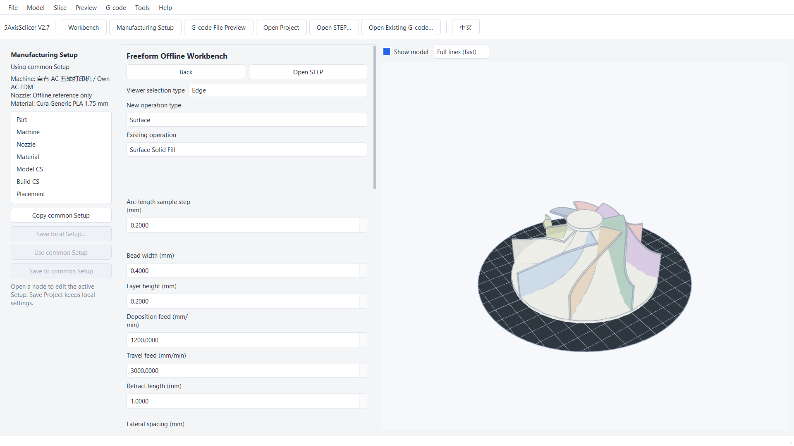

# 5AxisSclicer

5AxisSclicer is a Windows desktop slicer for five-axis additive manufacturing. Open a STEP/STP model, set up the part, machine, and material, choose a Workbench for the geometry, preview the generated path, and export NC/G-code for offline review.

*An impeller example in the Freeform Workbench.*

## Start here

- [Illustrated five-Workbench guide](docs/guides/quickstart_clickthrough_en.md): follow the interface from opening a model to exporting a path.
- [Learning manual](docs/guides/user_learning_manual_en.md): learn the interface and apply the example workflow to your own model.
- [Example files](example/README.en.md): practice with models and offline G-code.
- [中文 README](README.md) · [中文图文教程](docs/guides/quickstart_clickthrough_zh.md)

## Features and guides

| Module | What it does | Guide |
| --- | --- | --- |
| Common Manufacturing Setup | Set the part, machine, nozzle, material, and coordinates | [Setup walkthrough](docs/guides/quickstart_clickthrough_en.md) |
| Planar Workbench | Generate infill, contours, and support for planar layers | [Planar guide](docs/guides/planar_workbench_en.md) |
| Curve Workbench | Deposit one or more paths along model edges | [Curve guide](docs/guides/curve_workbench_en.md) |
| Rotary Workbench | Generate paths around a fixed cylindrical or conical axis | [Rotary guide](docs/guides/rotary_workbench_en.md) |
| Tube Workbench | Generate indexed or continuous paths along a tube | [Tube guide](docs/guides/tube_workbench_en.md) |
| Freeform Workbench | Generate paths on surfaces or assigned solid regions | [Freeform guide](docs/guides/freeform_workbench_en.md) |
| G-code File Preview | Open existing NC/G-code and inspect the 3D path and code | [Preview guide](docs/guides/gcode_preview_en.md) |

Find guides for machine profiles, materials, and coordinates in the [guide index](docs/guides/README.md#english-guides). The software is still being tested and improved; check settings and paths against your equipment before printing.
