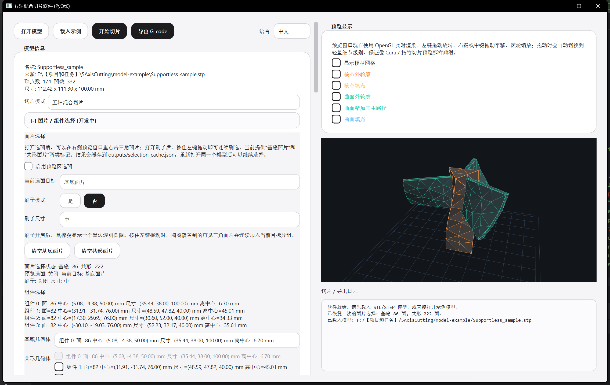
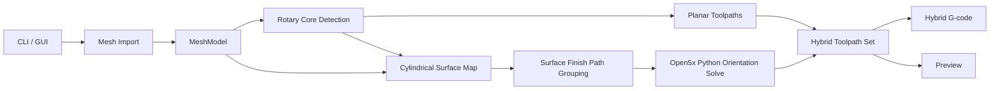

# 5AxisSlicer

`5AxisSlicer` 是一个面向五轴回转床 3D 打印研究的 Python 切片软件。它围绕“平面主体先打印，五轴曲面路径后打印”的混合流程展开，支持 GUI 交互、显式选面、Open5x 纯 Python 姿态求解接入，以及混合 `G-code` 导出。

`5AxisSlicer` is a Python slicing application for research on five-axis rotary-bed 3D printing. It focuses on a hybrid workflow: print the planar body first, then append five-axis surface paths. The project provides a GUI, explicit face selection, Open5x pure-Python orientation solving, and hybrid `G-code` export.

Current version / 当前版本: `V0.2.0`




> **Start Here | 先看这里**
>
> **运行环境 / Environment**
>
> - `conda activate 5AxisSlicer`
> - Workspace root / 工作目录: `~\5AxisCutting`
> - GUI entry / 图形界面入口: `python main.py`
> - Headless entry / 无界面入口: `python main.py <model> --headless -o <output.gcode>`
>
> **最常用使用步骤 / Recommended usage steps**
>
> 1. 激活环境 / Activate the environment: `conda activate 5AxisSlicer`
> 2. 启动界面 / Launch the GUI: `python main.py`
> 3. 点击“打开模型”导入 `STL` 或 `STEP` / Click `Open Model` and import an `STL` or `STEP`
> 4. 在左侧选择切片模式 / Choose the slicing mode on the left:
>    - `五轴混合切片`：平面主体 + 五轴曲面尾段 / planar body + five-axis surface tail
>    - `三轴平面切片`：只输出平面切片 / planar-only output
> 5. 如果要手动指定基底和共形区域，展开“面片 / 组件选择”，开启预览区选面，再用点击或刷子模式选面 / If you want to define substrate and conformal regions manually, expand `Face / Component Selection`, enable preview picking, then use clicking or brush mode
> 6. 点击“开始切片”并检查右侧预览和下方日志 / Click `Start Slice` and inspect the preview and log panel
> 7. 点击“导出 G-code”并保存结果 / Click `Export G-code` and save the result
>
> **推荐 GUI 流程 / Recommended GUI workflow**
>
> - 混合切片推荐先看预览，再决定是否手动选面 / For hybrid slicing, inspect the preview first and then decide whether explicit face selection is needed
> - 手动选面时，先选“基底面片”，再选“共形面片” / When selecting faces manually, pick substrate faces first and conformal faces second
> - 面片结果会缓存到 `outputs/selection_cache.json` / Face selections are cached in `outputs/selection_cache.json`
> - 预览里刷子模式只是选面工具，不会改变切片参数 / Brush mode is only a face-selection tool and does not change slicing parameters
>
> **推荐命令 / Recommended commands**
>
> ```bash
> conda activate 5AxisSlicer
> python main.py
> ```
>
> ```bash
> conda activate 5AxisSlicer
> python main.py model-example/Propeller-D.STEP --headless -o outputs/verification/propeller_v020.gcode
> ```
>
> ```bash
> conda activate 5AxisSlicer
> python main.py model-example/Propeller-D.STEP --headless --slice-mode planar -o outputs/verification/propeller_planar_v020.gcode
> ```
>
> **当前对齐基准 / Current structural reference**
>
> - 正确的五轴结构参考文件是 [EXAMPLE.gcode](/F:/【项目和任务】/5AxisCutting/model-example/EXAMPLE.gcode) / The main five-axis reference file is [EXAMPLE.gcode](/F:/【项目和任务】/5AxisCutting/model-example/EXAMPLE.gcode)
> - 当前文档、验证和五轴导出逻辑统一对齐它的“平面主体 + 少量长五轴尾段”结构 / The current documentation, validation flow, and five-axis export logic all follow its “planar body + a small number of long five-axis tail segments” structure
> - `V0.2.0` 的说明、验证和示例均以这份参考文件为准 / The `V0.2.0` notes, validation steps, and examples all use this file as the reference

## 1. Project Summary | 项目简介

### 中文

本项目服务于 Open5x 风格五轴打印迁移与研究，核心目标是：

- 支持普通三角网格模型的 `STL` / `STEP` 导入
- 让模型先按平面方式完成主体或基底打印
- 再对外部叶片、壳体、曲面功能区生成五轴路径
- 在 GUI 中完成参数调节、选面、预览、切片、导出
- 尽量复用 `Open5x-main/Grasshopper_Definition/open5x` 里的纯 Python 思路，而不依赖 Rhino 运行时

当前版本已经实现：

- `STL` / `STEP` 导入
- GUI 与 headless 两种运行方式
- 自动居中、平移、旋转、语言切换
- 纯三轴平面切片
- 五轴混合切片
- 面片点击选面与刷子刷选
- 面片选择缓存恢复
- Open5x 纯 Python 姿态求解接入
- 混合 `G-code` 导出
- 预览区路径过滤与选面高亮

### English

This project supports Open5x-style five-axis printing migration and research. The main goals are:

- Import triangle-based models from `STL` and `STEP`
- Print the main body or substrate as a planar phase first
- Generate five-axis paths for blades, shells, and other outer conformal regions
- Provide GUI-based parameter editing, face selection, preview, slicing, and export
- Reuse the pure-Python logic from `Open5x-main/Grasshopper_Definition/open5x` without depending on Rhino at runtime

The current version already provides:

- `STL` / `STEP` import
- GUI and headless workflows
- Auto-centering, translation, rotation, and language switching
- Pure planar slicing
- Hybrid five-axis slicing
- Click-based and brush-based face selection
- Cached face-selection restore
- Open5x pure-Python orientation solving
- Hybrid `G-code` export
- Preview filtering and selection highlighting

## 2. What Changed In V0.2.0 | V0.2.0 重点变化

### 中文

相对于 `V0.1.0`，`V0.2.0` 的更新集中在五轴混合切片、Open5x 纯 Python 接入和使用流程完善三个方向：

1. `V0.1.0` 以通用混合切片框架为主，`V0.2.0` 增加了Open5x里面用于演示的 [EXAMPLE.gcode](/F:/【项目和任务】/5AxisCutting/model-example/EXAMPLE.gcode) 这一结构参考，用来统一五轴尾段的组织方式。
2. `V0.1.0` 已支持基础混合切片，`V0.2.0` 进一步把五轴导出收敛到“平面主体 + 少量长五轴尾段”的输出结构。
3. `V0.1.0` 侧重本地姿态求解，`V0.2.0` 接入了 `Open5x-main/Grasshopper_Definition/open5x` 的纯 Python 逻辑（由Codex转译），并继续保持运行时不依赖 Rhino。
4. 在圆柱参数图中增加了 seam 重排逻辑，并优化了 surface-finish 路径拼接阈值，用于减少五轴碎片段。
5.  扩展了 GUI 的显式选面、刷子模式、预览遮挡和路径显示能力，便于手动指定基底和共形区域。
6.  重写了 README，把安装、启动、切片和导出步骤前置，方便直接上手。

### English

Compared with `V0.1.0`, `V0.2.0` focuses on hybrid five-axis slicing, Open5x pure-Python integration, and a clearer usage workflow:

1. `V0.1.0` introduced the general hybrid slicing framework, and `V0.2.0` adds the Open5x demo file [EXAMPLE.gcode](/F:/【项目和任务】/5AxisCutting/model-example/EXAMPLE.gcode) as the main structural reference for the five-axis tail.
2. `V0.1.0` already supported baseline hybrid slicing, and `V0.2.0` further organizes the exported result as a planar body followed by a small number of long five-axis tail segments.
3. `V0.1.0` mainly used the local orientation path, and `V0.2.0` integrates the pure-Python logic from `Open5x-main/Grasshopper_Definition/open5x`, translated and adapted by Codex, while keeping Rhino out of the runtime path.
4. `V0.2.0` adds cylindrical surface-map seam relocation and adjusts the surface-finish stitching threshold to reduce fragmented five-axis segments.
5. `V0.2.0` expands the GUI workflow with explicit face selection, brush mode, preview occlusion, and better path visualization.
6. `V0.2.0` also rewrites the README so installation, launch, slicing, and export steps appear at the top of the document.

## 3. Installation | 安装与环境

### 3.1 Environment | 环境

推荐环境：

```bash
conda activate 5AxisSlicer
```

主要依赖见 [requirements.txt](/requirements.txt)：

- `numpy`
- `scipy`
- `scikit-image`
- `matplotlib`
- `PyQt6`
- `gmsh`

Recommended environment:

```bash
conda activate 5AxisSlicer
```

The main dependencies are listed in [requirements.txt](/requirements.txt):

- `numpy`
- `scipy`
- `scikit-image`
- `matplotlib`
- `PyQt6`
- `gmsh`

### 3.2 Open5x Dependency | Open5x 依赖

当前工程会优先复用：

- [open5x_adapter.py](/five_axis_slicer/open5x_adapter.py)
- [pipeline.py](/Open5x-main/Open5x-main/Grasshopper_Definition/open5x/pipeline.py)
- [kinematics.py](/Open5x-main/Open5x-main/Grasshopper_Definition/open5x/kinematics.py)
- [gcode.py](/Open5x-main/Open5x-main/Grasshopper_Definition/open5x/gcode.py)

运行时只使用这些纯 Python 逻辑。`rhino_io.py` 与 `.gh` 文件不参与当前软件的运行流程。

The current project primarily reuses:

- [open5x_adapter.py](/five_axis_slicer/open5x_adapter.py)
- [pipeline.py](/Open5x-main/Open5x-main/Grasshopper_Definition/open5x/pipeline.py)
- [kinematics.py](/Open5x-main/Open5x-main/Grasshopper_Definition/open5x/kinematics.py)
- [gcode.py](/Open5x-main/Open5x-main/Grasshopper_Definition/open5x/gcode.py)

Only these pure-Python modules are used at runtime. `rhino_io.py` and `.gh` files are kept as references and are not part of the runtime path.

## 4. How To Use | 使用方法

### 4.1 GUI Workflow | 图形界面操作步骤

### 中文

推荐按下面步骤操作：

1. 执行 `python main.py`
2. 点击“打开模型”，导入 `STL` 或 `STEP`
3. 查看左侧“模型信息”，确认尺寸和面数正常
4. 选择切片模式：
   - `五轴混合切片`
   - `三轴平面切片`
5. 如果是混合切片，再决定是否手动选面
6. 需要手动选面时：
   - 展开“面片 / 组件选择”
   - 开启“启用预览区选面”
   - 先把“当前选面目标”切到“基底面片”，在预览中点选或刷选
   - 再把“当前选面目标”切到“共形面片”，继续选取
7. 点击“开始切片”
8. 在右侧预览窗口和下方日志确认路径与警告
9. 点击“导出 G-code”

### English

Recommended GUI steps:

1. Run `python main.py`
2. Click `Open Model` and import an `STL` or `STEP`
3. Check the model information panel
4. Choose the slicing mode:
   - `Hybrid five-axis slicing`
   - `Planar three-axis slicing`
5. If using hybrid slicing, decide whether explicit face selection is needed
6. For explicit face selection:
   - Expand `Face / Component Selection`
   - Enable preview picking
   - Select substrate faces first
   - Then switch to conformal faces and keep selecting
7. Click `Start Slice`
8. Inspect the preview and log output
9. Click `Export G-code`

### 4.2 Brush Selection | 刷子选面

刷子模式用于连续选面，不是切片参数。

- `是` 表示开启刷子
- `否` 表示关闭刷子
- 刷子大小支持多档
- 按住左键拖动可以连续选取
- 结果缓存到 `outputs/selection_cache.json`

Brush mode is used for continuous face selection and is not a slicing parameter.

- `是`: brush mode on
- `否`: brush mode off
- multiple brush sizes are available
- hold the left mouse button and drag to paint-select faces
- the result is cached in `outputs/selection_cache.json`

### 4.3 Headless Workflow | 无界面命令行流程

混合切片：

```bash
conda activate 5AxisSlicer
python main.py model-example/Propeller-D.STEP --headless -o outputs/verification/propeller_v020.gcode
```

纯平面切片：

```bash
conda activate 5AxisSlicer
python main.py model-example/Propeller-D.STEP --headless --slice-mode planar -o outputs/verification/propeller_planar_v020.gcode
```

带组件选择的 headless：

```bash
conda activate 5AxisSlicer
python main.py model-example/Propeller-D.STEP --headless --substrate-component 0 --conformal-components 1,2 -o outputs/verification/propeller_manual_v020.gcode
```

Hybrid slicing:

```bash
conda activate 5AxisSlicer
python main.py model-example/Propeller-D.STEP --headless -o outputs/verification/propeller_v020.gcode
```

Planar slicing:

```bash
conda activate 5AxisSlicer
python main.py model-example/Propeller-D.STEP --headless --slice-mode planar -o outputs/verification/propeller_planar_v020.gcode
```

Headless export with explicit component selection:

```bash
conda activate 5AxisSlicer
python main.py model-example/Propeller-D.STEP --headless --substrate-component 0 --conformal-components 1,2 -o outputs/verification/propeller_manual_v020.gcode
```

### 4.4 Common CLI Options | 常用命令行参数

- `--slice-mode hybrid|planar`：混合五轴或纯三轴 / hybrid five-axis or planar-only slicing
- `--layer-height`：共形阶段层高 / conformal-layer height
- `--planar-layer-height`：平面阶段层高 / planar-layer height
- `--grid-step`：曲面采样步长 / surface sampling step
- `--core-top-z`：手动指定核心顶高 / manual core top height
- `--core-detection-percentile`：核心检测百分位 / rotary-core detection percentile
- `--disable-planar-core`：关闭平面核心阶段 / disable the planar core phase
- `--substrate-component`：手动指定基底组件 / manually set the substrate component
- `--conformal-components`：手动指定共形组件列表 / manually set the conformal component list
- `--u-sign` / `--v-sign`：机床旋转轴方向 / rotary-axis sign
- `--u-zero` / `--v-zero`：机床零位偏移 / rotary zero offset
- `--min-u` / `--max-u` / `--min-v` / `--max-v`：机床角度限位 / rotary-axis limits
- `--phase-lift`：切换到五轴阶段时的安全抬升 / safe lift during the switch to the five-axis phase

## 5. Reference Files | 参考文件

### 中文

当前版本建议这样理解样例文件：

- [EXAMPLE.gcode](/F:/【项目和任务】/5AxisCutting/model-example/EXAMPLE.gcode)
  - 当前主要结构参考
  - 用来校准五轴尾段应该是什么组织形式
- `model-example/` 下的几何模型
  - 用来跑自动模式或显式选面模式


### English

Use the example files like this:

- [EXAMPLE.gcode](/F:/【项目和任务】/5AxisCutting/model-example/EXAMPLE.gcode)
  - main structural reference
  - used to calibrate how the five-axis tail should be organized
- geometry files under `model-example/`
  - used for auto-mode and explicit face-selection tests


## 6. Repository Layout | 仓库结构

```text
5AxisSlicer/
├─ main.py
├─ README.md
├─ requirements.txt
├─ .gitignore
├─ five_axis_slicer/
│  ├─ __init__.py
│  ├─ core.py
│  ├─ geometry.py
│  ├─ planar.py
│  ├─ slicer.py
│  ├─ kinematics.py
│  ├─ gcode.py
│  ├─ hardware.py
│  ├─ gui.py
│  ├─ gui_text.py
│  ├─ viewer.py
│  ├─ qt_compat.py
│  ├─ open5x_adapter.py
│  └─ assets/
├─ Open5x-main/
│  └─ Open5x-main/
│     └─ Grasshopper_Definition/
│        └─ open5x/
├─ model-example/
│  ├─ Propeller-D.STEP
│  ├─ Supportless_sample.stp
│  └─ EXAMPLE.gcode
└─ outputs/
   └─ verification/
```

## 7. Architecture Overview | 架构总览

### 中文

项目目前分成 7 层：

1. **入口层**：`main.py`
2. **核心数据层**：`core.py`
3. **几何导入层**：`geometry.py`
4. **平面切片层**：`planar.py`
5. **混合切片层**：`slicer.py`
6. **运动学与导出层**：`kinematics.py`、`gcode.py`、`open5x_adapter.py`
7. **界面与预览层**：`gui.py`、`viewer.py`、`gui_text.py`、`qt_compat.py`

### English

The project is currently organized into 7 layers:

1. **Entry layer**: `main.py`
2. **Core data layer**: `core.py`
3. **Geometry import layer**: `geometry.py`
4. **Planar slicing layer**: `planar.py`
5. **Hybrid slicing layer**: `slicer.py`
6. **Kinematics and export layer**: `kinematics.py`, `gcode.py`, and `open5x_adapter.py`
7. **GUI and preview layer**: `gui.py`, `viewer.py`, `gui_text.py`, and `qt_compat.py`



## 8. Core Workflow | 核心工作流

### 8.1 Planar Phase | 平面阶段

- 读取网格
- 自动居中
- 检测回转核心
- 生成三轴 perimeter / infill

- load the mesh
- center the model automatically
- detect the rotary core
- generate planar perimeter and infill paths

### 8.2 Hybrid Five-Axis Phase | 混合五轴阶段

- 构建圆柱参数图
- 从参数图中剔除已经属于核心的区域
- 自动把 seam 挪到最空的角度
- 生成 surface-finish 路径
- 通过 Open5x 纯 Python 求解 `A/B` 或 `U/V` 姿态
- 将五轴段附加到平面段之后导出

- build the cylindrical surface map
- remove the region that already belongs to the rotary core
- move the seam to the emptiest angular region
- generate surface-finish toolpaths
- solve `A/B` or `U/V` orientations with the Open5x pure-Python logic
- append the five-axis segments after the planar phase during export

### 8.3 Explicit Face Selection | 显式选面模式

如果用户在 GUI 中选了面片，则流程会优先尊重选面结果：

- 选中的“基底面片”进入平面阶段
- 选中的“共形面片”进入五轴阶段
- 预览保留相机视角
- 选面缓存可恢复

If the user selects faces in the GUI, the workflow gives priority to the explicit face-selection result:

- selected substrate faces go into the planar phase
- selected conformal faces go into the five-axis phase
- the preview keeps the current camera view
- the face-selection cache can be restored

## 9. Main Files | 主要文件说明

| File | 中文作用 | English role |
| --- | --- | --- |
| [main.py](/F:/【项目和任务】/5AxisCutting/main.py) | 程序入口，组织 GUI 和 headless 流程 | Entry point for GUI and headless workflows |
| [five_axis_slicer/core.py](/F:/【项目和任务】/5AxisCutting/five_axis_slicer/core.py) | 定义核心数据结构 | Defines the core data structures |
| [five_axis_slicer/geometry.py](/F:/【项目和任务】/5AxisCutting/five_axis_slicer/geometry.py) | 负责 `STL` / `STEP` 导入和网格处理 | Handles `STL` / `STEP` import and mesh utilities |
| [five_axis_slicer/planar.py](/F:/【项目和任务】/5AxisCutting/five_axis_slicer/planar.py) | 回转核心检测和平面刀路 | Rotary-core detection and planar paths |
| [five_axis_slicer/slicer.py](/F:/【项目和任务】/5AxisCutting/five_axis_slicer/slicer.py) | 混合切片主流程、surface-finish 分组、seam 重排 | Hybrid slicing pipeline, surface-finish grouping, seam relocation |
| [five_axis_slicer/open5x_adapter.py](/F:/【项目和任务】/5AxisCutting/five_axis_slicer/open5x_adapter.py) | Open5x 纯 Python 接入层 | Adapter layer for the Open5x pure-Python solver |
| [five_axis_slicer/gcode.py](/F:/【项目和任务】/5AxisCutting/five_axis_slicer/gcode.py) | 平面段与五轴段的混合导出 | Hybrid export for planar and five-axis phases |
| [five_axis_slicer/gui.py](/F:/【项目和任务】/5AxisCutting/five_axis_slicer/gui.py) | 主界面、参数面板、选面交互 | Main window, controls, and face-selection workflow |
| [five_axis_slicer/viewer.py](/F:/【项目和任务】/5AxisCutting/five_axis_slicer/viewer.py) | OpenGL 预览、路径显示、选面高亮与遮挡 | OpenGL preview, path rendering, selection highlights, and occlusion |
| [Open5x-main/Open5x-main/Grasshopper_Definition/open5x](/F:/【项目和任务】/5AxisCutting/Open5x-main/Open5x-main/Grasshopper_Definition/open5x) | 迁移参考与纯 Python 求解来源 | Migration reference and pure-Python solving source |

## 10. Preview And Selection Notes | 预览与选面说明

### 中文

预览区当前支持：

- 模型网格显示
- 平面 / 曲面路径分类过滤
- 面片点选
- 刷子刷选
- 选中面高亮
- 遮挡处理，尽量避免背面被挡住的高亮线穿出来

选面建议：

- 如果模型结构清楚，优先用组件选择
- 如果模型是一体网格，再用显式选面
- 选“基底”时尽量覆盖回转主体
- 选“共形”时尽量只覆盖叶片、壳体、外表层

### English

The preview currently supports:

- mesh display
- path-kind filtering
- click picking
- brush picking
- selected-face highlighting
- occlusion-aware line rendering to reduce back-face clutter

Recommended selection strategy:

- prefer component-based selection when the model is already split cleanly
- use explicit face picking when the model is a single connected mesh
- select the rotary body as substrate
- select blades, shells, or outer layers as conformal geometry

## 11. Verification | 验证建议

推荐至少做以下检查：

1. `python main.py`
2. `python main.py model-example/Propeller-D.STEP --headless -o outputs/verification/propeller_v020.gcode`
3. `python main.py model-example/Propeller-D.STEP --headless --slice-mode planar -o outputs/verification/propeller_planar_v020.gcode`
4. 打开 GUI 手动检查：
   - 预览是否正常显示
   - 选面高亮是否正常
   - 切片结果是否能导出
5. 对照 [EXAMPLE.gcode](/F:/【项目和任务】/5AxisCutting/model-example/EXAMPLE.gcode) 检查五轴块结构

Recommended checks:

1. `python main.py`
2. `python main.py model-example/Propeller-D.STEP --headless -o outputs/verification/propeller_v020.gcode`
3. `python main.py model-example/Propeller-D.STEP --headless --slice-mode planar -o outputs/verification/propeller_planar_v020.gcode`
4. Open the GUI and check manually:
   - whether the preview renders correctly
   - whether face highlights behave correctly
   - whether slicing results can be exported
5. Compare the five-axis block structure against [EXAMPLE.gcode](/F:/【项目和任务】/5AxisCutting/model-example/EXAMPLE.gcode)

## 12. Git And Release Policy | Git 与发布规则

### 中文

为了避免仓库被大量导出结果污染，当前建议：

- 只提交运行必要代码、文档、配置和样例模型
- 不提交 `outputs/verification/` 下的验证导出结果
- 不提交根目录下临时生成的 `gcode`
- 只保留明确需要的参考 `gcode`
- 发布 `V0.2.0` 时，优先提交：
  - `README.md`
  - `.gitignore`
  - `main.py`
  - `five_axis_slicer/`
  - `Open5x-main/Open5x-main/Grasshopper_Definition/open5x/`
  - 必要的 `model-example` 参考模型与正确参考 `gcode`

### English

To keep the repository clean:

- commit code, docs, configuration, and necessary example assets only
- do not commit `outputs/verification/` exports
- do not commit temporary root-level `gcode` files
- keep only explicit reference `gcode` files when needed
- for the `V0.2.0` release, prioritize:
  - `README.md`
  - `.gitignore`
  - `main.py`
  - `five_axis_slicer/`
  - `Open5x-main/Open5x-main/Grasshopper_Definition/open5x/`
  - required `model-example` models and the correct reference `gcode`

## 13. Current Limits | 当前已知限制

- `Propeller-D` 当前已经收敛到少量长五轴块，但还没有完全收敛到参考样例的三段结构
- 某些模型仍可能出现轻微的 `U` / `V` 限位告警
- `STEP` 导入依赖 `gmsh`
- OpenGL 预览效果与显卡、驱动、Qt 版本有关

- `Propeller-D` has already converged to a small number of long five-axis blocks, but it has not fully converged to the three-block structure of the reference example yet
- some models may still produce minor `U` / `V` limit warnings
- `STEP` import depends on `gmsh`
- the OpenGL preview depends on the GPU, driver, and Qt environment

## 14. References | 参考资料

- [open5x_adapter.py](/F:/【项目和任务】/5AxisCutting/five_axis_slicer/open5x_adapter.py)
- [Open5x-main/Open5x-main/Grasshopper_Definition/open5x](/F:/【项目和任务】/5AxisCutting/Open5x-main/Open5x-main/Grasshopper_Definition/open5x)
- [slicer.py](/F:/【项目和任务】/5AxisCutting/five_axis_slicer/slicer.py)
- [gcode.py](/F:/【项目和任务】/5AxisCutting/five_axis_slicer/gcode.py)
- [viewer.py](/F:/【项目和任务】/5AxisCutting/five_axis_slicer/viewer.py)

## Codex participated in the programming of this project.
## 本项目有 Codex 参与编程
