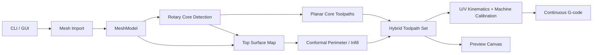
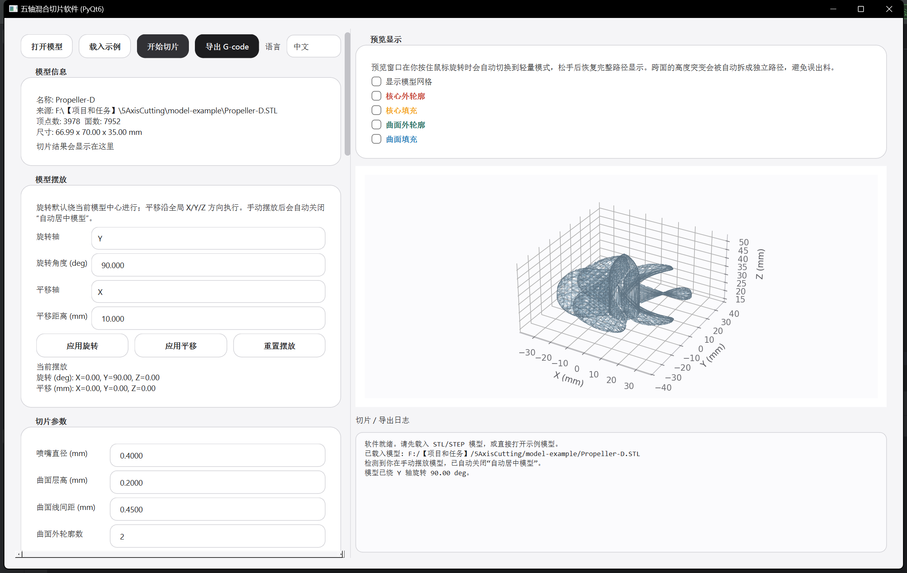
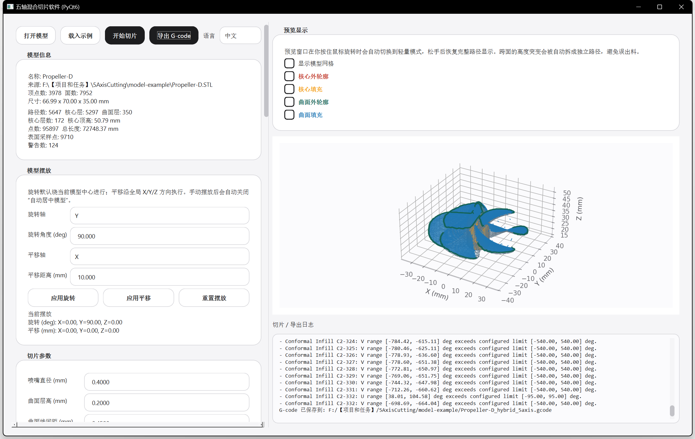

# 5AxisSlicer

`5AxisSlicer` 是一个面向五轴回转床 3D 打印研究的 Python 切片软件。项目围绕“回转核心先打印 + 曲面路径后打印”的混合流程展开，输出结果为一份连续的 `G-code` 文件，支持图形界面调参与路径预览。

`5AxisSlicer` is a Python slicing application for research on five-axis rotary-bed 3D printing. The project centers on a hybrid workflow: print the rotary core first, then print conformal paths on the outer surface. The final output is one continuous `G-code` file with GUI-based parameter editing and path preview.

Current version / 当前版本: `0.1.0`
> **Important for Robot | 给AI机器人的重点说明**
>
> - 工作环境 / Environment: `conda activate 5AxisSlicer`
> - 工作目录 / Workspace root: `F:\【项目和任务】\5AxisCutting`
> - 主要入口 / Main entry points: `main.py`, `five_axis_slicer/slicer.py`, `five_axis_slicer/gui.py`
> - 建议验证方式 / Recommended checks:
>   - `python main.py`
>   - `python main.py model-example/Propeller-D.STL --headless -o model-example/propeller_hybrid.gcode`
> - 文档维护规则 / Documentation rule: `README.md` 保持中英文双语，同步更新架构、参数和流程说明。 / Keep `README.md` bilingual and keep architecture, parameter, and workflow notes in sync with the codebase.

## 1. Project Summary | 项目简介

### 中文

5AxisSlicer 参考了 Freddi Hong / Open5X 的硬件思路与研究方向，目标集中在以下场景：

- 回转核心体、基座、基体的三轴打印。
- 叶片、壳体、导电走线、功能层的五轴 conformal 打印。
- 机床标定、路径可视化、研究参数对比。

当前工程已经实现：

- `STL` 导入。
- `STEP` 导入接口。
- 模型自动放置到 `(0, 0, 0)` 附近。
- 模型平移、旋转、语言切换。
- 回转核心检测与三轴切片。
- 曲面采样、曲面 perimeter / infill 生成。
- `U/V` 姿态求解与机床标定。
- 连续混合 `G-code` 导出。

### English

5AxisSlicer follows the hardware idea and research direction introduced by Freddi Hong / Open5X. The current scope covers:

- Three-axis printing of a rotary core, substrate, or base body.
- Five-axis conformal printing of blades, shells, conductive traces, and functional surface layers.
- Machine calibration, path visualization, and parameter studies.

The current project already provides:

- `STL` import.
- A `STEP` import interface.
- Automatic placement of the model near `(0, 0, 0)`.
- Model translation, rotation, and UI language switching.
- Rotary-core detection and planar slicing.
- Surface sampling plus conformal perimeter / infill generation.
- `U/V` orientation solving and machine calibration.
- Continuous hybrid `G-code` export.

## 2. Open5X Reference | Open5X 参考背景

### 中文

本项目采用 Open5X 的两个核心方向：

1. 让桌面级笛卡尔打印机能够结合双旋转机构进入五轴打印实验。
2. 让 conformal slicing 形成完整的软件流程，包含导入、切片、预览、标定和导出。

5AxisSlicer 在这些方向上继续展开，实现方式采用独立 Python 软件与 PyQt 图形界面。

### English

This project follows two core directions from Open5X:

1. Extend a desktop Cartesian printer with a two-axis rotary mechanism for five-axis printing experiments.
2. Build a complete conformal slicing workflow covering import, slicing, preview, calibration, and export.

5AxisSlicer carries these ideas forward through a standalone Python application with a PyQt GUI.

## 3. Repository Layout | 仓库结构

```text
5AxisSlicer/
├─ main.py
├─ README.md
├─ requirements.txt
├─ five_axis_slicer/
│  ├─ __init__.py
│  ├─ core.py
│  ├─ geometry.py
│  ├─ planar.py
│  ├─ slicer.py
│  ├─ kinematics.py
│  ├─ gcode.py
│  ├─ hardware.py
│  ├─ gui.py
│  ├─ gui_text.py
│  ├─ viewer.py
│  ├─ qt_compat.py
│  └─ assets/
└─ model-example/
   ├─ Propeller-D.STL
   ├─ Propeller-D.STEP
   ├─ Propeller-D.SLDPRT
   ├─ propeller_hybrid.gcode
   ├─ propeller_reworked_overview.png
   └─ ui_style_req2_preview.png
```

## 4. Architecture Overview | 架构总览

### 中文

项目架构分成 6 个层次：

1. **入口层**：`main.py` 负责 CLI 参数、GUI 启动和 headless 导出。
2. **数据层**：`core.py` 定义网格、表面图、刀路、机床参数和切片结果。
3. **几何层**：`geometry.py` 负责模型导入、法向生成、折线重采样。
4. **切片层**：`planar.py` 与 `slicer.py` 负责回转核心和曲面路径生成。
5. **运动学与导出层**：`kinematics.py` 与 `gcode.py` 负责姿态求解和 G-code 写出。
6. **界面层**：`gui.py`、`viewer.py`、`gui_text.py`、`qt_compat.py` 负责 UI、预览和跨 Qt 版本兼容。

### English

The architecture is organized into 6 layers:

1. **Entry layer**: `main.py` handles CLI arguments, GUI launch, and headless export.
2. **Data layer**: `core.py` defines meshes, surface maps, toolpaths, machine parameters, and slice results.
3. **Geometry layer**: `geometry.py` handles model import, normal generation, and polyline resampling.
4. **Slicing layer**: `planar.py` and `slicer.py` generate rotary-core and conformal paths.
5. **Kinematics and export layer**: `kinematics.py` and `gcode.py` solve tool orientation and write G-code.
6. **Interface layer**: `gui.py`, `viewer.py`, `gui_text.py`, and `qt_compat.py` handle UI, preview, and Qt-version compatibility.



## 5. File-by-File Guide | 文件作用说明

| File | 中文作用 | English role |
| --- | --- | --- |
| `main.py` | 程序入口；处理 CLI 参数；选择 GUI 或 headless 模式；组织切片和导出流程。 | Application entry point; parses CLI arguments; chooses GUI or headless mode; runs slicing and export. |
| `five_axis_slicer/__init__.py` | 对外导出核心数据类型和默认机床预设。 | Exposes the main data models and the default machine preset. |
| `five_axis_slicer/core.py` | 定义 `MeshModel`、`SurfaceMap`、`Toolpath`、`SliceParameters`、`MachineParameters`、`SliceResult` 等核心数据结构。 | Defines `MeshModel`, `SurfaceMap`, `Toolpath`, `SliceParameters`, `MachineParameters`, and `SliceResult`. |
| `five_axis_slicer/geometry.py` | 读取 `STL` / `STEP`；将三角片整理成统一网格；生成面法向和点法向；提供折线重采样和 demo 网格。 | Loads `STL` / `STEP`; builds a unified mesh; computes face and vertex normals; provides polyline resampling and a demo mesh. |
| `five_axis_slicer/planar.py` | 实现回转核心检测、水平截面提取、核心轮廓与填充生成。 | Implements rotary-core detection, horizontal section extraction, and planar perimeter / infill generation. |
| `five_axis_slicer/slicer.py` | 实现混合切片主流程；构建 surface map；剔除核心区域；生成 conformal perimeter / infill；拆分跨面路径。 | Implements the main hybrid slicing pipeline; builds the surface map; removes the core region; generates conformal perimeter / infill; splits cross-face paths. |
| `five_axis_slicer/kinematics.py` | 将表面法向换算为数学 `U/V` 角；叠加机床符号、零位和限位；给出旋转床运动学结果。 | Converts surface normals into mathematical `U/V` angles; applies machine sign and zero offsets; evaluates the rotary-bed kinematics. |
| `five_axis_slicer/gcode.py` | 将混合刀路转成连续 G-code；插入 travel、抬升、回抽、阶段模板和速度补偿。 | Converts hybrid toolpaths into continuous G-code; inserts travel moves, lift moves, retraction, phase templates, and feed compensation. |
| `five_axis_slicer/hardware.py` | 提供 Open5X 风格默认机床预设与 GUI 摘要文本。 | Provides the Open5X-style default machine preset and GUI summary text. |
| `five_axis_slicer/gui.py` | 主界面；参数面板；文件导入；模型摆放；切片执行；G-code 导出。 | Main window; parameter panels; file import; model placement; slicing execution; G-code export. |
| `five_axis_slicer/gui_text.py` | 存放中英文界面文本、标签键值和路径类别文案。 | Stores bilingual UI text, label keys, and path-kind labels. |
| `five_axis_slicer/viewer.py` | 负责模型和刀路预览；支持轻量交互模式和路径类型过滤显示。 | Handles mesh and toolpath preview; supports lightweight interaction mode and path-type filtering. |
| `five_axis_slicer/qt_compat.py` | 兼容 `PyQt5` / `PyQt6`；统一导出 Qt 控件符号。 | Bridges `PyQt5` / `PyQt6`; exports a unified Qt widget set. |
| `five_axis_slicer/assets/` | 存放界面资源。 | Stores UI assets. |
| `model-example/` | 存放示例模型、导出结果和预览截图。 | Stores example models, generated results, and preview screenshots. |

## 6. Core Data Model | 核心数据模型

### 中文

`core.py` 中的几个数据类构成了整个项目的数据骨架：

- `MeshModel`：三角网格、法向、包围盒、刚体变换。
- `SurfaceMap`：按规则 XY 网格采样得到的表面高度图和法向图。
- `Toolpath`：一条路径的空间点列、法向列、类型、阶段和层信息。
- `SliceParameters`：切片工艺参数。
- `MachineParameters`：机床标定参数和 G-code 模板。
- `SliceResult`：最终切片结果、警告和统计信息。

### English

The dataclasses in `core.py` form the project-wide data backbone:

- `MeshModel`: triangle mesh, normals, bounds, and rigid transforms.
- `SurfaceMap`: a regular XY-sampled height and normal map.
- `Toolpath`: one path with spatial points, normals, kind, phase, and layer metadata.
- `SliceParameters`: process parameters for slicing.
- `MachineParameters`: machine calibration values and G-code templates.
- `SliceResult`: final slicing output, warnings, and statistics.

## 7. Slicing Logic | 切片实现逻辑

### 7.1 Overall Pipeline | 总体流程

1. **Model import / 模型导入**  
   `geometry.py` 读取 `STL` 或 `STEP`，生成统一的 `MeshModel`。  
   `geometry.py` loads `STL` or `STEP` and builds a unified `MeshModel`.

2. **Placement normalization / 摆放归一化**  
   `MeshModel.centered_for_build()` 会把模型的 XY 中心放到原点附近，并让最低点落到 `Z=0`。  
   `MeshModel.centered_for_build()` places the XY center near the origin and moves the lowest point to `Z=0`.

3. **Rotary core detection / 回转核心检测**  
   `planar.py` 用一系列水平切片分析中心区域，估计核心的中心点、半径随高度的变化、有效高度区间。  
   `planar.py` analyzes a stack of horizontal sections to estimate the core center, radius profile, and active height range.

4. **Planar core slicing / 核心三轴切片**  
   核心区域按水平层生成 perimeter 和 infill，`U/V` 在这个阶段保持固定。  
   The core region is sliced into planar perimeters and infill while `U/V` stays fixed.

5. **Top surface map construction / 顶部曲面图构建**  
   `slicer.py` 在规则 XY 网格上采样模型顶部可打印区域，为每个有效点记录 `Z` 和法向。  
   `slicer.py` samples the printable top region on a regular XY grid and stores `Z` plus the local normal for each valid point.

6. **Core exclusion / 核心区域剔除**  
   核心已经在前一阶段完成打印，曲面阶段只保留核心外侧区域。  
   The core is already printed in the previous phase, so the conformal phase keeps only the area outside the core.

7. **Component split / 连续区域拆分**  
   表面会按高度连续性拆成独立 patch。每个 patch 单独生成路径。  
   The sampled surface is split into height-continuous patches. Each patch is processed independently.

8. **Conformal perimeter generation / 曲面外轮廓生成**  
   通过距离变换和等值轮廓提取，得到逐层 offset 的曲面 perimeter。  
   Distance transforms and iso-contours generate offset conformal perimeters.

9. **Conformal infill generation / 曲面填充生成**  
   将扫描线旋转到指定角度，与有效区域相交后得到曲面 infill。  
   Scan lines are rotated to the selected angle and clipped against valid surface regions to produce conformal infill.

10. **Cross-face split / 跨面跳段拆分**  
    无效采样点和过大的 3D 跳变会把路径切成多个片段，片段之间使用 travel。  
    Invalid samples and large 3D jumps split one path into multiple segments, with travel moves inserted between them.

11. **Kinematics solve / 姿态求解**  
    `kinematics.py` 把法向换成数学 `U/V`，再叠加方向符号、零位偏移、回零角度和限位。  
    `kinematics.py` converts normals into mathematical `U/V` angles, then applies axis signs, zero offsets, home angles, and motion limits.

12. **G-code export / G-code 导出**  
    `gcode.py` 合并两个阶段的路径，插入起始模板、阶段切换模板、结束模板、抬升、回抽和速度补偿。  
    `gcode.py` merges the two path phases and inserts start / phase-change / end templates, lift moves, retraction, and feed compensation.

### 7.2 Rotary Core Detection Details | 回转核心检测细节

### 中文

`planar.py` 中的核心检测流程包含以下步骤：

- `HorizontalSectionExtractor` 提取多个高度的闭合轮廓。
- `estimate_rotary_core_center()` 在中心附近网格上统计“连续处于实体内部”的占据率，得到核心中心。
- `_estimate_slice_core_radius()` 从中心向多个角度发射射线，找到边界交点距离，得到该高度的半径估计。
- `_smooth_positive_radii()` 平滑层间波动。
- `_keep_primary_core_run()` 保留主连续区段，使核心形成可打印的整体实体。

### English

The rotary-core detection pipeline in `planar.py` works as follows:

- `HorizontalSectionExtractor` extracts closed loops at multiple heights.
- `estimate_rotary_core_center()` evaluates occupancy around the center region and finds the XY point that stays inside the model most consistently.
- `_estimate_slice_core_radius()` casts rays from the center in many directions and measures boundary distances at a given height.
- `_smooth_positive_radii()` smooths layer-to-layer fluctuations.
- `_keep_primary_core_run()` keeps the main continuous height interval so the core forms one printable body.

### 7.3 Surface Sampling Details | 曲面采样细节

### 中文

`build_surface_map()` 对每个三角面做 XY 投影，并在网格中保存最高的交点高度。这个阶段同时插值点法向，后续 perimeter、infill、姿态解算都直接使用这张曲面图。

### English

`build_surface_map()` projects each triangle into XY and stores the highest valid height in the grid. The function also interpolates vertex normals, and the resulting surface map becomes the shared source for perimeter generation, infill generation, and orientation solving.

### 7.4 Path Splitting Details | 路径拆分细节

### 中文

`sample_surface_segments()` 会在两种情况下切断路径：

- 当前采样点落在无效区域。
- 相邻点的三维距离跳变超过阈值。

这样生成的结果更接近真实制造过程：跨面、跨叶片、跨空腔的位置使用 travel，导出时不会把这些位置写成带 `E` 的连续挤出段。

### English

`sample_surface_segments()` splits a path when:

- the current sample lands in an invalid region, or
- the 3D jump between neighboring points exceeds a threshold.

This behavior matches the intended manufacturing flow: travel moves connect separated faces, blades, and cavities, while extrusion remains on the actual printable surface.

## 8. GUI and Preview | 图形界面与预览

### 中文

GUI 由 `gui.py`、`viewer.py`、`gui_text.py`、`qt_compat.py` 共同组成：

- `gui.py` 负责窗口布局、参数面板、文件选择、切片执行和导出。
- `viewer.py` 基于 Matplotlib 做三维预览，支持路径颜色区分和轻量交互模式。
- `gui_text.py` 保存中英文文案，便于界面切换和后续维护。
- `qt_compat.py` 兼容 `PyQt5` 和 `PyQt6`。

当前 GUI 支持：

- 模型平移与旋转。
- 中英文切换。
- 路径类型显示开关。
- 机床标定参数编辑。
- 黑白勾选框和无滚轮误改值的输入控件风格。

### English

The GUI is built by `gui.py`, `viewer.py`, `gui_text.py`, and `qt_compat.py`:

- `gui.py` handles layout, parameter panels, file dialogs, slicing, and export.
- `viewer.py` renders the 3D scene with Matplotlib, including path colors and lightweight interaction mode.
- `gui_text.py` stores bilingual text for UI switching and maintenance.
- `qt_compat.py` bridges `PyQt5` and `PyQt6`.

The current GUI supports:

- Model translation and rotation.
- Chinese and English switching.
- Path-type visibility filters.
- Machine calibration editing.
- Black-and-white checkbox styling and input controls protected from accidental wheel edits.

## 9. Machine Model | 机床模型

### 中文

默认机床预设位于 `five_axis_slicer/hardware.py`，描述的是 Open5X 风格的回转床机构：

- `X/Y/Z`：笛卡尔直线轴。
- `U`：打印床绕机器 `Y` 轴倾斜。
- `V`：打印床绕倾斜后的局部轴旋转。

`MachineParameters` 提供以下关键量：

- 旋转中心。
- 机床偏移。
- `U/V` 方向符号。
- `U/V` 零位补偿。
- `Home U / Home V`。
- `U/V` 限位。
- 阶段切换抬升高度。
- 起始、切换、结束 G-code 模板。

### English

The default machine preset lives in `five_axis_slicer/hardware.py` and represents an Open5X-style rotary-bed mechanism:

- `X/Y/Z`: Cartesian linear axes.
- `U`: bed tilt around the machine `Y` axis.
- `V`: bed spin around the tilted local axis.

`MachineParameters` provides the key values for:

- rotary center,
- build offsets,
- `U/V` axis signs,
- `U/V` zero offsets,
- `Home U / Home V`,
- `U/V` limits,
- phase-change lift,
- start / phase-change / end G-code templates.

## 10. How to Run | 运行方式

### 10.1 GUI Workflow | GUI 使用流程

### 中文

推荐按照下面的顺序使用软件：

1. 启动 GUI，点击 `打开模型`，优先导入 `STL`。
2. 先检查模型在预览中的朝向，不要急着直接切片。
3. **重点注意：软件内显示的 `X/Y/Z` 坐标，就是实际 3D 打印机使用的 `X/Y/Z` 坐标。**
4. 如果模型当前姿态与打印机上的真实装夹方向不一致，请先在软件里旋转模型，再执行切片。
5. 确认模型最低点、中心位置和整体朝向合理后，再调整切片参数和机床参数。
6. 点击 `切片` 检查路径预览、统计信息和 `U/V` 警告，最后再导出 `G-code`。

一个最容易出错的点是“没有先旋转就切片”。本软件暂时不会自动理解零件应该如何装夹，因此**切片前请先把模型旋转到与打印机实际打印XYZ姿态一致**。

### English

The recommended GUI workflow is:

1. Launch the GUI and use `Open Model`, preferably with an `STL` file.
2. Check the model orientation in the preview before slicing.
3. **Important: the `X/Y/Z` coordinates shown inside the software are the same `X/Y/Z` coordinates used by the real 3D printer.**
4. If the model orientation does not match the real mounting or printing setup, rotate the model in the software first, then slice.
5. After the lowest point, center position, and overall orientation look correct, adjust slicing and machine parameters.
6. Run `Slice`, review the preview, statistics, and any `U/V` warnings, and then export the `G-code`.

One common mistake is slicing before correcting the model orientation. The software does not automatically infer the intended fixturing direction, so **please rotate the model into the real printer pose before slicing**.

### 10.2 GUI

```bash
conda activate 5AxisSlicer
python main.py
```

### 10.3 Headless Export

```bash
conda activate 5AxisSlicer
python main.py model-example/Propeller-D.STL --headless -o model-example/propeller_hybrid.gcode
```

### 10.4 Manual Core Top Height

```bash
conda activate 5AxisSlicer
python main.py model-example/Propeller-D.STL --headless --core-top-z 42 -o output.gcode
```



### 10.5 Common CLI Options | 常用命令行参数

- `--layer-height`：曲面层高 / conformal layer height
- `--planar-layer-height`：核心层高 / planar core layer height
- `--grid-step`：表面采样网格 / surface sampling step
- `--core-top-z`：手动指定核心顶高 / manual core top height
- `--core-detection-percentile`：核心半径识别分位值 / core-radius detection percentile
- `--disable-planar-core`：跳过核心阶段 / skip the planar core phase
- `--u-sign --v-sign`：机床轴方向 / machine axis signs
- `--u-zero --v-zero`：机床零位偏移 / machine zero offsets
- `--min-u --max-u --min-v --max-v`：机床限位 / machine angle limits
- `--phase-lift`：阶段切换安全抬升 / safe lift during phase change

## 11. Example Model Source | 示例模型来源

### 中文

仓库中的示例叶轮模型来源于 GrabCAD：

- Source page: [Centrifugal Propeller 3](https://grabcad.com/library/centrifugal-propeller-3)

仓库版本做了两项处理：

- 按项目需求进行了缩小。
- 删除了底部螺纹孔。

示例目录中保留了 `STL`、`STEP` 和 `SLDPRT` 版本，便于切片测试与格式对比。

### English

The example propeller model in this repository comes from GrabCAD:

- Source page: [Centrifugal Propeller 3](https://grabcad.com/library/centrifugal-propeller-3)

The repository version includes two adjustments:

- scaled down for this project,
- bottom threaded hole removed.

The example directory keeps `STL`, `STEP`, and `SLDPRT` versions for slicing tests and format comparison.

## 12. Development Notes | 开发说明

### 中文

推荐开发顺序：

1. 修改代码。
2. 运行 GUI 或 headless 导出。
3. 检查路径统计、警告和示例 G-code。
4. 更新 README 中对应章节。

推荐关注的输出：

- `model-example/propeller_hybrid.gcode`
- `model-example/propeller_reworked_overview.png`
- `model-example/ui_style_req2_preview.png`

### English

Recommended development sequence:

1. edit the code,
2. run the GUI or a headless export,
3. check path statistics, warnings, and the sample G-code,
4. update the matching README sections.

Useful outputs to inspect:

- `model-example/propeller_hybrid.gcode`
- `model-example/propeller_reworked_overview.png`
- `model-example/ui_style_req2_preview.png`

## 13. Current Scope | 当前范围

### 中文

- 推荐输入格式：`STL`。
- `STEP` 导入路径已经接通，运行依赖 `gmsh`。
- 核心检测算法适合存在明显中心回转体的零件。
- `U/V` 超限警告可以帮助排查模型姿态、机床限位和零位设置。
- 软件目前还不算完善，仍在持续优化中；某些界面细节、导入链路和极端模型的切片结果还需要继续打磨。
- 对研究原型和复杂零件，建议每次切片前都先检查模型旋转方向、打印坐标对应关系和预览结果，再决定是否导出。

### English

- Preferred input format: `STL`.
- The `STEP` import path is available and uses `gmsh` at runtime.
- The core-detection algorithm fits parts with a clear central rotary body.
- `U/V` limit warnings help diagnose model orientation, machine limits, and zero-angle settings.
- The software is still not fully polished and is actively being improved; some UI details, import paths, and edge-case slicing results still need refinement.
- For research prototypes and complex parts, it is best to verify model rotation, printer-coordinate alignment, and preview results before every export.

## 14. References | 参考资料

- Freddie Hong project page: [Open5x: Accessible 5-axis 3D printing and conformal slicing](https://freddiehong.com/2022/02/28/open5x-accessible-5-axis-3d-printing-and-conformal-slicing/)
- Open5X repository: [FreddieHong19/Open5x](https://github.com/FreddieHong19/Open5x)
- CHI 2022 paper entry: [Open5x: Accessible 5-axis 3D printing and conformal slicing](https://dl.acm.org/doi/10.1145/3491101.3519782)

## Codex participated in the programming of this project. 
## 本项目有Codex参与编程


