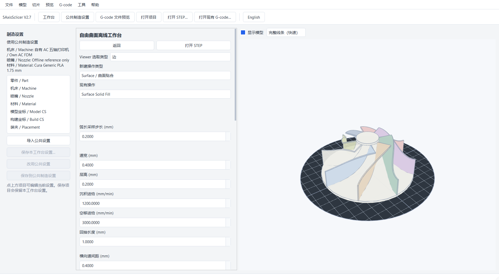

# 5AxisSclicer

5AxisSclicer 是用于五轴增材制造的 Windows 桌面切片软件。打开 STEP/STP 模型后，可以设置零件、机床和材料，按几何形状选择工作台，生成并查看路径，最后导出供离线检查的 NC/G-code 文件。

*自由曲面工作台中的叶轮示例。*

## 从这里开始

- [五个工作台图文教程](docs/guides/quickstart_clickthrough_zh.md)：跟着界面完成一次打开模型、设置、生成和导出。
- [学习手册](docs/guides/user_learning_manual_zh.md)：了解软件界面，以及如何把示例步骤用到自己的模型。
- [示例文件](example/README.md)：下载模型和离线 G-code，练习查看与对比路径。
- [English README](README.en.md) · [English quick start](docs/guides/quickstart_clickthrough_en.md)

## 功能与说明

| 模块 | 适合做什么 | 详细说明 |
| --- | --- | --- |
| 公共制造设置 | 设置零件、机床、喷嘴、材料和坐标 | [设置与操作教程](docs/guides/quickstart_clickthrough_zh.md#公共设置与本工作台设置) |
| Planar 平面工作台 | 对平面截层生成填充、轮廓和支撑路径 | [Planar 指南](docs/guides/planar_workbench_zh.md) |
| Curve 曲线工作台 | 沿模型边线生成单道或多道沉积路径 | [Curve 指南](docs/guides/curve_workbench_zh.md) |
| Rotary 回转工作台 | 围绕固定轴生成圆柱、圆锥等回转路径 | [Rotary 指南](docs/guides/rotary_workbench_zh.md) |
| Tube 管状工作台 | 沿管体生成分段或连续生长路径 | [Tube 指南](docs/guides/tube_workbench_zh.md) |
| Freeform 自由曲面工作台 | 在曲面或指定实体区域上生成路径 | [Freeform 指南](docs/guides/freeform_workbench_zh.md) |
| G-code 文件预览 | 打开已有 NC/G-code，查看三维路径和代码 | [预览指南](docs/guides/gcode_preview_zh.md) |

更多关于机型、材料和坐标的说明见[手册目录](docs/guides/README.md)。软件仍在测试和完善中；实际打印前请按自己的设备检查设置和路径。
