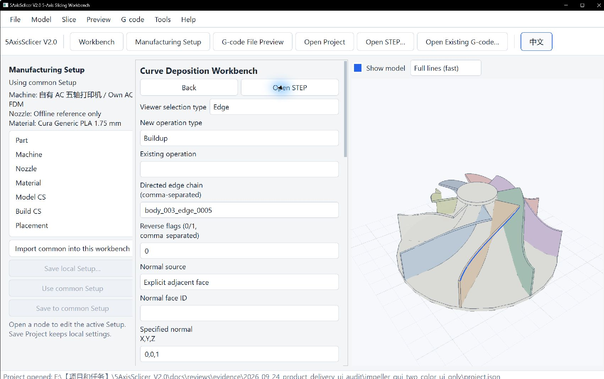

# Curve Workbench Guide

Curve creates Buildup, Multi-pass Buildup, and Offset Buildup along an ordered STEP edge chain. Lengths use mm and angles rad internally. Paths are transformed from Source/Model to Build and then Workpiece/Machine frames for offline checks. Practice values and print results must be established on the user's equipment.

Before starting, complete Part, Model CS, Build CS, machine, nozzle, reviewed material, and placement in Setup. Choose edges in travel order with **Viewer Selection Type: Edge**, then click **Use selected Viewer edges**. Select a face when an authoritative adjacent normal is needed. A two-sided edge requires an explicit normal face; otherwise choose **User direction** and enter a unit normal.

The blue edge has been copied into **Directed edge chain**. This shows geometry selection only; no operation or toolpath has been generated. Edge IDs depend on the loaded model. The Setup and operation panels scroll independently.

Generated-path view hides the CAD model by default so deposited lines remain visible. Turn on **Show model** to check placement; **Full lines (fast)** shows the whole path, while **Bead width** helps inspect local width. Projects save complete geometry references and kernel signatures. If STEP topology changes, references are rebound only when the match is unique; missing or ambiguous matches invalidate the operation.

## Edge order, direction, and normal

- Edge IDs are comma-separated and ordered as generated.
- Each edge has a reverse flag: `0` keeps STEP direction and `1` reverses it. Reversal changes endpoints, tangent, and offset side.
- Adjacent endpoints must be within chain tolerance; broken chains are not silently skipped.
- An explicit adjacent face supplies surface normals. User direction is for curves without an authoritative face; a direction parallel to the tangent cannot define nozzle orientation.

## Operations

| Operation | Path rule | Main checks |
| --- | --- | --- |
| Buildup | One bead along chain arc length | Endpoints, length, tangent continuity, normal/nozzle axis, material, start/end events |
| Multi-pass Buildup | Raise passes along the normal by layer height, alternating direction | Pass count, total height, reversal, separate Retract/Prime/Dwell events |
| Offset Buildup | Original chain is pass 0; further passes follow `normal × tangent` | Spacing/order, frame reversal, self-intersection, trimmed-face boundary |

Example parameter values are interface practice only. Set sampling step, chord error, chain tolerance, bead width, layer height, feed, retract, pass count, and spacing for the actual geometry, nozzle, material, and machine. Layer height must not exceed twice bead width. Layer count and offset pass count are 1–100; dwell is nonnegative.

## Generate and inspect

Click **Apply**, then **Generate and Validate**. The common chain is geometry → plan → shared Toolpath/events → machine-axis trajectory → validation → postprocessor → G-code readback.

| State | Meaning |
| --- | --- |
| Ready | Offline generation and readback passed; export is available. |
| Warning | Export is available with warnings saved for review. |
| Error | Generation, motion checks, or readback failed; export is disabled. |
| Stale | An input changed; regenerate before export. |

Cancel preserves the previous valid result. Viewer paths come from the generated result, not historical G-code.

Typical recovery: `curve.chain_disconnected` means check order and reverse flags; `curve.normal_ambiguous` requires an explicit face; `curve.normal_missing` requires a valid adjacent face or user normal; `curve.normal_parallel_tangent` requires a different direction; `curve.edge_degenerate` requires a valid STEP edge. For `curve.offset_outside_face`, check the face and edge direction and choose an offset that remains inside the trimmed face. Do not mask discontinuities by raising tolerances.

## Export, save, and limits

A Ready or Warning result exports six files: `main.gcode`, `toolpath.json`, `machine_axes.csv`, `warnings.json`, `preview.json`, and `manifest.json`. Strict readback compares points, axes, feed, extrusion, and events under the registered controller semantics. Any Error or readback failure blocks export.

Projects save Curve operations, geometry references, Setup, resources, and selected Workbench. Toolpaths are not embedded in `project.json`; after reopening, regenerate before export. Changes to source STEP are parsed in the background; conflicting edits are rejected instead of overwriting them.

The restricted `curve` script namespace and `/curve/*` HTTP routes use the same command rules as the UI. Curve is for finite deposition along STEP edge chains. It does not provide arbitrary surface fill, organic/tree supports, general industrial support, or production collision qualification. Generic XYZAC, offline IK/FK, axis/motion checks, conservative collision checks, readback, and Viewer inspection are offline checks only. Real controller semantics, calibration, complete fixture/nozzle collision checks, material suitability, removability, and trial prints require separate qualification. Check model licensing before redistribution.
