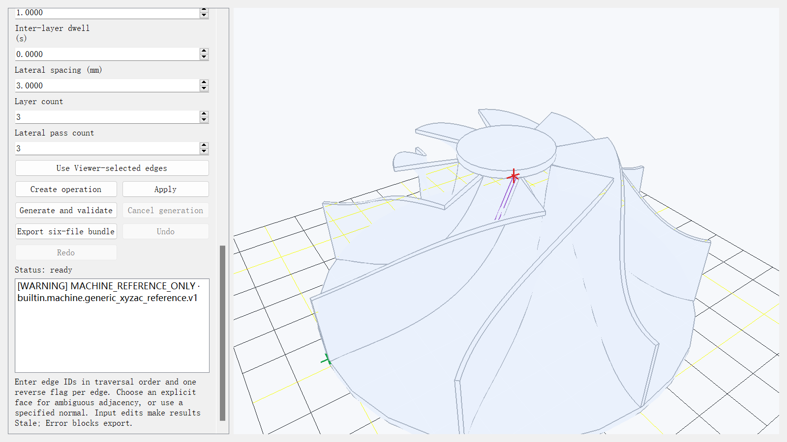
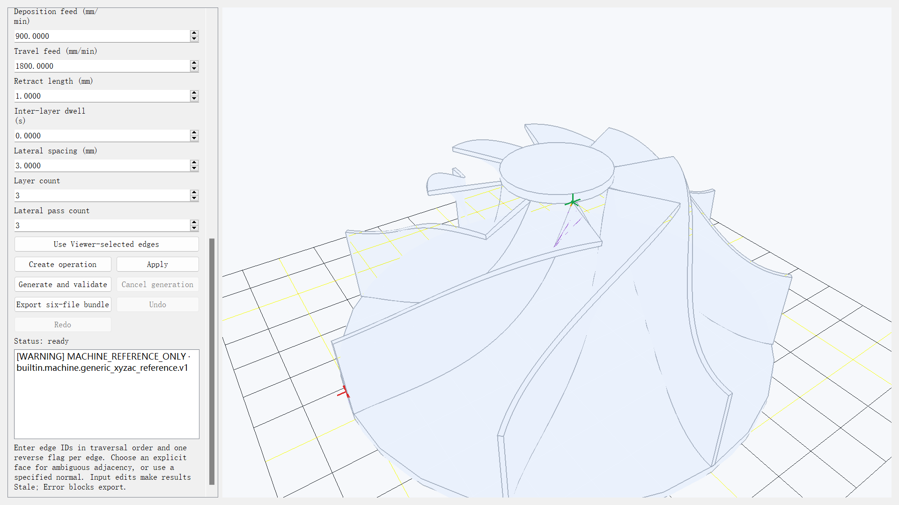

# Curve 工作台图文手册

> 初次使用请先完成[学习总册](user_learning_manual_zh.md)的 L01—L06；本页是 Curve 专项参考。叶轮边链用于练习有向链和法向，换零件后必须重新选择 edge、邻面和工艺参数。

适用版本：C01—C05，2026-09-12 当前本地版本。Curve 工作台沿 STEP 有向 edge 链生成 Buildup、Multi-pass Buildup 和 Offset Buildup。内部长度为 mm、角度为 rad；界面长度显示 mm。路径从 Source/Model frame 转换到 Build frame，再进入 Workpiece/Machine frame 的离线轨迹检查。

## 1. 前置条件与入口

1. 打开 STEP，并在 Tube Setup 中完成零件、Model CS、Build CS、机型、喷嘴、已审阅材料和安装位置。
2. 回到工作台首页，进入“曲线工作台 / Curve Workbench”。
3. Viewer 中切换到 edge 选择模式，按行进顺序选择边；单击“采用 Viewer 已选边”。也可以直接填写稳定 edge ID。
4. 双邻面的边必须填写明确的邻面 ID；若没有权威邻面，选择“用户指定方向”并填写单位法向 X,Y,Z。

项目保存的是 edge/face 的完整 `GeometryReference` 描述符、父实体信息和 kernel signature。STEP 更新后会做唯一重绑；缺失、重复候选或拓扑漂移会使操作无效并要求重新选择。


总览图显示当前 Buildup、`body_002_edge_0011` 有向链、反向标志和 `body_002_face_0006` 明确邻面。左侧使用滚动区；1366 × 768 下没有横向滚动，按钮未截断。

## 2. 边链顺序、反向和法向

- “有向边链”按逗号分隔，顺序就是生成顺序。
- “反向标志”与 edge 一一对应，`0` 保持 STEP 方向，`1` 反向。反向会同时改变起止端、切向和 Offset 的横向侧别。
- 相邻 edge 的端点距离必须小于“链连接容差”。断链不会自动跳过或用空移掩盖。
- “明确邻面”从指定 trimmed face 计算每个采样点的曲面法向；双邻面时不猜测。
- “用户指定方向”适用于没有权威邻面的空间曲线。方向与切向平行时无法定义喷嘴姿态，生成会报错。

## 3. 三种操作

| 操作 | 路径规则 | 关键检查 |
| --- | --- | --- |
| Buildup | 沿链按弧长生成一条沉积道 | 精确端点、弧长、连续切向、法向/nozzle axis、材料量、起止事件 |
| Multi-pass Buildup | 按层高沿法向累计抬升；相邻层交替方向 | 层数、累计高度、换向、Retract/Prime/Dwell 与沉积段分离 |
| Offset Buildup | 以原链为第 0 道，沿 `normal × tangent` 正方向生成横向多道 | 道间距、道序、局部标架反转、自交、trimmed face 越界 |


图中右侧 Viewer 直接读取本次生成的 shared Toolpath。状态为 Ready，问题列表保留 Generic XYZAC 参考机型警告。








真实叶轮样条的 Offset 示例把反向标志设为 `1`，使 `normal × tangent` 的正方向进入所选 trimmed face。相邻两道的独立三维点距为 2.947—3.000 mm（界面证据参数为 3.0 mm）；若保持正向，投影会塌回边界并以 `curve.offset_outside_face` 拒绝，不能用重叠路径冒充三道。

## 4. 参数

| 参数 | 默认值 | 作用与有效范围 |
| --- | ---: | --- |
| 弧长采样步长 | 1.0 mm | 大于 0；控制相邻采样目标距离 |
| 弦误差 | 0.05 mm | 大于 0；进入路径长度验收容差 |
| 链连接容差 | 0.01 mm | 大于 0；用于相邻边端点和闭合判断 |
| 道宽 | 0.6 mm | 大于 0；参与沉积体积和碰撞包络 |
| 层高 | 0.2 mm | 大于 0，且不超过道宽的 2 倍 |
| 沉积进给 | 900 mm/min | 大于 0；写入沉积点与 G-code |
| 空移进给 | 1800 mm/min | 大于 0；只用于 approach/travel |
| 回抽长度 | 1.0 mm | 大于 0；写入独立 Retract/Prime 事件 |
| 层间停留 | 0 s | 大于等于 0；非零时写入 Dwell 事件 |
| 层数 | 3 | 1—100；仅 Multi-pass 使用 |
| 横向道数 | 3 | 1—100；仅 Offset 使用 |
| 横向道间距 | 0.6 mm | 大于 0；沿局部横向标架累计 |

修改几何、Setup、资源或工艺参数后，已有结果显示 Stale，必须重新 Generate。显示质量、相机和可见性不参与语义哈希，不改变路径。

## 5. 生成、取消、检查与 Viewer

单击“应用”把界面值送入统一领域命令，再单击“生成与检查”。生成链为：

`Geometry → CurvePlan → shared Toolpath/events → MachineAxisTrajectory → ValidationReport → Postprocessor → G-code readback`

状态含义：

- Ready：离线生成和回读通过，可以导出。
- Warning：可以导出，警告随结果保存；应查看问题列表和 `warnings.json`。
- Error：生成、运动检查或回读失败，禁止导出。
- Stale：输入已变化，旧结果不可导出，重新生成后恢复。

生成期间“取消生成”可用。取消不会破坏上一份有效 Toolpath；界面继续显示原 Ready/Warning 结果。Viewer 中单道、多层和横向多道都来自生成结果，不从历史 G-code 伪造。

## 6. 典型错误与恢复

### 6.1 断链、方向和法向

- `curve.chain_disconnected`：检查 edge 顺序；必要时将对应反向标志改为 `1`。
- `curve.normal_ambiguous`：该 edge 有多个邻面，填写权威 face ID。
- `curve.normal_missing`：整条链没有共同邻面，重新选择链/邻面，或使用明确的用户法向。
- `curve.normal_parallel_tangent`：用户法向与局部切向平行，改用可定义喷嘴姿态的方向。
- `curve.edge_degenerate`：零长或退化边不能生成，回到 STEP 修复或重选。

### 6.2 Offset 越界


该例在 8 × 6 × 1 mm 解析 STEP 上选择了会向面外偏移的边，第三道越过 trimmed face，状态显示 `curve.offset_outside_face`，导出按钮禁用。


改选面内方向的 edge、重新“应用”和“生成与检查”后恢复为 Warning；警告来自 Generic XYZAC 参考机型，不影响离线六件套导出。

## 7. 六件套与回读

每个 Ready/Warning 结果导出一个目录，必须同时包含：

| 文件 | 用途 |
| --- | --- |
| `main.gcode` | 按注册 Generic XYZAC 语义生成的离线 NC |
| `toolpath.json` | shared Toolpath 点、事件、层/区域、姿态和材料量 |
| `machine_axes.csv` | XYZAC 轴轨迹、时间和 FK 误差 |
| `warnings.json` | Warning/Error 代码、对象和上下文 |
| `preview.json` | Viewer 使用的预览数据 |
| `manifest.json` | 输入、算法版本、语义哈希、输出哈希和导出资格 |

导出前会按同一注册控制器语义独立回读 `main.gcode`，核对点数、轴值、进给、挤出和事件。Error 或回读失败时六件套导出被阻止。

## 8. 撤销、保存重开与 STEP 更新

- Create、Apply 和参数修改支持 Undo/Redo；撤销恢复运行时有效结果，不把旧结果误标成新参数结果。
- 项目保存 Curve 操作、稳定几何引用、Setup、资源和当前工作台。生成 Toolpath 不嵌入 `project.json`。
- 重开后引用和参数恢复，旧 Ready/Warning 结果按 Stale 处理，需要重新生成。
- “更新原始 STEP”在后台解析。解析期间若 Tube、Planar 或 Curve 输入发生变化，提交会拒绝，避免覆盖并发编辑。

## 9. 受限脚本与 HTTP

脚本只接受字面量和 `curve/曲线` namespace，不执行 Python、文件、进程或网络调用。事务不能跨工作台。

```python
curve.create_operation(operation_type="curve_buildup", operation_id="curve-1")
curve.set_operation(
    operation_id="curve-1",
    edge_ids=["body_002_edge_0011"],
    reversed_flags=[False],
    normal_mode="adjacent_face",
    normal_face_id="body_002_face_0006",
    feedrate_mm_min=900.0,
)
curve.generate_operation(operation_id="curve-1")
curve.export_operation(operation_id="curve-1", destination="output/curve-1")
```

HTTP 使用同一命令内核：`/curve/state`、`/curve/issues`、`/curve/validate`、`/curve/operation/create`、`/curve/operation/set`、`/curve/operation/generate`、`/curve/generation/cancel`、`/curve/operation/export`、`/curve/undo`、`/curve/redo`。远程访问、token 和绑定地址仍受应用 HTTP 设置约束。

## 10. 当前能力边界

当前仅完成沿 STEP edge 链的有限 Curve 操作。锐角标架反转、自交、裁剪和退化区域按错误退出，不静默丢道。Tree/Organic、自由曲面区域填充、一般工业支撑生态和实机工艺资格不属于 Curve C01—C05。

Generic XYZAC、离线 IK/FK、轴限、速度/加速度、奇异检查、保守碰撞接口、G-code 回读和 OpenGL Viewer 已验证。真实控制器语义、真实机床标定、现场夹具/喷嘴完整碰撞、材料适配、可拆卸性和试切均未验证。

当前可追溯证据见 [`2026-09-12_curve_workbench_final`](../reviews/evidence/2026-09-12_curve_workbench_final/validation_manifest.json)。真实叶轮 STEP 的来源、作者和再分发许可证仍未知，本轮只用于本地验收；仓库许可证不自动覆盖该模型。
