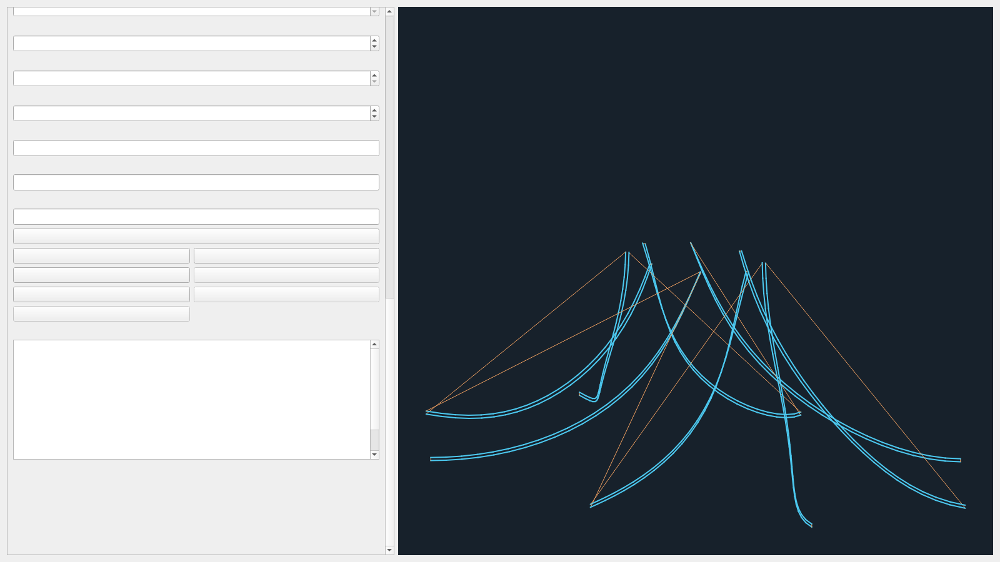
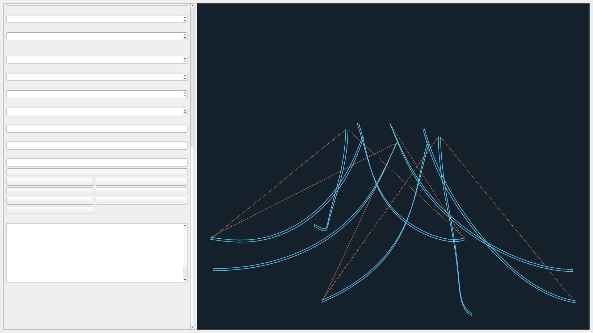

# Freeform 受限自由曲面工作台使用手册

本手册对应论文核心 AC 离线版本的 Freeform 子集。它支持在一个明确修剪面或最多 16 个显式面组成的有限面组上，沿最多 32 条导引边链生成曲面贴合或薄壁路径。当前输出可检查、可回读、可保存重开，但没有真实控制器、机床标定和现场试切资格。

## 1. 从 STEP 到离线产品

1. 打开 STEP，进入“自由曲面工作台 / Freeform Workbench”。
2. 新建 `Surface / 曲面贴合` 或 `Thin Wall / 薄壁` 操作。
3. 在 Viewer 中选导引 edge 和其明确邻接 face。单导引线可填写边 ID、反向标志和邻面 ID；多导引线在“多导引线 JSON”中提交对象数组。
4. “受限面组 ID”必须包含每条导引线引用的 face。未列入面组的邻面会被拒绝。
5. 按需要填写材料计划 JSON，再点“应用”。
6. 点“生成与检查 / Generate”。状态为 `Warning` 且导出按钮可用时，说明离线产品和严格回读通过；当前内置控制器未知项会保留 Warning。
7. 导出目录固定包含 `main.gcode`、`toolpath.json`、`machine_axes.csv`、`warnings.json`、`preview.json`、`manifest.json` 六个文件。


图中右侧路径来自当前叶轮 8 个显式面和 8 条导引线生成的 383 个预览段。截图使用 Qt 证据绘制器读取生产生成 payload；本次无显示会话无法初始化生产 VTK/OpenGL，限制保存在证据清单。

## 2. 多导引线格式

每个元素需要 `edge_ids`、`reversed_flags` 和 `face_id`。反向标志数量应与边数量一致：

```json
[
  {
    "edge_ids": ["body_002_edge_0011"],
    "reversed_flags": [true],
    "face_id": "body_002_face_0006"
  },
  {
    "edge_ids": ["body_003_edge_0011"],
    "reversed_flags": [true],
    "face_id": "body_003_face_0006"
  }
]
```

几何引用在项目中保存签名。源文件更新时系统尝试重绑；失败会把操作标为 Invalid，成功重绑也会使旧结果进入 Stale，必须重新生成。

## 3. 主要参数

| 参数 | 单位 | 作用 |
| --- | --- | --- |
| 弧长采样步长 | mm | 控制导引曲线离散间距 |
| 弦误差 | mm | 控制曲线近似误差 |
| 链连接容差 | mm | 判断多 edge 导引链是否连续 |
| 道宽、层高 | mm | 计算沉积体积；层高不得超过道宽的 2 倍 |
| 横向道间距、横向道数 | mm、count | 在修剪面内投影有限多道 |
| 层数 | count | 沿曲面法向生成有限多层 |
| 沉积/空移进给 | mm/min | 写入 Toolpath 和 `G94` 离线 NC |
| 最大相邻法向变化 | rad | 超限时以 `freeform.normal_discontinuity` 拒绝 |

参数、几何、材料计划、Setup 或控制器契约改变后，旧结果都进入 Stale。撤销可恢复上一个有效结果；取消发生在发布前时保留上一份有效产品。





三档截图均无横向滚动和按钮截断。GUI、受限脚本 `freeform/自由曲面` 与 `/freeform/*` HTTP 路由使用同一个命令内核。

## 4. 正常案例与错误恢复

当前证据包含：半球校徽 7 条图案边、三叶扇叶 3 条薄壁导引、叶轮 8 面 16 道、预装 T0/T1 双通道，以及 Tube 的 pipe2。每例均使用当前 CAD 生成，历史 NC 只比较 frame、模式和指令数量。

典型失败：

- 导引线离开修剪域：`curve.offset_outside_face`。半球的 `body_002_edge_0018` 是保留反例；改选已验证的 0001、0005、0007、0009、0012、0014 或 0016 后重新应用。
- 相邻采样法向跳变：`freeform.normal_discontinuity`。应缩小区域、换导引线或核对面连接，不能直接提高阈值掩盖不连续。
- 区域没有材料：`material.region_unassigned`。补齐每个 `guide-NN-pass-NN` 的显式分配。
- 轴限或累计 C 超限：状态为 Error 并阻止导出。累计 C 限值未知时保留离线 Warning。
- 严格回读发现模式、轴、进给、相对 E、事件或命令流被改动：产品不得作为有效输出。

## 5. 能力边界

当前算法只处理有限显式面组和导引边链，不提供任意网格全局参数化、自动图案识别、自动材料分区、复杂自交修复或生产级碰撞证明。T0—T3 宏文件、控制器/固件版本、协调 XYZAC、回转中心、零偏、累计 C 上限、真实工具扫掠和温控通信均待现场证据。`Warning` 的六件套只用于离线审查。

完整机器可读结果见[PC01—PC07 验证清单](../reviews/evidence/2026-09-13_paper_core_ac/validation_manifest.json)。
