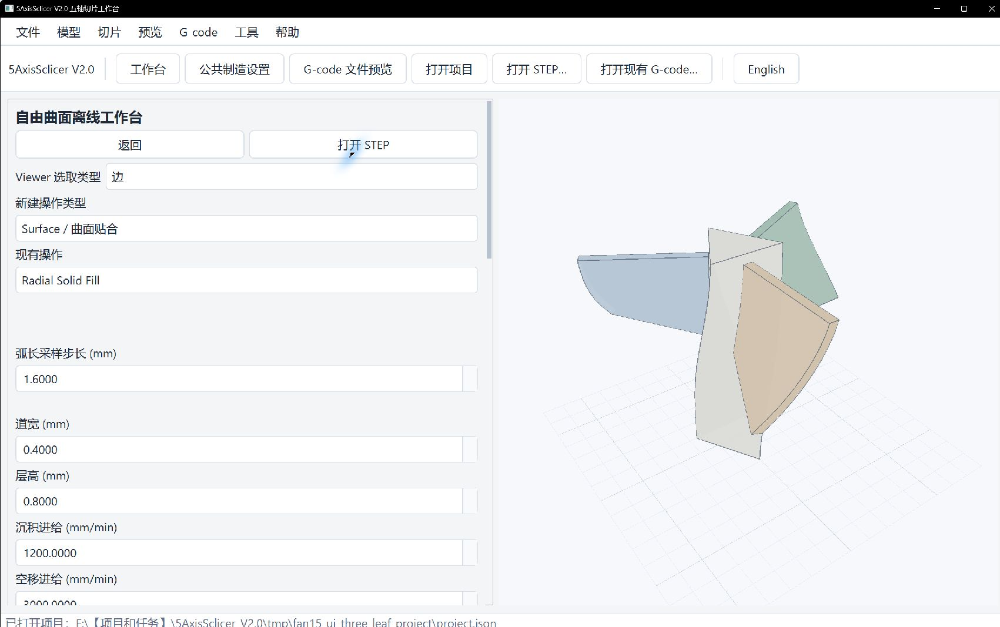

# Freeform 受限自由曲面工作台使用手册

Freeform 的导引模式支持在一个明确修剪面或最多 16 个显式面组成的有限面组上，沿最多 32 条导引边链生成曲面贴合或薄壁路径。输出可检查、可回读、可保存重开。实际参数和打印效果以用户设备调试结果为准，本项目持续测试和完善中。

左侧“制造设置”栏可直接编辑当前生效的机床、喷嘴、材料和坐标。默认与其他工作台共用公共设置；点“导入公共设置到本工作台”后可保留 Freeform 独立副本，或用“保存到公共制造设置”共享修改。按钮位置、保存项目与影响范围见[图文点击教程](quickstart_clickthrough_zh.md#公共设置与本工作台设置)。

`Spherical Solid Fill`、`Surface Solid Fill`、`Radial Solid Fill` 分别要求球面实体角色、根边与成对曲面、hub 与叶片及旋转轴。本页以下步骤和图片专指有限导引模式；实体模式入口见[五工作台教程](quickstart_clickthrough_zh.md#5-freeform曲面与实体)，几何选择与适用条件见[实体方法说明](solid_fill_method_zh.md)。大型模型的生成可能较慢，生成完成前应保持原有结果为 Stale，不要导出旧路径。

> 初次使用请先完成[学习总册](user_learning_manual_zh.md)的 L01—L06；本页是受限 Freeform 专项参考。半球、扇叶和叶轮只用于练习面组、导引线和材料区域，换零件后必须重新建立全部几何引用。

## 1. 从 STEP 到离线产品

1. 打开 STEP，进入“自由曲面工作台 / Freeform Workbench”。
2. 在“新建操作类型”中选择 `Surface / 曲面贴合` 或 `Thin Wall / 薄壁`，再向下滚动点“新建操作”。打开已有项目时，先在“现有操作”中选要编辑的操作；改变“新建操作类型”不会改变它。
3. 在中间参数区的“Viewer 选取类型”选“边”，到右侧模型上点导引 edge；再切“面”并点其明确邻接 face。向下滚动点“采用 Viewer 已选边”，核对边的顺序、反向标志和邻面。单导引线可在普通字段中修改；多导引线在“多导引线 JSON”中提交对象数组。
4. “受限面组 ID”必须包含每条导引线引用的 face。未列入面组的邻面会被拒绝。
5. 需要分配不同材料时点“编辑材料表…”，需要换料时再点“编辑换料站…”。填写和核对方法见[多色材料与换料站](material_channels_zh.md)。然后点“应用”。
6. 点“生成与检查 / Generate”。若 CAD 模型遮住路线，可在右侧取消“显示模型”查看完整线条；切换“沉积道宽”可检查线宽效果。状态为 `Warning` 且导出按钮可用时，说明离线产品和严格回读通过；控制器尚需用户核对的项目会保留 Warning。
7. 导出目录固定包含 `main.gcode`、`toolpath.json`、`machine_axes.csv`、`warnings.json`、`preview.json`、`manifest.json` 六个文件。



图中“现有操作”为径向实体，只用来说明两个选择框的区别；执行本节导引模式时，应新建 `Surface` 或 `Thin Wall`。图中只有 CAD 模型，尚未生成路径。

## 2. 多导引线格式

每个元素需要 `edge_ids`、`reversed_flags` 和 `face_id`。反向标志数量应与边数量一致：

```json
[
  {
    "edge_ids": ["body_002_edge_0011"],
    "reversed_flags": [true],
    "face_id": "body_002_face_0006"
  },
  {
    "edge_ids": ["body_003_edge_0011"],
    "reversed_flags": [true],
    "face_id": "body_003_face_0006"
  }
]
```

几何引用在项目中保存签名。源文件更新时系统尝试重绑；失败会把操作标为 Invalid，成功重绑也会使旧结果进入 Stale，必须重新生成。

## 3. 主要参数

| 参数 | 单位 | 作用 |
| --- | --- | --- |
| 弧长采样步长 | mm | 控制导引曲线离散间距 |
| 弦误差 | mm | 控制曲线近似误差 |
| 链连接容差 | mm | 判断多 edge 导引链是否连续 |
| 道宽、层高 | mm | 计算沉积体积；层高不得超过道宽的 2 倍 |
| 横向道间距、横向道数 | mm、count | 在修剪面内投影有限多道 |
| 层数 | count | 沿曲面法向生成有限多层 |
| 沉积/空移进给 | mm/min | 写入 Toolpath 和 `G94` 离线 NC |
| 最大相邻法向变化 | rad | 超限时以 `freeform.normal_discontinuity` 拒绝 |

参数、几何、材料计划、Setup 或控制器契约改变后，旧结果都进入 Stale。撤销可恢复上一个有效结果；取消发生在发布前时保留上一份有效产品。

页面下方依次有“应用”“生成与检查”和“导出六件套”。若“导出六件套”不可点，先核对当前操作状态和问题列表，不能把 CAD 模型显示当作路径生成成功。实体角色输入与摘要的实际界面见[五工作台教程](quickstart_clickthrough_zh.md#5-freeform曲面与实体)。

GUI、受限脚本 `freeform/自由曲面` 与 `/freeform/*` HTTP 路由使用同一套操作参数和检查规则。

### 实体模式：生长方式与材料区域

在 `Surface Solid Fill` 中，先从 Viewer 选择实体、承载面、对面和根边，点“从 Viewer 已选几何建立候选”并核对角色。“曲面实体生长方式”有两个选项：“沿侧面厚度叠层”保持原有厚度方向；“从根边向外生长”用于有明确承载根边、路径需沿曲面向外逐层延伸的模型。选项仅在 `Surface Solid Fill` 操作中显示。两种方式都应在预览中检查首道承接、每层连接和空移，不要根据外形相似直接选模式；具体适用条件见[实体方法说明](solid_fill_method_zh.md)。

选好生长方式后点“应用”。需要 T0/T1 等通道时，再点“编辑材料表…”，在区域下拉框选当前实体或阶段，点“添加所选区域”，然后在“通道”列选填 T0/T1。球面实体与根边向外生长模式优先使用稳定实体 ID；其他模式依界面显示的阶段候选分配。自定义路径可用“手动添加（高级）”。随后再次“应用”并生成；换料站的坐标、指令和示例值见[多色材料与换料站](material_channels_zh.md)。示例温度、层高和站位仅用于对应案例，自己的材料与设备需要重新调试。

## 4. 正常案例与错误恢复

练习时可从半球的图案边、三叶扇的薄壁导引、叶轮的面组和预装 T0/T1 双通道入手。换模型后重新选导引和材料区域，不复制示例 ID。

典型失败：

- 导引线离开修剪域：`curve.offset_outside_face`。重新选择位于目标修剪面内的边，核对邻面和偏置距离，再应用并生成；不要照抄其他模型的 edge ID。
- 相邻采样法向跳变：`freeform.normal_discontinuity`。应缩小区域、换导引线或核对面连接，不能直接提高阈值掩盖不连续。
- 区域没有材料：`material.region_unassigned`。补齐每个 `guide-NN-pass-NN` 的显式分配。
- 轴限或累计 C 超限：状态为 Error 并阻止导出。累计 C 限值未知时保留离线 Warning。
- 严格回读发现模式、轴、进给、相对 E、事件或命令流被改动：产品不得作为有效输出。

## 5. 能力边界

当前算法只处理有限显式面组和导引边链，不提供任意网格全局参数化、自动图案识别、自动材料分区、复杂自交修复或生产级碰撞证明。T0—T3 宏文件、控制器/固件版本、协调 XYZAC、回转中心、零偏、累计 C 上限、真实工具扫掠和温控通信均待现场证据。`Warning` 的六件套只用于离线审查。
