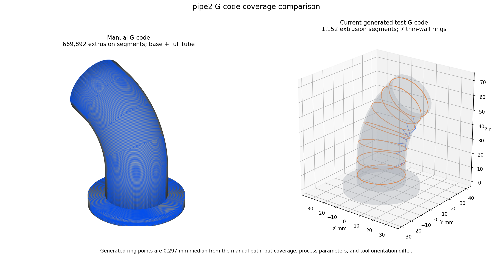
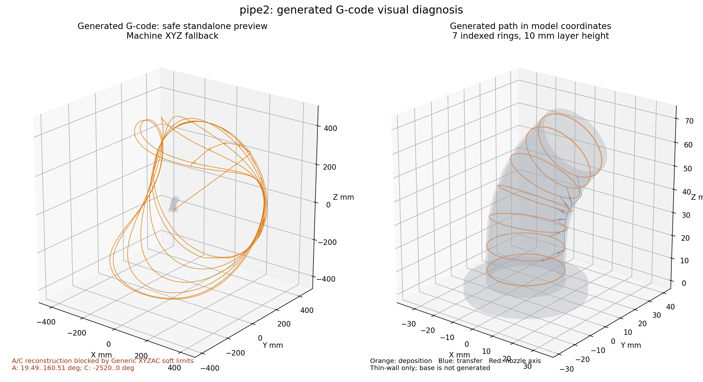

# G-code 预览中文手册

本文说明 5AxisSclicer V2.0 中读取 NC/G-code、叠加 STEP、检查路径和定位代码的操作。预览是离线检查工具；Generic XYZAC 仍未取得真实机床资格，不能替代试切和控制器验证。

## 1. 两个入口

### 1.1 普通 Preview

启动工作台后，使用“打开现有 G-code…”选择 `.gcode`、`.nc`、`.tap` 或 `.txt`。也可以命令行启动：

```powershell
python -m five_axis_slicer.app --gcode "example\pipe2\弯管.gcode"
```

该入口只读取并预览已有 NC，适合快速检查空移、沉积、层序和机床坐标。示例文件：`example/pipe2/弯管.gcode`。

### 1.2 切片结果页

使用“切片成果预览”，或以 `--results` 启动结果页；在结果页可同时指定模型和 G-code：

```powershell
python -m five_axis_slicer.app --results --model "example\叶轮\叶轮.stp" --gcode "example\叶轮\叶轮完整.gcode"
```

结果页显示来源、模型/G-code 路径、统计、缩略图、参数和代码上下文。页面中的历史或外部 G-code 必须保留来源说明，不能据此反推本软件算法。


## 2. 模型叠加与视图

在预览页打开 STEP 后，模型和刀路会共用当前坐标上下文。用 FIT/ISO 或视图立方体恢复可见范围；用模型视图检查实体，用机床视图检查机床坐标和 A/C 姿态。叶轮示例模型为 `example/叶轮/叶轮.stp`，工作台入口和“打开现有 G-code”按钮见[总览截图](../reviews/evidence/2026-09-11_t01_t07/ui/01-zh-1600x900.png)。该截图中的 `SETUP_PART_MISSING` 是 Tube 设置错误示例，不代表 G-code 解析失败。

## 3. 路径筛选与颜色

- 层范围：拖动层/进度范围，仅显示选定层或路径前缀，适合定位局部问题。
- Travel：显示空移、退离、转位和接近；隐藏后只看沉积几何。
- Extrusion：显示材料沉积段；隐藏后可检查是否存在误沉积。
- 角色分色：按 travel、deposition、retract、index、approach、prime 等事件区分；颜色是诊断标记，不代表机床颜色或材料属性。
- 进度与代码上下文：拖动进度条或选择代码行，查看当前段、层、区段、进给和坐标；底部代码窗口用于核对原始行号。

## 4. 五轴 A/C 逆变换安全回退

预览解析器会依据控制器语义重建坐标；当文件缺少可确认的旋转轴约定、单位或轴映射时，使用安全回退并保留坐标变换标记。逆变换只用于显示和检查，不能当作逆运动学求解，也不能证明无碰撞。发现姿态跳变、轴范围异常或模型与轨迹错位时，应关闭逆变换解释、回到原始机床坐标，核对控制器配置、单位（长度 mm、角度显式声明）和 G90/G91 等模式后再判断。

## 5. pipe2 对比案例

`example/pipe2/弯管新.stp` 是管体与底座示例；`example/pipe2/弯管.gcode` 是历史 NC 观察输入，来源包含外部切片/人工拼接。用于对照时记录模型、G-code、控制器和哈希，比较层序、空移/沉积角色、A/C 范围及回读结果。



当前程序生成环线到手工路径的最近距离中位数约为 0.297 mm，说明环线位于手工路径覆盖区附近；程序文件只有 7 个粗粒度截面，不包含手工文件中的底座和完整高密度管体，不能据此判定两份 G-code 等价。



左图按正式 Generic XYZAC 限位执行安全回读。当前测试 G-code 的 A/C 轴超限，预览器保留 Machine XYZ；右图从产品 `toolpath.json` 恢复模型坐标，仅用于定位算法路径。两张图片由本轮诊断脚本生成并固化到手册素材目录。

## 6. 常见问题

**模型不显示**：确认 STEP 路径和单位，先点击 FIT/ISO；检查是否只加载了 G-code。

**轨迹与模型错位**：核对 Model/Build/机床坐标、Placement、旋转轴语义；先采用原始坐标回退，不要直接调整模型位置。

**颜色或 Travel 不见**：检查 Travel、Extrusion 和角色图例开关，并确认当前层范围包含目标段。

**代码行与路径不一致**：等待后台索引完成，检查文件是否在加载期间被修改；重新打开同一文件并核对来源哈希。

**逆变换结果异常**：停止把图形当作可加工结论，记录控制器、单位、A/C 轴方向和范围，改用原始机床坐标复核。

**结果页按钮不可用**：成果可能已过期或 Setup 缺少 Part/Machine；修复问题列表后重新生成。含 `SETUP_PART_MISSING` 的截图仅适合作为错误示例。

## 7. 证据与限制

项目测试覆盖流式解析、缓存一致性、取消和预览段适配；具体版本与状态见 `docs/planning/progress_tracker.md`。预览成功不等于真实机床验证，Generic XYZAC 仍是离线参考。
