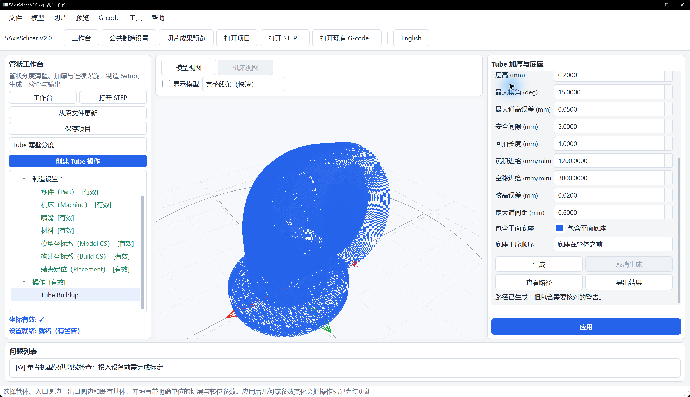

# G-code 预览中文手册

本文说明 5AxisSclicer V2.0 中读取 NC/G-code、叠加 STEP、检查路径和定位代码的操作。预览用于离线检查。实际参数、实际效果以用户设备调试结果为准，本项目持续完善中。

## 1. 打开 G-code 文件预览

启动工作台后，点顶部“G-code 文件预览”或“打开现有 G-code…”，选择 `.gcode`、`.nc`、`.tap` 或 `.txt`。也可以命令行启动：

```powershell
python -m five_axis_slicer.app --gcode "example\pipe2\弯管.gcode"
```

也可用 `--results` 直接进入文件预览页，同时指定 STEP 和已有 G-code。工作台刚生成、尚未导出的路径应先在当前工作台查看；要在文件预览页检查代码，先从工作台导出，再打开 `main.gcode`：

```powershell
python -m five_axis_slicer.app --results --model "example\叶轮\叶轮.stp" --gcode "example\叶轮\叶轮完整.gcode"
```

文件预览页显示输入来源、路径、统计和代码上下文。只打开 G-code 也能看路径；若需检查路径是否贴合实体，再点“打开 STEP”叠加对应模型。历史或外部 G-code 应保留来源说明，不能据此反推本软件的路径生成方法。


图中只载入了 G-code，所以右侧出现“尚未载入 STEP 模型”的提示。路径可以单独查看；沿右侧面板向下滚动可看到统计和代码上下文。图中程序只用于说明预览操作位置，不作为弯管制造程序的验收图。

## 2. 模型叠加与视图

在预览页打开 STEP 后，模型和刀路会共用当前坐标上下文。点 FIT 查看全部路径，滚动鼠标滚轮放大；ISO 和右上角的方向立方体用于调整视角。叶轮示例模型为 `example/叶轮/叶轮.stp`。

左下角的 X/Y/Z 方向标随视角一起旋转，用于辨认当前观察方向；它不改变模型或机床坐标。若需比较几何尺寸，先点 FIT，再从侧面和俯视角分别检查。

当实体盖住内部或背面的路线时，在右侧“场景显隐”取消勾选“模型”，先看完整沉积路径，再打开模型核对贴合位置。Tube 工作台的“查看路径”会默认隐藏模型；大型路径优先选择“完整线条（快速）”。“沉积道宽（简化）”适合检查局部道宽，交互可能更慢。文件预览页也可用画质模式切换。

## 3. 路径筛选与颜色

- 阶段导航：本软件导出的多操作 NC 可按“操作 1”“操作 2”等工序查看；旧叶轮文件若含叶片标记，可按底座和叶片选择。没有这些标记时，可使用层范围或进度条。切到某个操作后，拖动进度条只改变该操作内的显示进度。
- 层范围：拖动层/进度范围，仅显示选定层或路径前缀，适合定位局部问题。
- Travel：显示空移、退离、转位和接近；隐藏后只看沉积几何。
- Extrusion：显示材料沉积段；隐藏后可检查是否存在误沉积。
- 角色分色：按 travel、deposition、retract、index、approach、prime 等事件区分；颜色是诊断标记，不代表机床颜色或材料属性。
- 进度与代码上下文：拖动进度条或选择代码行，查看当前段、层、区段、进给和坐标；底部代码窗口用于核对原始行号。

## 4. 五轴 A/C 逆变换安全回退

预览解析器会依据控制器语义重建坐标；当文件缺少可确认的旋转轴约定、单位或轴映射时，使用安全回退并保留坐标变换标记。逆变换只用于显示和检查，不能当作逆运动学求解，也不能证明无碰撞。发现姿态跳变、轴范围异常或模型与轨迹错位时，应关闭逆变换解释、回到原始机床坐标，核对控制器配置、单位（长度 mm、角度显式声明）和 G90/G91 等模式后再判断。

本软件导出的自有 AC 程序会写入机型与刀具长度，预览以喷嘴出丝端还原零件坐标。打开较早导出的 `main.gcode` 时，请同时保留同目录的 `manifest.json`；若只有单独的 NC 文件且缺少刀具长度信息，先核对刀具长度和坐标来源，再判断路径与 STEP 是否贴合。

## 5. pipe2 路径查看案例

`example/pipe2/弯管新.stp` 是管体与底座示例。选择 Tube Buildup 操作，生成后点击“查看路径”，中央选择“完整线条（快速）”并关闭“显示模型”。检查底座是否完整、管壁是否连续、入口和出口是否与模型相接。下图中的道宽 0.6 mm、层高 0.2 mm 和弦高误差 0.02 mm 是这个案例的练习值；自己的管件应按设备、喷嘴、材料和精度要求重新设定。



`example/pipe2/弯管.gcode` 是另一份历史 NC 观察输入，来源包含外部切片/人工拼接。对照时应分别记录模型、程序来源和控制器语义，再比较层序、空移、A/C 范围及覆盖；不要仅凭整体外观认定两份程序等价。

## 6. 常见问题

**模型不显示**：确认 STEP 路径和单位，先点击 FIT/ISO；检查是否只加载了 G-code。

**只能看到模型外侧的几条线**：关闭“显示模型”，确认沉积路径已启用，再检查层范围和进度是否筛掉了其余路线。

**旋转或缩放很卡**：选“完整线条（快速）”、暂时隐藏模型和辅助姿态，缩小显示层范围；局部检查道宽时再切换道宽模式。

**轨迹与模型错位**：核对 Model/Build/机床坐标、Placement、旋转轴语义；先采用原始坐标回退，不要直接调整模型位置。

**颜色或 Travel 不见**：检查 Travel、Extrusion 和角色图例开关，并确认当前层范围包含目标段。

**代码行与路径不一致**：等待后台索引完成，检查文件是否在加载期间被修改；重新打开同一文件并核对来源哈希。

**逆变换结果异常**：停止把图形当作可加工结论，记录控制器、单位、A/C 轴方向和范围，改用原始机床坐标复核。

**“解析 G-code”按钮不可用**：先在左侧点“打开 G-code”并选择文件。只打开 G-code 时的“尚未载入 STEP 模型”提示不影响路径查看；需要模型对照时再打开对应 STEP。

## 7. 使用限制

预览成功只说明文件已被读取并显示。投入设备前应核对机床标定、控制器轴语义、装夹、路径和试打印结果；实际参数、实际效果以用户设备调试结果为准。
