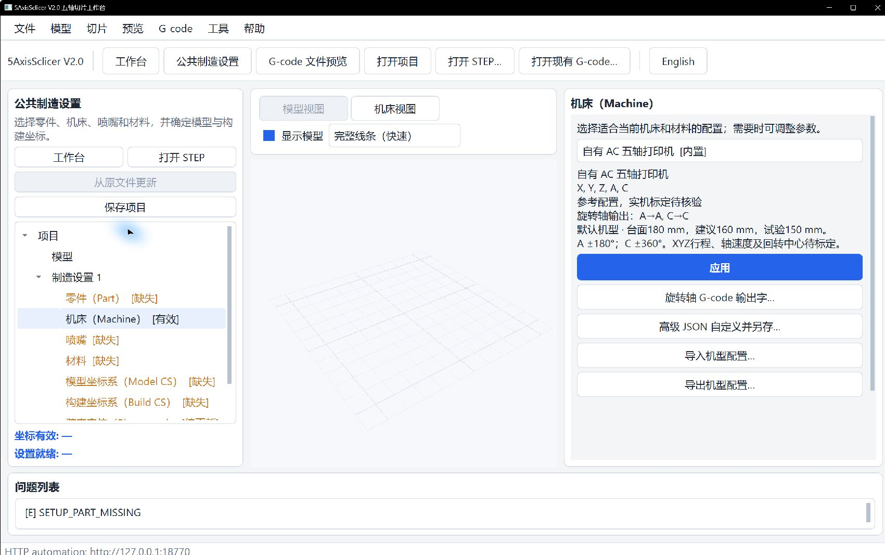

# Select and Customize a Machine Profile

New desktop projects default to **Own AC FDM**. Open **Common Manufacturing Setup**, select **Machine**, choose a profile, and click **Apply**. Merely browsing the list does not change the applied machine. Existing projects keep their saved machine. After changing a profile, recheck placement and regenerate affected operations.

This screenshot shows the machine page before part, nozzle, and material setup. Its not-ready status is expected and does not indicate a completed slice.

The own-machine reference specifies a 180 mm physical bed, A ±180°, and C ±360°. Suggested print diameter (160 mm) and paper-specimen range (150 mm) are process references, not collision limits that adjust automatically with tilt. XYZ travel, axis speed, acceleration, rotary centre, and zero pose still require machine-specific calibration.

## Customize and exchange profiles

- **Rotary G-code Axis Words…** edits output letters for joints that exist in the selected machine. Changing a letter does not change the internal joint, kinematics, direction, order, limits, units, scale, or offset. Save creates and applies a user-profile copy.
- **Advanced JSON Customize and Save As…** validates the current profile structure and saves an independent user profile.
- **Import Machine Profile…** imports a compatible JSON profile into the user library.
- **Export Machine Profile…** writes the selected profile to JSON. The own-machine profile includes its references and unknowns.

Imported or saved profiles appear in the list; select and apply them to use them in the project. User profiles remain available after restart. After edits, check that Machine is valid and regenerate affected operations.

## Map internal A/C joints to U/W output words

For a controller that expects U/W, keep internal A/C semantics and set the output map:

1. Select the machine in **Common Manufacturing Setup > Machine**.
2. Open **Rotary G-code Axis Words…**.
3. Set A to `U` and C to `W`, then save a named copy.
4. Regenerate operations. Old results become Stale when the machine semantic hash changes.
5. Inspect `CONTROLLER_AXIS_MAP` and U/W moves in exported `main.gcode`; strict readback uses the same profile map.

Only one ASCII letter is accepted and lowercase is normalized to uppercase. Letters must be unique and cannot be `E/F/G/M/N/P/S/T`, which have other meanings in the current dialect. A map cannot add a B joint or convert an AC machine to ABC. The file preview is not a substitute for strict readback of generated output.

The script API is `tube.set_machine_axis_words({"A": "U", "C": "W"}, name="DIY U/W")`; HTTP uses `POST /setup/machine/axis-map` with the same mapping. Applying either updates loaded manufacturing Workbenches and makes affected old products Stale.

## Units and qualification

Profile JSON uses mm for lengths and radians for angles. A 180° limit is about 3.141592653589793 rad; 360° is about 6.283185307179586 rad. Linear speed uses mm/s, angular speed rad/s, and acceleration uses mm/s² and rad/s². Unknown limits should be `null`, not invented large values. Fill offsets, rotary centre, and transforms from calibration.

The own profile's 0.4 mm nozzle, 1.75 mm filament, 0.2 mm layer height, 0.4 mm bead width, and temperatures are process references; they are not automatically applied to operations or tool-change macros. No validated commercial-brand profile library or converter for other slicer formats is included. Before machine use, verify firmware macros, axis words and directions, units, scale, offsets, nozzle envelope, and calibration. Offline reference output does not qualify a real machine.
