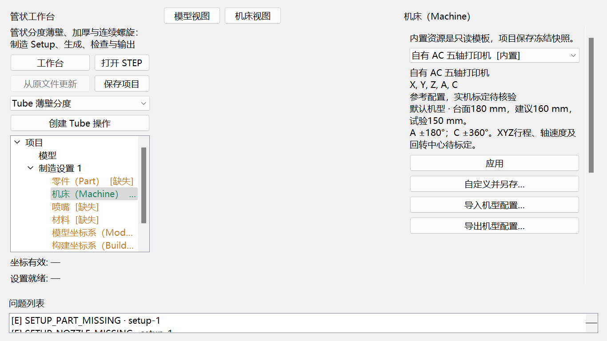
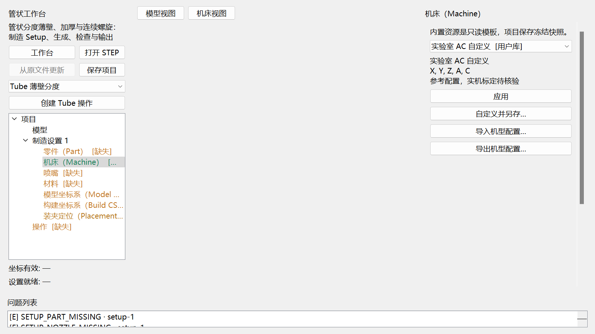
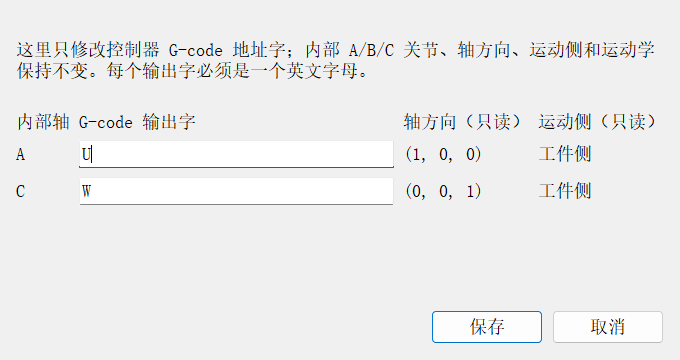
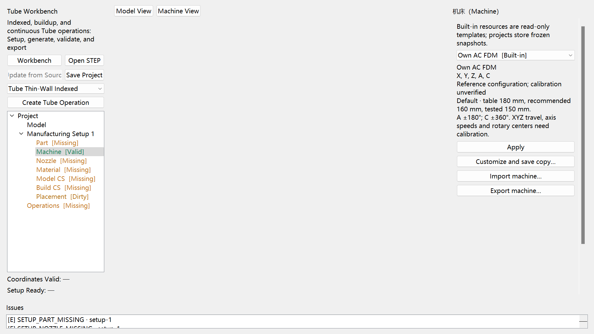

# 机型选择与自定义配置

新建桌面项目默认使用“自有 AC 五轴打印机 / Own AC FDM”。进入 Tube 工作台，在左侧 Setup 树选择“机床”，右侧型号栏可切换机型。该 Setup 同时供 Tube、Planar、Curve 和 Rotary 工作台使用。打开旧项目时保留原项目机型；首次导入 STEP 保留当前选择，换成另一模型的新 Setup 使用自有机型默认值。

## 选择机型

从型号栏选择自有 AC、Cartesian Reference、Generic XYZAC Reference 或用户库机型，再点击“应用”。只浏览下拉列表不会修改已应用配置。切换机型后装夹和相关生成结果需要重新检查。



图为参数页，无零件、喷嘴和材料准备，底部未就绪提示属于预期状态；该图不代表已完成切片。

自有机型采用180 mm物理台面、A ±180°、C ±360°。建议打印直径160 mm，论文试件范围150 mm，两者为工艺参考，当前并非随倾角自动变化的碰撞边界。XYZ 行程、轴速度及加速度上限留空；回转中心、零姿态等仍需设备标定。界面注明“参考配置，实机标定待核验”。

## 自定义与文件交换

- **旋转轴 G-code 输出字…**：按当前机型实际存在的旋转关节显示内部轴、轴方向、运动侧和输出字。只修改输出字时不改变内部关节、运动学、轴方向、顺序、限位、单位、比例或零偏。保存后输入型号名称，软件建立用户机型副本并立即应用。
- **高级 JSON 自定义并另存…**：打开当前机型的 JSON 编辑器，可修改型号名称、关节、行程、回转中心、装夹和台面。保存时先校验结构，再输入显示名称，生成独立用户配置；内置配置保持可复用。
- **导入机型配置…**：选择符合本软件格式的 JSON，输入型号名称后存入用户库。可使用本软件导出的配置，也可使用资源库的 version 1 machine 文件或完整 MachineProfile 对象。
- **导出机型配置…**：把当前下拉列表选中的机型保存为 JSON。导出自有机型时包含论文来源、未知字段说明和工艺参考。

普通 JSON 导入或另存完成后，新型号出现在列表中并被选中；点击“应用”才应用到项目。专用旋转轴输出字对话框保存后会自动应用。关闭重开软件后仍可从用户库选择它。



## 旋转轴输出字：A/C 改为 U/W

内部轴名用于运动学和轴轨迹，控制器输出字用于 `main.gcode`。例如自有 AC 机型可保留内部 A/C，同时让固件接收 U/W：

1. 在 Tube Setup 的“机床”页选中目标机型。
2. 点击“旋转轴 G-code 输出字…”。
3. 在 A 行输入 `U`，在 C 行输入 `W`。输入小写会规范为大写。
4. 点击“保存”，给副本输入易识别的型号名称。
5. 重新生成各工作台已有操作；旧结果因机型语义哈希变化进入 Stale，不能直接导出。
6. 打开六件套中的 `main.gcode`，检查头部 `CONTROLLER_AXIS_MAP`，并确认运动块使用 U/W。生成链会按同一机型映射严格回读。



对话框按实际旋转关节动态显示。AC 机型只出现 A/C；只有真实机型配置中存在 B 关节时才显示 B。修改输出字不会凭空增加 B 轴，也不会把 AC 机构变成 ABC 机构。

当前接受单个 ASCII 字母并自动转大写。输出字不能与其他关节重复，也不能使用 `E/F/G/M/N/P/S/T`：这些字在当前生成方言或控制器命令中已有固定含义。非法输入不会修改已应用机型。允许的自定义字可被生成产品的严格 G-code 回读识别；独立的“Imported NC Review”仍需显式注册对应控制器语义，不能用其普通预览代替产品回读。

受限脚本使用：

```python
tube.set_machine_axis_words({"A": "U", "C": "W"}, name="DIY U/W")
```

HTTP 使用同一领域命令：

```text
POST /setup/machine/axis-map
{"mapping":{"A":"U","C":"W"},"name":"DIY U/W"}
```

脚本或 HTTP 应用后，四个已加载制造工作台立即同步同一 Setup；相关旧产品进入 Stale。项目 JSON 和 `manufacturing-setup.yaml` 保存完整 Machine 快照，重开后映射保持不变。

用户库采用每条资源独立文件，并为每次导入或另存生成新 ID，不覆盖已有配置。Windows 默认目录为 `%LOCALAPPDATA%/5AxisSclicer/resource-library/machine/`；可用既有 `FIVE_AXIS_SLICER_RESOURCE_LIBRARY` 环境变量指定库目录。项目保存机型快照，后续库文件改变不会静默覆盖已保存项目。

## 参数单位与文件边界

JSON 内长度用 mm、角度用 rad，旋转限位180°写为约3.141592653589793，360°写为约6.283185307179586。线性轴速度单位mm/s、角速度rad/s，加速度对应mm/s²和rad/s²；输出轴字及单位由 `post_axis_map` 定义。未知限值用 null，不填虚构的大数。零偏、回转中心和刚体变换中的零值／单位矩阵需要按设备标定结果填写。

自有配置文件保留0.4 mm喷嘴、1.75 mm丝材、0.2 mm层高、0.4 mm道宽及材料温度等论文参考。这些 process_reference 字段不自动应用到操作或换料宏；喷嘴、材料和工序参数继续在各自入口配置。自定义机型库保存 MachineProfile；自有原文件的补充论文参考仍保存在内置 JSON 中。

市售品牌机型可在取得真实设备配置后按本格式建档导入。当前未附带经过验证的品牌机型库；Bambu Studio、OrcaSlicer、Cura 等异种配置文件没有直接转换器。导入不兼容文件会显示错误，原项目不变；请按本软件导出的结构整理后重试。文件中的文字仅作为数据，不执行脚本或宏。



投入设备前，应按目标固件与机床核对控制器宏、轴字含义、轴正方向、单位、比例、零偏、喷嘴包络及各轴标定。参考机型的离线结果不能直接作为现场打印资格。
