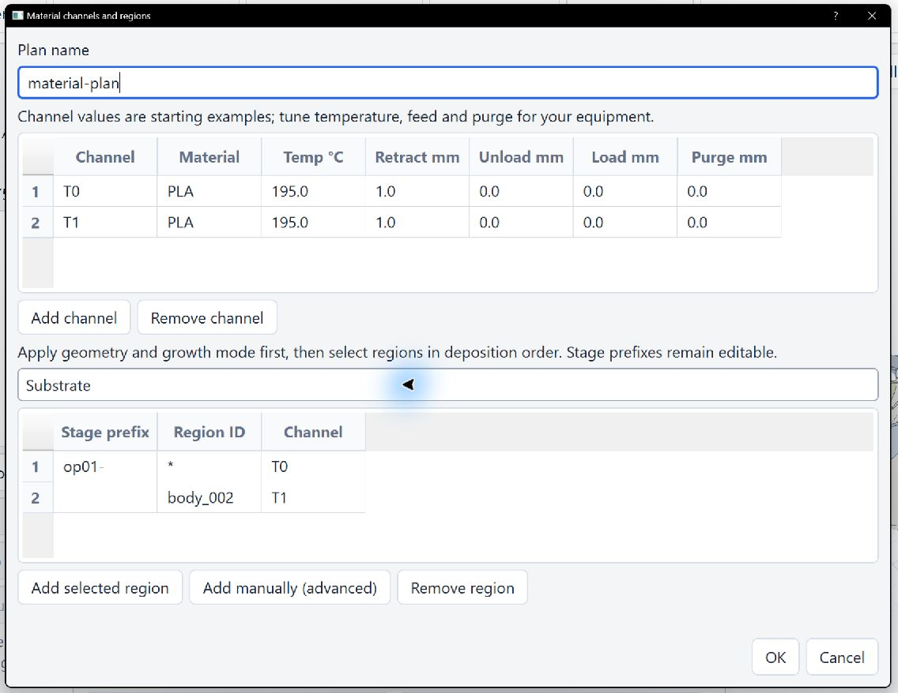

# Multicolour materials and the tool-change station

In Freeform, the material table assigns deposition regions to T0, T1, and other channels. CAD colours do not select filament automatically. Channels may use different colours of the same material, such as red, blue, and yellow PLA for three fan blades.

## Set up a Freeform operation

1. Create and select a solid-fill operation. Select its bodies, substrate, faces, and root edges in the Viewer as described in the [solid-growth method guide](solid_fill_method_en.md). Click **Build candidate from selected Viewer geometry**, verify the roles, and choose **Surface-solid growth** if applicable. Click **Apply** before opening the material table so its choices reflect the current operation.
2. Click **Edit material table**. Add T0, T1, and other channels in the upper table; enter material, temperature, retract, unload, load, and purge lengths. In the region selector, choose the displayed substrate, solid body, or blade and click **Add selected region**. Set the new row's Channel to T0/T1 and add rows in deposition order. Re-selecting a region locates its existing row. Confirming the dialog fills Material plan JSON. Spherical solids and root-outward surface solids use stable body IDs; radial blades currently use per-blade stage choices. The older surface-thickness mode can split one body into several paths, so one stage number should not be assumed to cover that body. For custom assignments, use **Add manually (advanced)** and verify `stage_id`, `region_id`, and `channel_id` in the generated `toolpath.json`.
3. Click Edit tool-change station. Enter calibrated machine-frame nozzle-tip positions for clearance, cutter, exchange, purge, and wipe start/end, plus speeds, wipe passes, and the cutter command. Confirming the form fills Tool-change station JSON. Each station Z must be below clearance Z. A real channel transition without a station blocks NC export.
4. Click Apply and then Generate and validate. Inspect the issues, path preview, and `PAC SERVICE`/`PAC EVENT` records and T commands in the NC. Uncheck Show model to see deposition lines inside the part. Saving the project also saves the plan and station.

The table below shows T0/T1 channels and body-region assignments. Its temperature and filament-length values illustrate the controls; tune them for the actual material, extruder, and machine.



The following JSON is an advanced example for the three-blade fan. `op01-` through `op04-` describe only that example's merged order. For another model, choose its displayed region candidates instead of copying these IDs:

```json
{
  "schema_version": 1,
  "plan_id": "fan-three-colour-pla",
  "channels": [
    {"channel_id":"T0","material_id":"PLA-red","tool_command":"T0","nozzle_temperature_c":195,"purge_length_mm":8,"load_length_mm":20,"unload_length_mm":20},
    {"channel_id":"T1","material_id":"PLA-blue","tool_command":"T1","nozzle_temperature_c":195,"purge_length_mm":8,"load_length_mm":20,"unload_length_mm":20},
    {"channel_id":"T2","material_id":"PLA-yellow","tool_command":"T2","nozzle_temperature_c":195,"purge_length_mm":8,"load_length_mm":20,"unload_length_mm":20}
  ],
  "regions": [
    {"region_id":"*","channel_id":"T0","stage_prefix":"op01-"},
    {"region_id":"*","channel_id":"T0","stage_prefix":"op02-"},
    {"region_id":"*","channel_id":"T1","stage_prefix":"op03-"},
    {"region_id":"*","channel_id":"T2","stage_prefix":"op04-"}
  ]
}
```

Example station input for offline practice only:

```json
{"clearance_z_mm":180,"cutter_xyz_mm":[130,100,80],"exchange_xyz_mm":[140,100,80],"purge_xyz_mm":[150,100,80],"wipe_start_xyz_mm":[160,100,80],"wipe_end_xyz_mm":[170,100,80],"travel_feedrate_mm_min":3000,"wipe_feedrate_mm_min":1200,"wipe_passes":2,"cutter_command":"M98 P100"}
```

`region_id="*"` covers every path in a matching stage; a stable body region uses that body's ID directly. For one specific path, read its exact region ID from the output. Adjacent regions on the same channel do not trigger another change. Initial T0 selection only selects the tool and waits for temperature. An actual change retracts, moves to the cutter and cuts, moves to exchange and unloads the old channel, selects the new channel, waits for temperature, loads, purges, wipes, and returns. Unload length belongs to the old channel; load and purge lengths belong to the new one.

The service route and existing inter-operation travels are checked against already deposited beads using the configured nozzle envelope. At a new blade root, only limited tip contact near the end of the approach is allowed; nozzle-body and other travel collisions still block export. Check the fixture, cutter, cabling, machine frame, firmware macros, and sensors on your equipment. The values above are examples only: set temperature, extrusion lengths, positions, and limits for your own PLA and machine. `machine_executable=false` means that device-specific automated qualification is incomplete. Actual settings and print results depend on testing with your equipment; this project remains under testing and continued improvement.
