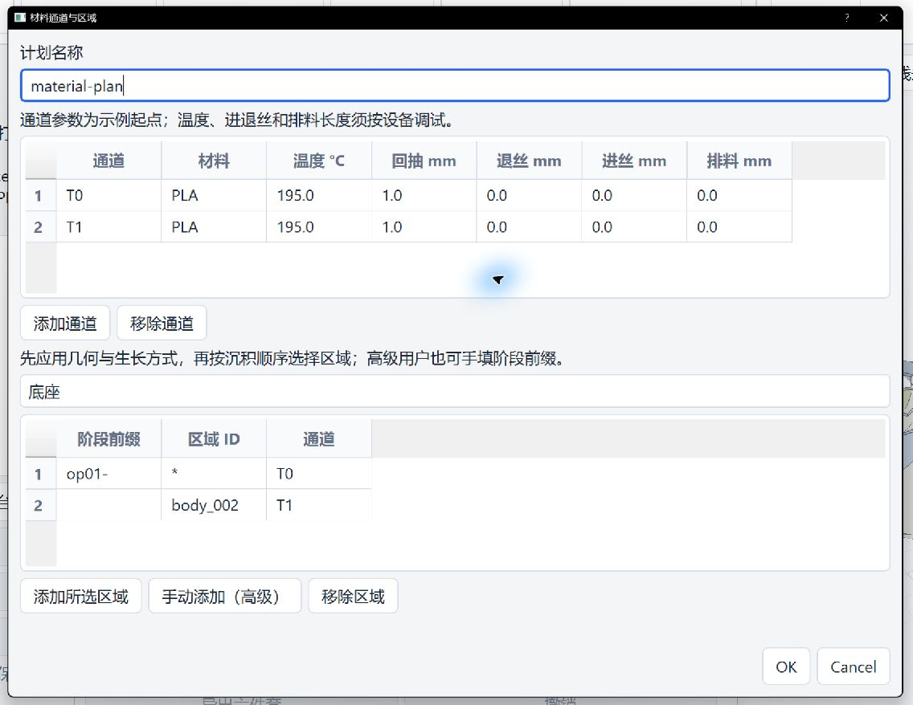
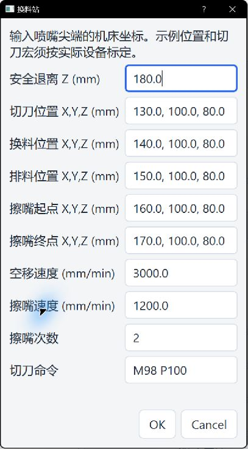

# 多色材料与换料站

Freeform 的材料表把沉积区域分配给 T0、T1 等通道。软件不会根据 CAD 颜色自动选料。每个通道可以使用同一种材料的不同颜色；例如三片叶片分别使用红、蓝、黄 PLA。

## 在 Freeform 中设置

1. 选择 Freeform，创建实体操作。按[实体几何选择说明](solid_fill_method_zh.md)在 Viewer 中选实体、基体、面及根边，点“从 Viewer 已选几何建立候选”，核对角色；`Surface Solid Fill` 还要选择“曲面实体生长方式”。先点“应用”，使材料表读取当前操作的实体角色。
2. 点击“编辑材料表…”，在上表添加 T0、T1 等通道，填写材料名称、温度、回抽、退丝、进丝及排料长度。在区域下拉框选择“底座”“球面实体”“曲面实体”或“叶片”等当前操作候选，点“添加所选区域”，再把新行的“通道”改成所需的 T0/T1。按实际沉积顺序添加；重复选择同一区域会定位已有行。确认后会写入“材料计划 JSON”。球面实体及“从根边向外生长”的曲面实体使用稳定实体 ID；径向叶片当前按各叶片阶段选择。旧“沿侧面厚度叠层”可能把一个实体拆成多条路径，不能把某个阶段编号当成整个实体。需要自定义分区时用“手动添加（高级）”，并用生成后的 `toolpath.json` 核对每个沉积点的 `stage_id`、`region_id` 和 `channel_id`。
3. 点击“编辑换料站…”，填写机床坐标系下标定的喷嘴尖端位置：安全退离高度、切刀、换料、排料、擦嘴起点和终点，并填写速度、擦嘴次数和切刀命令。确认后会写入“换料站坐标 JSON”。站位 Z 必须低于安全退离 Z；没有站位时，真正的 T 通道切换会阻止 NC 导出。
4. 点击“应用”，再点击“生成与检查”。检查问题列表、路径预览及导出 NC 中的 `PAC SERVICE`、`PAC EVENT`、T 指令与相对 E。预览中取消“显示模型”可看清模型内的完整沉积线。保存项目后，换料站设置和材料计划会一起保留。

下图展示 T0/T1 的材料表和实体区域分配。图中的温度与进退丝长度仅用于说明界面，使用时应按材料、挤出机和机床调试。





以下 JSON 是三叶扇案例的高级分配示例。`op01-` 至 `op04-` 只对应这个案例的合并顺序；操作其他模型时，请使用材料表给出的区域候选，不要复制编号：

```json
{
  "schema_version": 1,
  "plan_id": "fan-three-colour-pla",
  "channels": [
    {"channel_id":"T0","material_id":"PLA-red","tool_command":"T0","nozzle_temperature_c":195,"purge_length_mm":8,"load_length_mm":20,"unload_length_mm":20},
    {"channel_id":"T1","material_id":"PLA-blue","tool_command":"T1","nozzle_temperature_c":195,"purge_length_mm":8,"load_length_mm":20,"unload_length_mm":20},
    {"channel_id":"T2","material_id":"PLA-yellow","tool_command":"T2","nozzle_temperature_c":195,"purge_length_mm":8,"load_length_mm":20,"unload_length_mm":20}
  ],
  "regions": [
    {"region_id":"*","channel_id":"T0","stage_prefix":"op01-"},
    {"region_id":"*","channel_id":"T0","stage_prefix":"op02-"},
    {"region_id":"*","channel_id":"T1","stage_prefix":"op03-"},
    {"region_id":"*","channel_id":"T2","stage_prefix":"op04-"}
  ]
}
```

换料站输入格式示例（坐标仅用于离线练习）：

```json
{"clearance_z_mm":180,"cutter_xyz_mm":[130,100,80],"exchange_xyz_mm":[140,100,80],"purge_xyz_mm":[150,100,80],"wipe_start_xyz_mm":[160,100,80],"wipe_end_xyz_mm":[170,100,80],"travel_feedrate_mm_min":3000,"wipe_feedrate_mm_min":1200,"wipe_passes":2,"cutter_command":"M98 P100"}
```

`region_id="*"` 表示匹配阶段的全部路径；稳定的实体区域直接使用该实体 ID。若只改某条路径，请先从导出数据读取确切 `region_id`。同一通道的相邻区域不会重复执行换料。第一次选 T0 只发送 T0 和目标温度；有效换色依次回抽、退出、到切刀、切断、到换料位退丝、选新通道、等待温度、进丝、到排料位排料、擦嘴、返回路径。退丝使用旧通道的长度，进丝和排料使用新通道的长度。

## 安全边界

安全路径由机床站位、五轴姿态和已经沉积的线段计算，逐段检查配置的喷嘴轮廓。软件也检查原有的跨工序空走。新叶片接近叶根时，只允许喷嘴尖端在终点附近与已打印外壳发生有限道宽内的轻微接触；喷嘴锥体或其他空走碰撞仍会拒绝导出。没有喷嘴轮廓或夹具模型时，结果保留 Warning 和离线资格。切刀、夹具、线缆、整机外壳、真实宏和传感器需要按实际设备另外标定与验证。

示例中的 195 °C、长度及位置只用于说明字段。请按自己的 PLA、送料机构、喷嘴、刀臂和机床行程调整；`Tn` 与切刀宏须与实际控制器对应。当前输出中的 `machine_executable=false` 表示尚未完成针对具体设备的自动核验。实际参数和打印效果以用户设备的调试结果为准；本项目持续测试和完善中。
