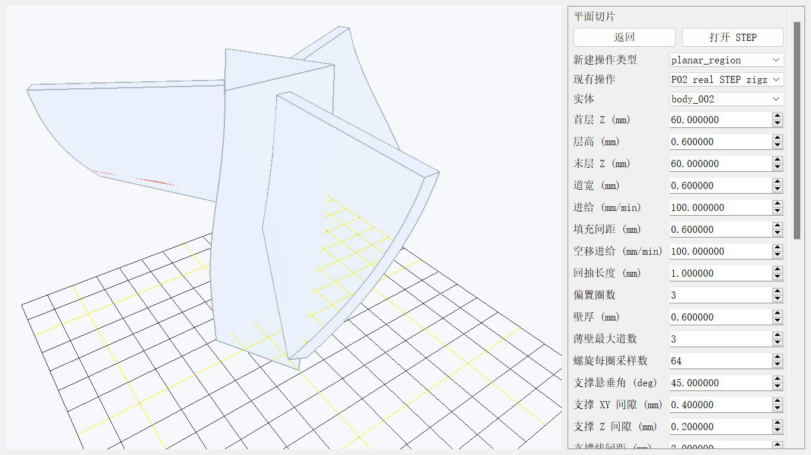
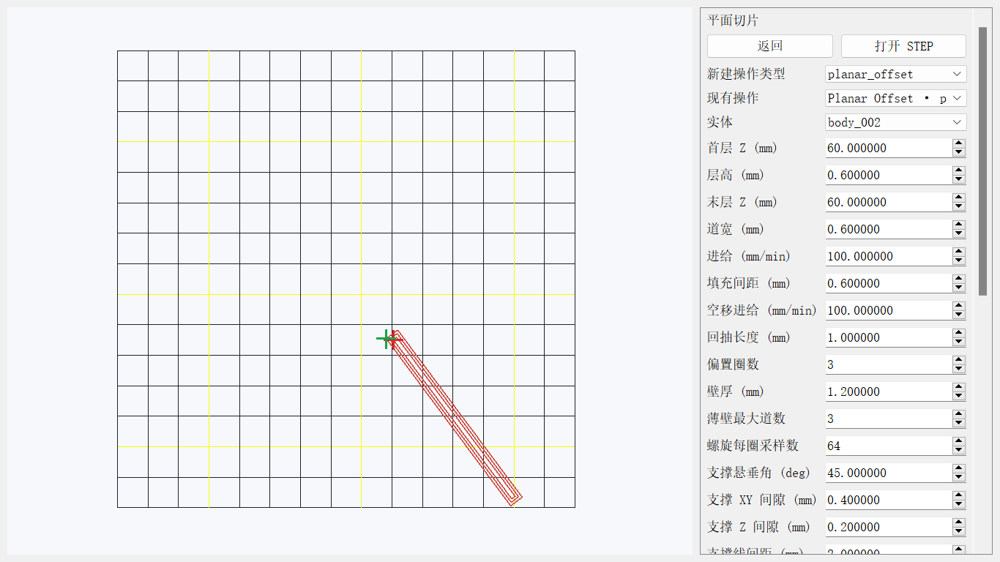
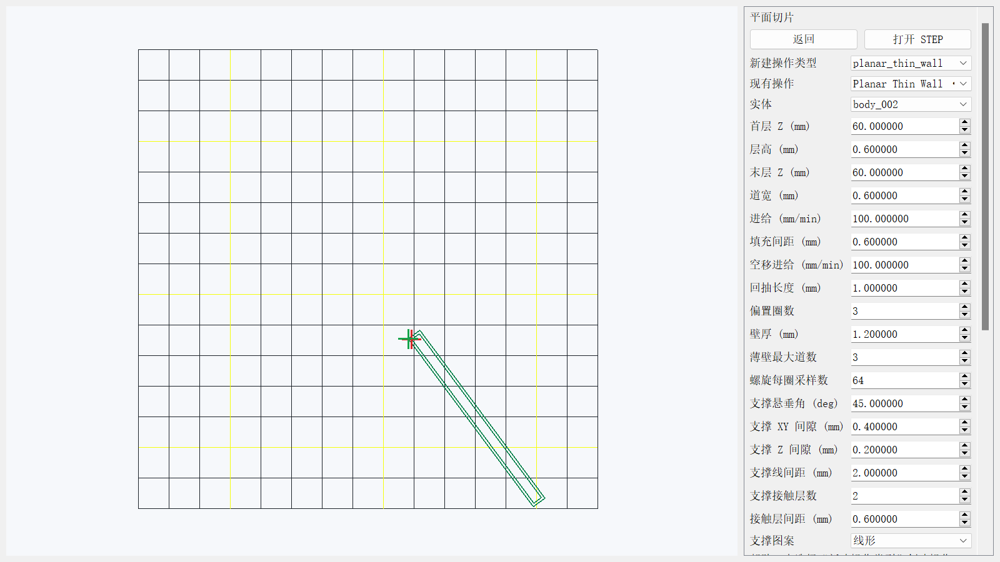
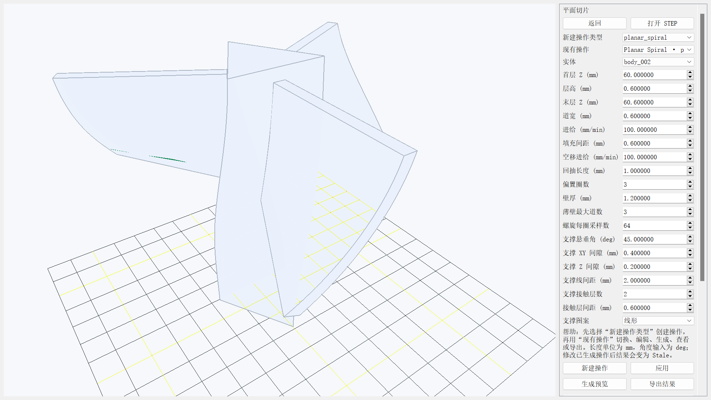

# Planar 平面工作台使用手册

> 初次使用请先完成[学习总册](user_learning_manual_zh.md)的 L01—L06；本页是 Planar 专项参考。随附平面件用于练习区域、层、道距和孔岛判断，示例参数不是其他零件的默认答案。

日期：2026-09-12。Planar 已具备 P01—P07 所述离线功能，阶段状态以进度台账为准。本手册覆盖 Region 截面预览、Zigzag Fill、Offset Fill、Thin Wall、Spiral，以及 buildplate-only 垂直支撑。所有结果都应先查看检查报告和回读状态；本手册不把离线参考结果描述为真实设备资格。

## AUD-02 修复后的使用要求

当前生成资格为 v3，旧 v1/v2 结果需要重新生成。路径操作要求零件、坐标、机型、喷嘴、已审阅材料和装夹全部应用；源 STEP 或这些输入变化会使结果 Stale。Error 禁止导出，按诊断修改输入后点击应用并重新生成；Warning 需查看具体限制。

Zigzag 现检查实际道宽包络与逐区域材料量。三叶扇全高 Z=56.3→95.9、层高/道宽 0.6、间距 0.65 mm 的离线对照为 7475 点，回读通过，采样未覆盖约 5.98%，属于稀疏填充。相同模型间距 0.6 mm 的密排有 5 层过填，禁止导出。pipe2 的 0.6 mm 密排也被阻断；0.4 mm 道宽/层高与 0.5 mm 间距对照可导出，但不代表实心资格。

Spiral 使用中间 Z 的真实实体有限采样；支撑检查完整运动段与目标 CAD，但零件/支撑联合逐层调度和完整喷嘴扫掠仍未验证。下文数值和图片均由本轮 v3 当前源码重新生成；更早的截图只保存在复盘 evidence 中，不再作为当前功能证据。

## 入口、前置条件与范围

从 Workbench 首页选择“平面切片 / Planar Slicing”，或在导入 STEP/STP 后进入该工作台。需要有效 STEP 实体、Setup、Model CS、Build CS、Machine、Nozzle 和 Placement。内部长度单位为 mm，进给为 mm/min；截层使用 Workpiece Build-XY 语义。

可复现实例为 `example/三叶扇/Supportless_sample.stp` 的 `body_002`。P06 证据使用首层 `Z=60 mm`、层高 `0.6 mm`、道宽 `0.6 mm`、进给 `100 mm/min`。Zigzag、Offset 和 Thin Wall 为单层；Spiral 使用 `Z=60.0` 到 `60.6 mm` 两个相邻层。

工作台包含一个预览操作和五个制造操作。`Planar Region` 只显示分层区域、孔和岛，不生成 NC，也不导出六件套；`Planar Zigzag`、`Planar Offset`、`Planar Thin Wall`、`Planar Spiral` 和 `Planar Support` 都进入共享 Toolpath、MachineAxisTrajectory、ValidationReport、后处理与 G-code 回读链。新建类型和现有操作使用两个独立选择框，可在一个项目中切换多个操作及其 Viewer 结果。

## 创建操作与参数

点击“新建操作 / Create operation”，选择 `Planar Region`、`Planar Zigzag`、`Planar Offset`、`Planar Thin Wall`、`Planar Spiral` 或 `Planar Support`，填写下表参数后点击“应用 / Apply”。修改参数、实体或坐标会使已有结果变为 Stale，必须重新生成。

| 参数 | 单位 | 适用操作 | 说明 |
| --- | --- | --- | --- |
| 实体 / Body | — | 全部 | 必填；稳定几何引用参与结果语义哈希。 |
| 首层 Z、末层 Z | mm | 全部 | 截层范围；末层不得低于首层。Spiral 必须形成至少两个相邻层；Support 还要求 `first_layer_z_mm = layer_height_mm`，即首个沉积平面位于 Build Z=0 上方一层高。 |
| 层高 / Layer height | mm | 全部 | 必须大于 0，并受当前道宽高宽比约束。 |
| 道宽 / Bead width | mm | 五种路径操作 | 用于路径、覆盖和材料体积估算。 |
| 进给、空移进给 | mm/min | 五种路径操作 | 分别控制沉积与非沉积移动。 |
| 回抽长度 / Retract length | mm | 五种路径操作 | 路径切换时的回抽与恢复量。 |
| 填充间距 / Line spacing | mm | Zigzag | 往复填充线间距，必须大于 0。 |
| 偏置圈数 / Offset pass count | 次 | Offset | 向内轮廓偏置的最大圈数；窄区、消失区会保留诊断。 |
| 壁厚 / Wall thickness | mm | Thin Wall | 目标壁厚；不足道宽按检查结果处理。 |
| 最大壁道数 / Thin-wall max passes | 道 | Thin Wall | 限制可生成的并行壁道数。 |
| 每轮廓采样数 / Spiral samples per contour | 点 | Spiral | 控制连续 Z 轮廓采样密度。 |
| 悬垂阈值 / Support overhang angle | deg | Support | 相对竖直方向的悬垂判定阈值；范围为 0 至 90，两个端点均不接受。 |
| 支撑 XY 间隙 / Support XY gap | mm | Support | 支撑柱与模型侧壁的水平脱离距离；必须非负。这是有意保留的无支撑区，不应误报为平台不可达。 |
| 支撑 Z 间隙 / Support Z gap | mm | Support | 支撑与接触模型层之间的垂直间隙；必须非负。 |
| 支撑主体线间距 / Support line spacing | mm | Support | 支撑主体 hatch 的线间距；必须大于 0。 |
| 支撑界面层数 / Support interface layers | 层 | Support | 靠近模型的界面层数量，范围 0—100。 |
| 支撑界面间距 / Interface spacing | mm | Support | 界面层 hatch 的线间距；必须大于 0。 |
| 支撑图案 / Support pattern | — | Support | `Lines`（线形）或 `Grid`（网格）；Grid 是相邻层交替正交的 Lines，不在同层重复交叉挤出。 |

### Region 与五种制造操作

- `Planar Region`：检查指定 Z 范围的截面、孔、岛和稳定实体引用。Viewer 可预览区域；该操作没有 MachineAxisTrajectory、G-code 或导出按钮资格。
- `Planar Zigzag`：轮廓优先的往复填充，核对间距、方向、顺序、道宽包络、逐区域材料量与残余。
- `Planar Offset`：从边界向内生成指定圈数的偏置路径；窄区部分消失为 Warning，全部消失为 Error。
- `Planar Thin Wall`：处理开放/闭合薄壁和有限多道；壁厚不足或残余覆盖会给出可定位诊断。
- `Planar Spiral`：受限于单岛无孔且至少两个相邻层，生成连续 Z 路径；多岛、孔或单层输入会拒绝。
- `Planar Support`：从 buildplate 向上建立垂直 Lines/Grid 支撑，分开主体和 interface；范围见 P07 小节。

## 正常流程

1. 打开 STEP，选择 body，确认 Setup 和资源均为有效状态。
2. 新建操作并选择类型；填写参数，点击“应用”。
3. 点击“生成预览 / Generate preview”。路径操作会生成共享 Toolpath、检查报告、Generic XYZAC 离线参考轨迹、G-code 和独立回读。
4. 在三维预览中核对沉积路径、空移、层和模型的相对位置；再查看 Warning/Error 与导出按钮状态。
5. 只有状态为 Ready 或允许导出的 Warning，且没有阻止性 Error 时，点击“导出结果 / Export result”。
6. 用“保存项目 / Save project”保存并重新打开。操作、稳定引用、参数和既有资格摘要会恢复；运行时 Toolpath/G-code 不写入项目文件，所以原 Ready/Warning 会在重开后显示 Stale，重新 Generate 后才能查看或导出当前结果。
7. “撤销 / Undo”和“重做 / Redo”覆盖创建、编辑等领域命令；撤销参数修改会恢复上一份有效 Viewer/导出结果。问题列表是可定位索引，激活条目会显示完整 code/object，并尽量定位到对应层或路径点。

### P07：buildplate-only 垂直支撑

选择 `Planar Support` 后，系统从首层构建平面向上投影可达的支撑柱，只保留与 buildplate 连通的竖直支撑；支撑主体和靠近模型的 interface 分开记录。悬垂判定使用 `Support overhang angle`，支撑 hatch 可选 `Lines` 或 `Grid`。该操作适合需要从平台起撑的悬垂区域，不提供从模型中途起撑、树状/自由形支撑或多材料支撑。

正常操作：绑定一个有效 STEP body，将 `first_layer_z_mm` 设为与 `layer_height_mm` 相等，使首个沉积平面位于 Build Z=0 上方一层高，再设置末层 Z 和其余 P07 参数，点击“应用 / Apply”后“生成预览 / Generate preview”。在三维预览中分别检查浅绿色 `support_material` 主体和深绿色 `support_interface` 接触层，确认 Warning/Error、路径顺序和模型间隙，再按通用流程导出、保存和重开。支撑生成时间较长时可点击“取消生成 / Cancel generation”；取消命令通过同一领域服务触达活动生成，上一份有效结果和 Viewer 保留。

以下情况应按问题列表处理：

- `planar.support_not_required` 表示没有检测到需要支撑的悬垂；本次生成不产生可导出结果。它是明确的无输出条件，不是几何内核崩溃；检查模型方向、阈值和层范围后，可保留模型原状或改用普通路径操作。
- `planar.support_region_too_narrow` 表示候选区域窄于当前道宽/间距，不能静默生成；减小道宽或线间距、调整间隙/界面间距，或接受该区域不支撑后重新生成。
- `planar.support_buildplate_first_layer_required` 表示首层 Z 未等于层高，截断了从 buildplate 开始的支撑链；将 `first_layer_z_mm` 改为 `layer_height_mm` 后 Apply 并重新生成。
- `planar.support_unreachable_from_buildplate` 仅表示区域确实被下方模型阻断或无法与 buildplate 连通；XY gap 造成的有意无支撑区不属于此错误。检查下方几何、模型朝向和层范围，必要时拆分模型或改用受支持的几何输入。
- `planar.support_layers_insufficient` 表示至少需要两个有效层；提高末层 Z 或修正层高后重新生成。
- `planar.support_parameter_invalid` 表示角度、间隙、间距、界面层数或图案不在允许范围；按字段修正后 Apply。
- 取消生成：长时间生成可安全取消；上一份有效 Ready 结果保留，确认输入后再重新生成。

## 脚本与 HTTP

受限脚本和 HTTP 与 GUI 使用同一个 `PlanarCommandService`。脚本命令包括 `planar.create_operation`、`planar.set_operation`、`planar.generate_operation`、`planar.export_operation`、`planar.cancel_generation`、`planar.issues`、`planar.validate`、`undo` 和 `redo`。HTTP 对应入口为 `/planar/operation/create`、`/planar/operation/set`、`/planar/operation/generate`、`/planar/operation/export`、`/planar/generation/cancel`、`/planar/issues`、`/planar/validate`、`/planar/undo` 和 `/planar/redo`。创建和设置请求携带 `operation_type`、`operation_id`、`body_id` 及允许的参数字段；生成、导出和取消仍遵守 Ready/Warning/Error/Stale 与事务回滚规则。

## P07 导出与能力边界

允许导出的 P07 结果沿用六件套：`main.gcode`、`toolpath.json`、`machine_axes.csv`、`warnings.json`、`preview.json`、`manifest.json`，当前算法版本为 `planar-support-product-v3`。用 `toolpath.json` 检查 `planar_support`、`planar_support_interface` 等 stage/region 语义，用 `warnings.json` 判断是否存在未服务区域；`main.gcode` 的可视化仍应结合 G-code 预览页核对。

P07 只实现 buildplate-only 的垂直支撑和 Lines/Grid hatch。生成链会检查每条支撑 travel/deposition 完整中心线段与目标 CAD 的相交情况；当前仍没有零件 Toolpath、已打印状态、支撑/零件联合逐层调度和完整喷嘴体扫掠，因此会保留 `planar.support_joint_schedule_unverified` Warning。它不保证真实打印中的支撑强度、可拆卸性、热传导、材料兼容、复杂悬空腔体或现场碰撞安全。Generic XYZAC、离线回读和 OpenGL 预览不能替代控制器注册、机床标定、试切和现场资格。

实现参考成熟切片器公开可观察的“悬垂检测→平台连通支撑→主体/界面分层→G-code”流程；本项目为 clean-room 独立实现，未复制或改写 CuraEngine、PrusaSlicer 的源码、测试或内部数据结构。相关项目采用 AGPLv3，许可证与来源边界见 [`reference_research.md`](../planning/reference_research.md) 的 OS-04、OS-05；本项目当前不因此改变自身发布许可。

P07 的解析浮空梁保留了平台下方四个空模型层，并在其下生成主体与 Interface 路径。证据结果含 66 个 Toolpath 点、33 条沉积段，独立复算和记录材料体积均为 61.86 mm³，G-code 为 66/66 点回读通过，六件套齐全。Generic XYZAC 的回转奇异以 Warning 保留，所以这是可导出的 Warning，不写成无警告的 Ready。

下图是道宽大于支撑域后的真实错误示例。长错误码完整换行，导出按钮禁用；恢复道宽后可重新生成，见 [中文恢复截图](assets/planar/current_p01_p07/p07/05_support_error_recovered_zh_1600x900.png)。

修改支撑线间距后旧结果进入 Stale、保留预览并禁止导出；[Stale 截图](assets/planar/current_p01_p07/p07/06_support_stale_en_1920x1080.png)及[重新生成后的恢复截图](assets/planar/current_p01_p07/p07/07_support_stale_recovered_zh_1600x900.png)记录了该流程。全部 9 个 P07 UI 案例覆盖顶部参数、底部帮助/问题列表、中英文与 1366×768、1600×900、1920×1080，横向滚动、可见按钮裁切和控件碰撞均为 0。

仓库真实复杂 STEP `Supportless_sample.stp` 的 `body_002` 已成功生成 9,662 点，材料量 5,663.310163 mm³，9,662/9,662 回读通过并导出六件套。另一个 `example/扇叶/风扇扇叶(1).STEP` 的 `body_001` 在 Z=57 mm 需要 0.00100791389 mm 端点修正，超过 0.001 mm 上限，进入 Error 且未导出。成功与严格拒绝结果见 [当前 P07 真实模型证据](../reviews/evidence/2026-09-12_p07_planar_final/real_model/)；当前 UI 摘要见 [稳定图片清单](assets/planar/current_p01_p07/p07/summary.json)。

P06 真实 STEP 摘要如下。四项均生成六件套，G-code 回读的坐标、挤出、进给和顺序比对均通过；`Warning` 仍须按下节含义处理。

| 操作 | 参数要点 | 路径点 | 结果摘要 |
| --- | --- | ---: | --- |
| Zigzag | 单层，间距 0.6 mm | 142 | 材料量 120.023964 mm³，回读通过。 |
| Offset | 单层，3 圈偏置 | 16 | 材料量 108.863714 mm³，回读通过。 |
| Thin Wall | 单层，壁厚 0.6 mm、最多 3 道 | 6 | 材料量 38.015905 mm³，残余覆盖 Warning，回读通过。 |
| Spiral | 两层，Z=60.0–60.6 mm，64 点/轮廓 | 129 | 连续 Z 路径；离散层投影 Warning，回读通过。 |

上图为 Offset 正常结果。英文等距视图见 [Offset 英文截图](assets/planar/current_p01_p07/p06/02_planar_offset_en_1600x900.png)。

Thin Wall 的英文模型叠加视图见 [Thin Wall 英文截图](assets/planar/current_p01_p07/p06/04_planar_thin_wall_en_1920x1080.png)。残余覆盖 Warning 不等于失败，但表示当前参数与区域未完全覆盖，需审阅后再使用导出结果。

Spiral 的英文顶视图见 [Spiral 英文截图](assets/planar/current_p01_p07/p06/06_planar_spiral_en_1366x768.png)。它必须至少跨两个相邻层；单层输入会被拒绝。

## Warning、Error 与恢复

| 提示或状态 | 含义 | 恢复动作 |
| --- | --- | --- |
| `planar.spiral_layers_insufficient` | Spiral 没有至少两个相邻层。 | 把末层 Z 调高至少一个有效层高，应用后重新生成。 |
| `planar.coverage_residual_high` Warning | 路径未覆盖完整采样区域。 | 检查壁厚、道宽、最大壁道数和区域；需要完整覆盖时调整参数或改用合适操作，再生成。 |
| `planar.spiral_discrete_layer_projection_only` Warning | Spiral 使用离散层投影近似。 | 审阅最大投影偏差和预览；它不代表连续实体资格。 |
| `xyzac.rotary_singularity` Warning | 离线参考轴轨迹在回转奇异邻域保留了 C 轴。 | 查看 `warnings.json` 与机型约束；不得据此认定真实控制器可运行。 |
| 参数、坐标或资源 Error | 层高、道宽、进给、Setup 或资源不合法，或运动检查阻止导出。 | 按问题列表修正具体字段；Error 存在时导出保持禁用。 |
| Stale | 参数、实体引用、坐标或资源在生成后改变。 | 不使用旧结果导出，重新 Generate。 |
| 取消生成 | 用户取消或后台任务中断。 | 上一份 Ready 结果保留；确认输入后重新生成。 |

此图是错误示例，导出按钮被禁用。将末层改为相邻层后，生成与回读恢复成功：

## 导出与证据

每次允许导出的路径操作生成六件套：`main.gcode`、`toolpath.json`、`machine_axes.csv`、`warnings.json`、`preview.json` 与 `manifest.json`。`toolpath.json` 保留 operation、layer、region、事件和材料语义；`machine_axes.csv` 仅为参考轴轨迹。真实 STEP 四操作的清单、SHA-256 和回读详情见 [当前 P01—P06 真实模型摘要](../reviews/evidence/2026-09-12_p07_planar_final/real_model/final_p01_p06/summary.json)。

## 能力边界

Generic XYZAC 仅为离线参考 profile，用于轴轨迹、格式和回读检查。控制器语义、真实机床标定、现场碰撞资格和试切沉积均未验证。Qt widget grab 是项目 OpenGL 查看器的直接渲染截图，并非真人点击流程或实机证据。

Planar 流程参考 CuraEngine 与 PrusaSlicer 的公开可观察行为，例如“截层→周边→填充→排序→G-code”。两者均为 AGPLv3；本项目未复制、翻译或改写其源码、测试或内部数据结构。固定来源和许可证边界见 [`reference_research.md`](../planning/reference_research.md) 的 OS-04、OS-05。
