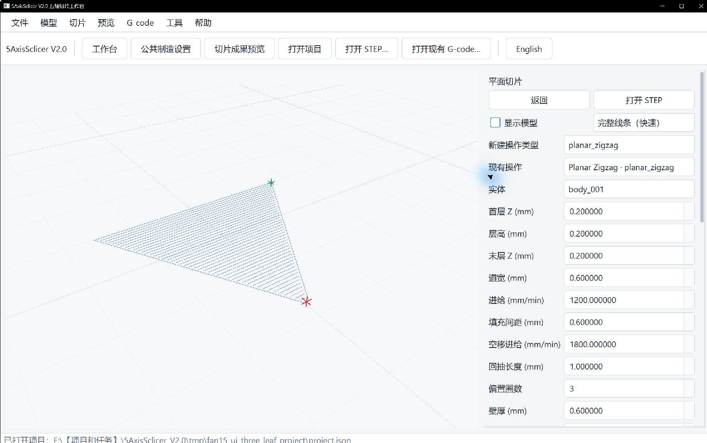
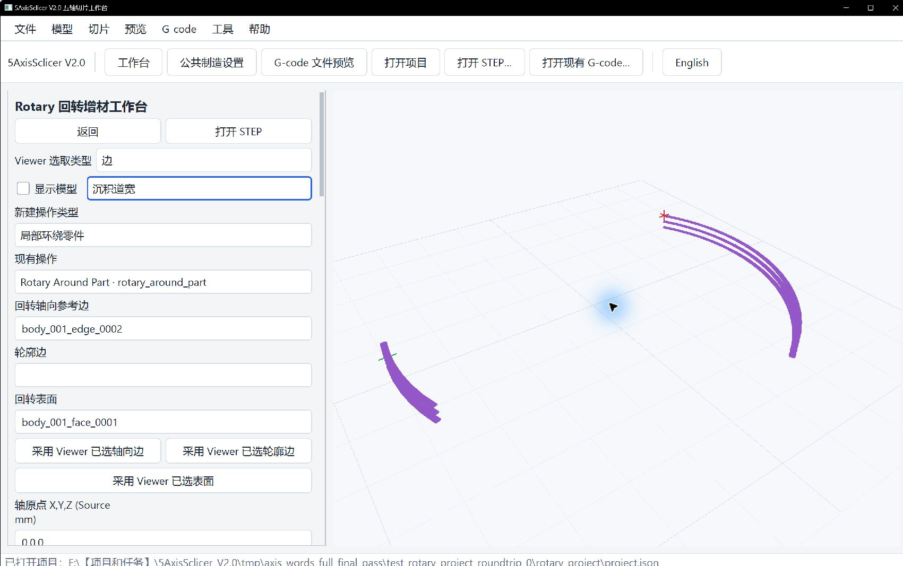
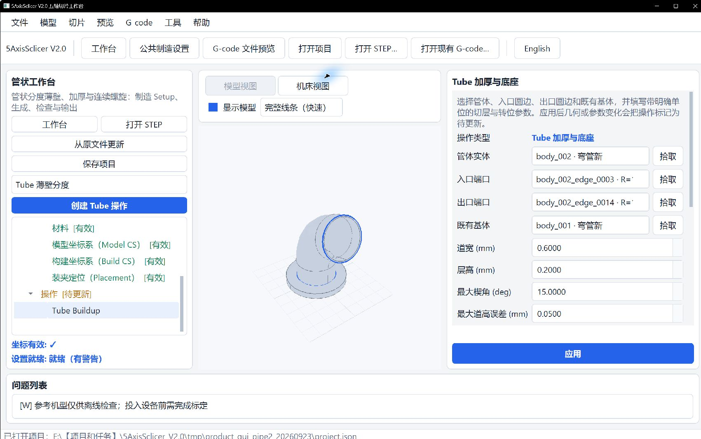
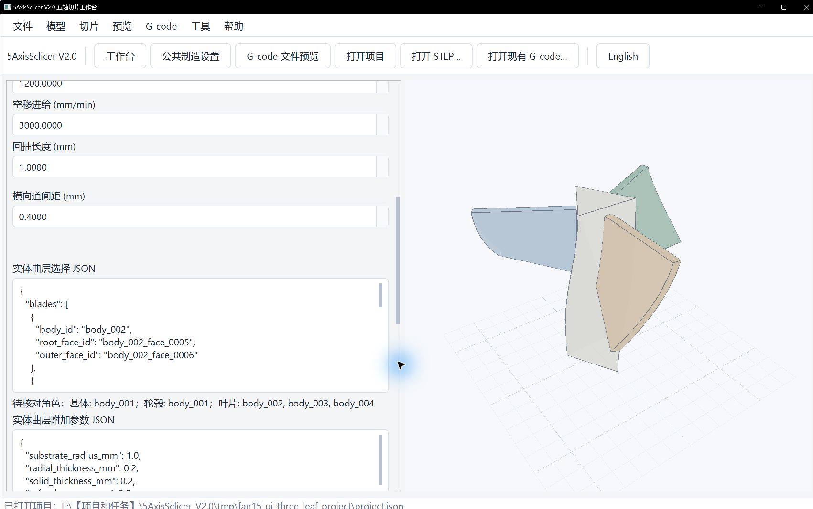
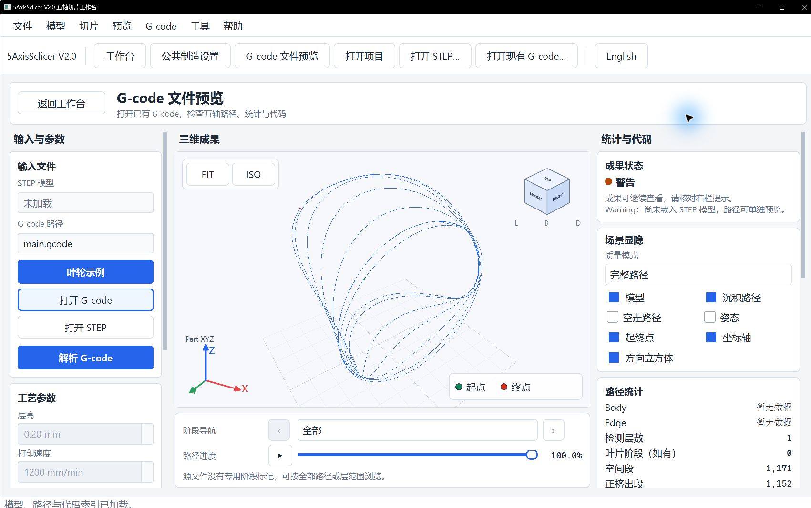

# First Slice: Click-through Guide to Five Workbenches

Complete manufacturing Setup, choose a Workbench that matches the geometry and process, then inspect the path and NC readback. IDs, dimensions, and parameter values in screenshots are examples only. Reselect geometry and qualify settings for your own model and equipment. See each Workbench guide for detailed parameters and recovery.

| Goal | Section | Suitable geometry |
| --- | --- | --- |
| Planar layers, regions, and supports | [Planar](#1-planar-slicing) | Geometry with planar slices |
| Deposit along one or more edges | [Curve](#2-curve-deposition-along-edges) | Ordered edge chain |
| Build around a fixed axis | [Rotary](#3-rotary-fixed-axis) | Cylindrical or conical surface |
| Build along a curved tube centreline | [Tube](#4-tube-growth) | Single tube with constant circular section |
| Build on trimmed surfaces or solids | [Freeform](#5-freeform-surfaces-and-solids) | Guide faces/edges or explicitly assigned solid roles |
| Inspect existing code | [G-code preview](#6-view-existing-g-code) | Existing NC/G-code |

## 0. Set up every Workbench

1. Start `run_app.py` or `scripts/run_app.ps1`, then open your STEP/STP model. Importing into the model preview alone does not create a manufacturing operation.
2. Open **Common Manufacturing Setup**. In **Part**, mark each closed body that belongs to the build. Apply **Machine → Model CS → Build CS → Placement** and review **Nozzle** and **Material**. Apply or confirm each draft.
3. Return to Workbench and check **Setup Ready**. Use the issue list to resolve Errors. Review reference-machine Warnings; they do not qualify a real machine.

The left Manufacturing Setup panel in Planar, Curve, Rotary, and Freeform shows whether settings are shared or Workbench-specific. Tube edits Setup through its project tree.

### Common and Workbench-specific settings

To share settings across Workbenches, edit Common Manufacturing Setup and return. To customize one Workbench, choose **Import Common Setup into this Workbench**, edit and apply its copy, then save the project. **Save to Common Manufacturing Setup** publishes the copy to other Workbenches. **Use Common Setup** discards the local copy and rebinds it to shared settings. These scope changes can make old paths Stale; regenerate them. Operation values such as layer height and bead width remain specific to that operation.

## 1. Planar slicing

Choose **Planar Slicing**, then create **Planar Region** to inspect sections or choose Zigzag, Offset, Thin Wall, Spiral, or Support for a path. Select the body, set layer range and process values, and click **Apply**. Support is vertical from the build plate only; its first-layer Z equals the layer height. Click **Generate Preview**. Keep the model visible to check placement; hide it and use **Full lines (fast)** to inspect occluded paths. Region is inspection-only and cannot export NC.

The screenshot uses one layer of `body_001` from a fan STEP. It demonstrates path visibility, not a complete fan program. Reselect the body, layer range, and process values for your model. See the [Planar guide](planar_workbench_en.md).

## 2. Curve deposition along edges

Choose **Curve Workbench** and create Buildup (one bead), Multi-pass Buildup (multiple layers), or Offset Buildup (side-by-side passes). Set Viewer selection to **Edge**, select edges in deposition order, and select an adjacent face when a normal is needed. Click **Use selected Viewer edges** and verify order, reverse flags, and face ID. Apply parameters and generate. For curves without an authoritative adjacent face, use a defined user direction. See the [Curve guide](curve_workbench_en.md).

Selection alone does not create or generate an operation.

## 3. Rotary fixed-axis deposition

Choose **Rotary Workbench** and create Spiral, Thin Wall, or Around Part. Select an axis edge and click **Use selected axis edge**, then select a coaxial cylindrical/conical face and click **Use selected surface**. Select an optional profile edge separately. Verify axis, zero direction, angular regions, and process values; apply geometry and parameters, then generate. Show the model to verify the selected surface, then hide it and inspect the full path. Angular intervals crossing 0° must be unwrapped in the intended direction.

The two regions shown are an example only. Reselect axis, surface, and intervals for your model. A freeform blade surface is not a cylindrical face. See the [Rotary guide](rotary_workbench_en.md).

## 4. Tube growth

Enter **Tube Workbench**, complete Setup, choose an operation type, and create it. Use the **Pick** controls for the tube body, inlet edge, outlet edge, and—when needed—substrate. Confirm that none of the fields are blank and that inlet-to-outlet direction matches the intended build. Apply operation values, generate, then open **View path**. Check layer support, base connection, indexing moves, and travel against deposited material.

The IDs shown belong only to that STEP model. Stale means the saved operation needs regeneration. See the [Tube guide](tube_workbench_en.md).

## 5. Freeform surfaces and solids

In **Freeform Workbench**, the new-operation selector controls the next operation; the existing-operation selector identifies the one being edited. Surface and Thin Wall need guide edges and adjacent faces. Select edges and faces in the Viewer, then click **Use selected Viewer edges** and verify order, reversals, and face group. Solid-fill modes require explicit geometric roles: spherical body, surface body and root geometry, or hub, blades, and growth axis. Click **Build candidate from selected Viewer geometry** and inspect each role against the model.

For **Surface Solid Fill**, choose **Layers through surface thickness** or **Grow outward from root edge** in **Surface-solid growth**. The outward method requires a supported root edge. Check bead width and layer height, then click **Apply**. For multiple colours, open **Edit material table**, choose a body or stage in the region selector, click **Add selected region**, and assign each row to T0/T1. Apply again after editing materials. See the [material guide](material_channels_en.md) for channels and station settings.

The IDs and roles shown belong to the example STEP. Generate and inspect whether the first beads attach to the substrate, later layers follow the chosen growth direction, and travel avoids the deposited part. Export is enabled only when the current result allows it. Choose values for your own model and equipment; the illustrated settings apply only to the example. See the [Freeform guide](freeform_workbench_en.md) and [solid-growth method guide](solid_fill_method_en.md).

## 6. View existing G-code

Choose **G-code File Preview** or **Open Existing G-code…** and select an existing file. Open the matching STEP only when needed. Use FIT, zoom, and scene visibility controls for model, extrusion, and travel; scroll the right panel for statistics and code context. Confirm the source controller semantics before interpreting rotary axes.

The screenshot contains G-code only. See the [G-code preview guide](gcode_preview_en.md).

## 7. Finish each generation

Review state and issues: Error blocks export; Stale means inputs changed and require regeneration; review every Warning. Export only an allowed Ready/Warning result to a dedicated empty folder or a recognizable previous six-file output folder. Check all six files: `main.gcode`, `toolpath.json`, `machine_axes.csv`, `warnings.json`, `preview.json`, and `manifest.json`. Review readback and `machine_executable`; offline verification is not real-machine qualification.

Save the project. After reopening, runtime results are Stale and must be regenerated. For a new model, select geometry, coordinates, and parameters again; do not copy example IDs. Research is unavailable; choose a supported Workbench.
