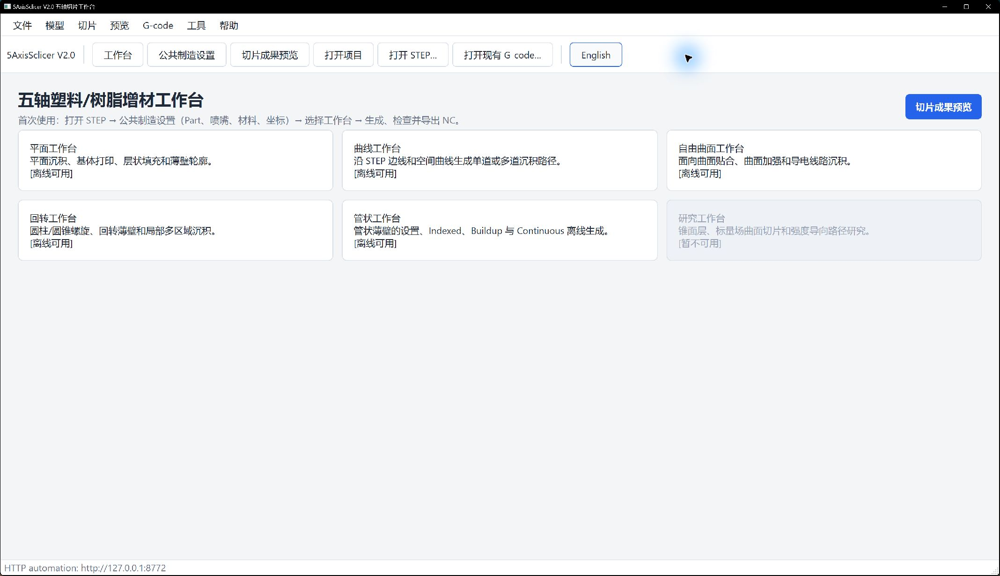
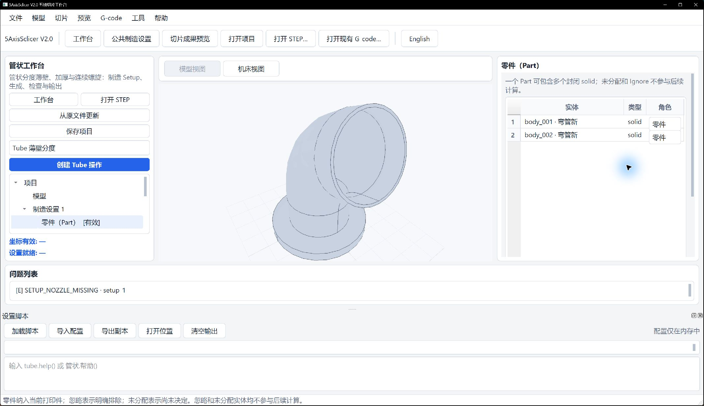
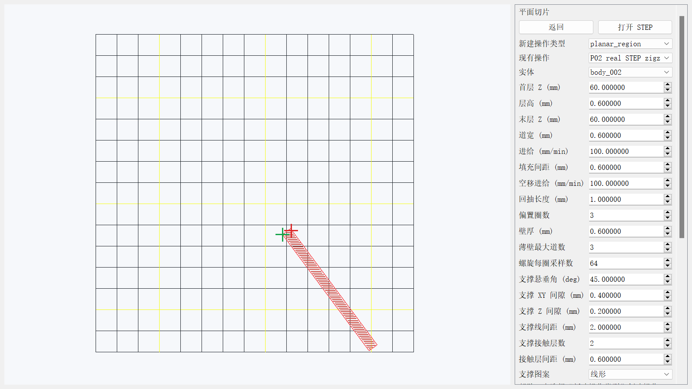
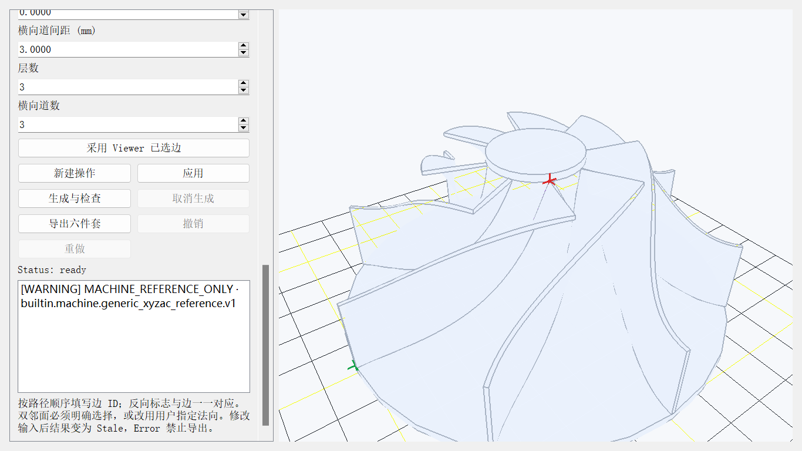
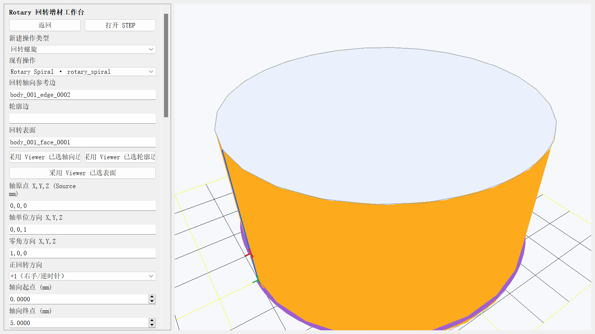
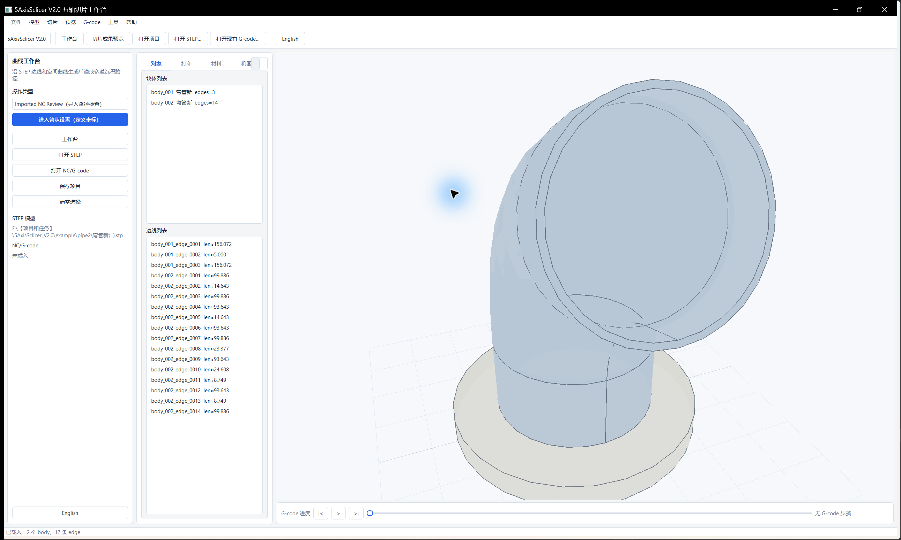
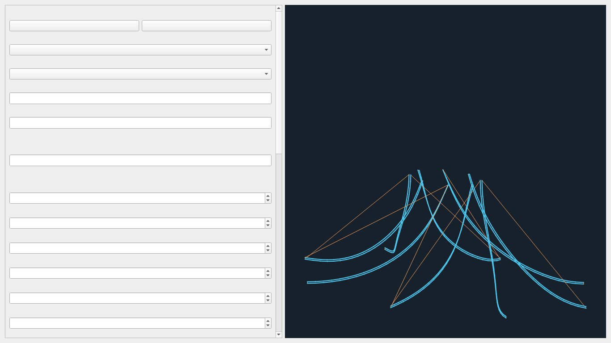
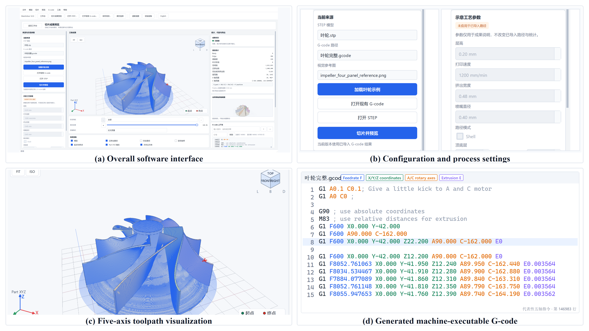

# 五个工作台：照着界面完成第一次切片

先完成公共制造设置，再选与几何和生长方式相符的工作台，最后检查路径和 NC 回读。图中的 ID、尺寸和参数只用于演示；自己的 STEP 必须重新选几何、核定工艺。界面图和路径图仅用于学习离线操作，不代表实机打印。参数解释和故障处理见各工作台手册。

| 要做什么 | 进入哪节 | 适用对象 |
| --- | --- | --- |
| 平面逐层、区域和平台支撑 | [Planar](#1-planar平面切片) | 平面截层实体 |
| 沿一条或多条边堆积 | [Curve](#2-curve沿边沉积) | 有序 edge 链 |
| 绕一根固定轴打印 | [Rotary](#3-rotary固定轴回转) | 圆柱或圆锥面 |
| 沿弯曲管中心线生长 | [Tube](#4-tube管体生长) | 单支恒定圆截面管 |
| 沿修剪曲面或实体生长 | [Freeform](#5-freeform曲面与实体) | 导引面/边，或明确实体角色 |
| 只查看已有程序 | [G-code 预览](#6-查看已有-g-code) | 已有 NC/G-code |

## 0. 所有工作台先做 Setup

1. 在仓库根目录运行 `run_app.py`（或 `scripts/run_app.ps1`）。进入工作台后打开自己的 STEP/STP。若只是导入到模型预览页，仍须进入制造工作台创建操作。
2. 点顶部“公共制造设置 / Manufacturing Setup”；在 **Part** 中把参与打印的封闭实体标为 Part，其他实体不要误选。依次应用 **Machine → Model CS → Build CS → Placement**，并检查 **Nozzle** 和 **Material** 已审核。每页有草稿时点“应用”或“确认”。
3. 回到工作台首页。检查状态“设置就绪”；如果为 Error，点问题列表查缺少的资源或坐标。参考机型的 Warning 需要保留并审阅，不代表可上机。

在右侧“角色”列选择“零件”，向下滚动并点“确认”。左侧显示“零件（Part）[有效]”后，再处理问题列表中的喷嘴和其他资源。Model CS 的三参考编辑位置见[坐标设置图](assets/tube_coordinate_setup/03_model_cs_editor.png)，完整说明见[Setup 手册](tube_coordinate_setup_zh.md)。

如果底部“设置脚本”占用画面，可在顶部“工具”菜单取消勾选“设置脚本”；需要脚本操作时再打开。

## 1. Planar：平面切片

1. 首页点“平面切片 / Planar Slicing”；在操作类型中选 `Planar Region` 先看截面，或选 `Zigzag`、`Offset`、`Thin Wall`、`Spiral`、`Support` 之一生成制造路径。
2. 点“新建操作 / Create operation”，在 Objects/Viewer 选要切的 body，填写首层、末层、层高、道宽等参数，点“应用 / Apply”。`Support` 的首层 Z 应等于层高，它只支持从 buildplate 起的垂直支撑。
3. 点“生成预览 / Generate preview”；在三维视图核对孔、岛、层、沉积和空移与 STEP 的位置。`Region` 仅看区域，不能导出 NC。

具体操作差异、参数和失败恢复见[Planar 手册](planar_workbench_zh.md)。

## 2. Curve：沿边沉积

1. 首页点“曲线工作台 / Curve Workbench”，选 `Buildup`（单道）、`Multi-pass Buildup`（多层）或 `Offset Buildup`（横向多道）并新建操作。
2. Viewer 切换 edge 选择模式，按沉积方向逐条选边，点“采用 Viewer 已选边”；检查左侧边链顺序和每条反向标志。双邻面的 edge 还须明确选邻面，或填写用户指定方向。
3. 输入道宽、采样步长和对应的层/道参数，点“应用”，再点“生成与检查”。在右侧追踪起点、终点、道间距及法向，遇到断链或 trim 越界应回到选择步骤。

选边顺序、反向和法向判断见[Curve 手册](curve_workbench_zh.md)。

## 3. Rotary：固定轴回转

1. 首页点“Rotary 回转增材工作台”，选 `Spiral`、`Thin Wall` 或 `Around Part`，点“新建操作”。
2. Viewer 切 edge 并选轴向参考边，点“采用 Viewer 已选轴向边”；再切 face 并选同轴圆柱/圆锥面，点“采用 Viewer 已选表面”。可选轮廓边要单独采用。仅填写数值轴不足以生成产品。
3. 核对轴、零角、角度区域和工艺值，点“应用几何与参数”→“生成与检查”。检查路径确实围绕所选轴，跨 0° 的角区间按连续方向展开。

叶片自由曲面不能选作圆柱面；示例和轴语义见[Rotary 手册](rotary_workbench_zh.md)。

## 4. Tube：管体生长

1. 首页进入“管状工作台 / Tube Workbench”；完成第 0 节 Setup，在左侧创建 `Tube Thin-Wall Indexed`，或由操作类型选择 `Buildup` / `Continuous`。
2. 在 Objects/Viewer 选管体，并绑定入口圆边、出口圆边；若操作需要基体，再选既有基体。检查中心线由入口通向出口，不要把弯管当成单一固定轴 Rotary。
3. 输入道宽、层高、弦误差和该模式需要的参数，点“应用”→“生成与检查”。重点看每层是否由已打印材料承接、转位/空移是否避让、底座是否来自所选 CAD。

界面入口图展示模型导入位置；模式选择、生成和适用范围见[Tube 手册](tube_workbench_zh.md)。导出前应检查逐层承接、空移与问题列表。离线检查不能代替机床碰撞与试打验证。

## 5. Freeform：曲面与实体

1. 首页点“自由曲面工作台 / Freeform Workbench”，选择模式并新建操作。`Surface` 和 `Thin Wall` 需要导引 edge 与明确邻 face；先在 Viewer 选几何，再核对左侧稳定 ID 和面组。
2. 按模式填写导引线/面组、道宽、层数及材料计划，点“应用”→“生成与检查”。右侧放大看首道能否贴住已有材料、相邻道是否循曲面而非平面横扫。
3. `Spherical Solid Fill`、`Surface Solid Fill`、`Radial Solid Fill` 使用角色选择与模式专属几何/工艺字段。分别核对球心及球面实体、承载/对面与根边、hub/叶片与旋转轴；不要把实体模式当成只选一条导引边的薄壁模式。

图为导引线模式示意。导引模式见[Freeform 手册](freeform_workbench_zh.md)，实体生长的几何选择和适用条件见[完整实体方法](fan15_solid_fill_method_notes.md)。大型操作可能耗时较长；生成完成前不要将旧预览当作当前结果。

## 6. 查看已有 G-code

进入 `Imported NC Review`，打开已有 G-code；需要对照时再叠加 STEP。用层范围、沉积/空移和角色筛选检查路径，并点路径段看对应代码。旧程序的旋转轴含义未经确认时，只看 Machine XYZ；不能把旧 B 直接当成当前 C。

定位和坐标语义见[G-code 预览手册](gcode_preview_zh.md)。

## 7. 每次生成后的共同收尾

1. 看状态和问题列表：`Error` 禁止导出；`Stale` 表示输入变了，须重新生成；`Warning` 要逐项核对。点预览的沉积/空移、层和姿态，并比对所选 STEP 几何。
2. 只有允许导出的 Ready/Warning 才点“导出结果”，检查六件套：`main.gcode`、`toolpath.json`、`machine_axes.csv`、`warnings.json`、`preview.json`、`manifest.json`。核对清单的回读状态与 `machine_executable`；当前参考机型/自有 AC 的离线验证不等于实机资格。
3. 点“保存项目”，重新打开后旧运行时结果会是 Stale，再点 Generate 才能取得当前导出资格。新模型应重新选择 body/face/edge、坐标和参数，不能复制演示 ID。

判断标准、错误恢复和迁移练习见[学习总册](user_learning_manual_zh.md)；高级参数见[手册中心](README.md)。Research 入口不可用，请选择上述工作台。
