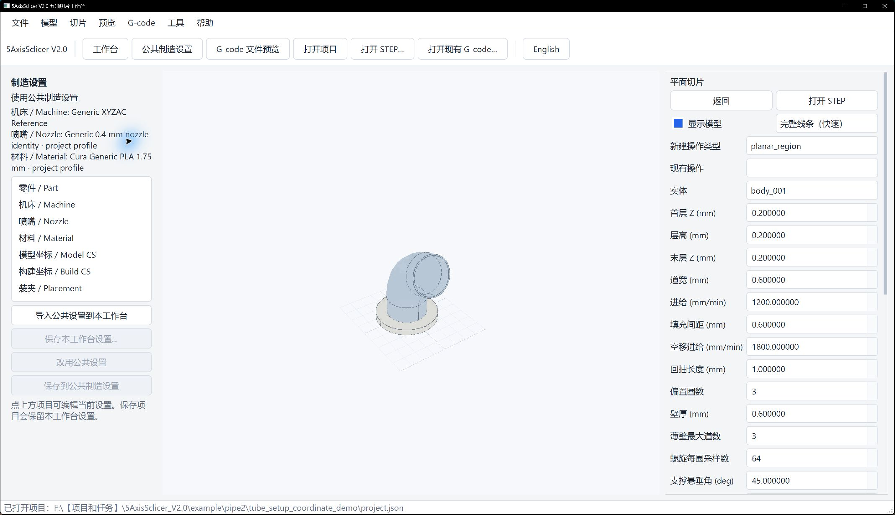
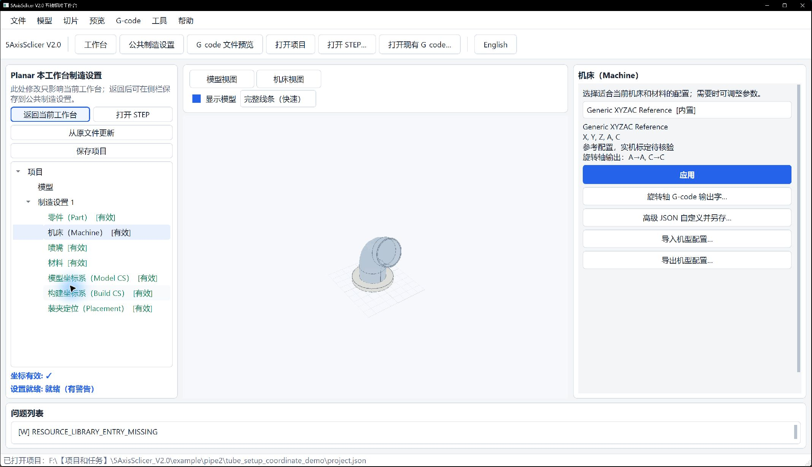
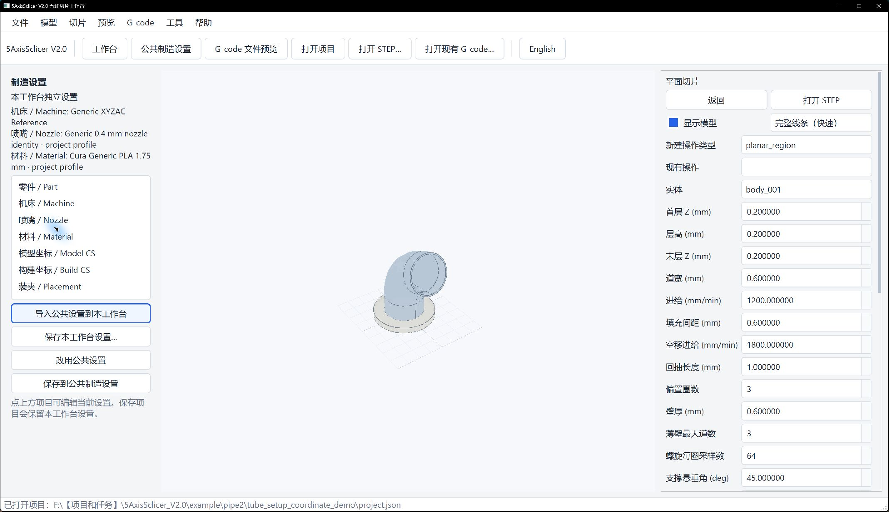

# 五个工作台：照着界面完成第一次切片

先完成公共制造设置，再选与几何和生长方式相符的工作台，最后检查路径和 NC 回读。图中的 ID、尺寸和参数只用于演示；自己的 STEP 必须重新选几何、核定工艺。实际参数和打印效果以用户设备调试结果为准，本项目持续测试和完善中。参数解释和故障处理见各工作台手册。

| 要做什么 | 进入哪节 | 适用对象 |
| --- | --- | --- |
| 平面逐层、区域和平台支撑 | [Planar](#1-planar平面切片) | 平面截层实体 |
| 沿一条或多条边堆积 | [Curve](#2-curve沿边沉积) | 有序 edge 链 |
| 绕一根固定轴打印 | [Rotary](#3-rotary固定轴回转) | 圆柱或圆锥面 |
| 沿弯曲管中心线生长 | [Tube](#4-tube管体生长) | 单支恒定圆截面管 |
| 沿修剪曲面或实体生长 | [Freeform](#5-freeform曲面与实体) | 导引面/边，或明确实体角色 |
| 只查看已有程序 | [G-code 预览](#6-查看已有-g-code) | 已有 NC/G-code |

## 0. 所有工作台先做 Setup

1. 在仓库根目录运行 `run_app.py`（或 `scripts/run_app.ps1`）。进入工作台后打开自己的 STEP/STP。若只是导入到模型预览页，仍须进入制造工作台创建操作。
2. 点顶部“公共制造设置 / Manufacturing Setup”；在 **Part** 中把参与打印的封闭实体标为 Part，其他实体不要误选。依次应用 **Machine → Model CS → Build CS → Placement**，并检查 **Nozzle** 和 **Material** 已审核。每页有草稿时点“应用”或“确认”。
3. 回到工作台首页。检查状态“设置就绪”；如果为 Error，点问题列表查缺少的资源或坐标。参考机型的 Warning 需要保留并审阅，不代表可上机。

图中左侧 Part、Machine、Nozzle 和 Material 均显示“有效”，底部为“设置就绪（有警告）”；右侧两个实体的“角色”均为“零件”。只有这两个实体参与该弯管案例，自己的模型应逐个判断。修改角色后，向下滚动点“确认”；Model CS 的三参考编辑位置见[坐标设置图](assets/tube_coordinate_setup/03_model_cs_editor.png)，完整说明见[Setup 手册](tube_coordinate_setup_zh.md)。

如果底部“设置脚本”占用画面，可在顶部“工具”菜单取消勾选“设置脚本”；需要脚本操作时再打开。

### 公共设置与本工作台设置

Planar、Curve、Rotary 和 Freeform 的左侧都有“制造设置”栏，列出 Part、Machine、Nozzle、Material、Model CS、Build CS 和 Placement。栏内会显示当前使用“公共制造设置”还是“本工作台独立设置”，以及当前机床、喷嘴和材料。Tube 左侧的项目树就是公共设置编辑入口。

图中左侧显示“使用公共制造设置”；点设置节点可编辑公共参数。右侧的层高、道宽等属于当前切片操作，不会因为保存制造设置而变成所有工作台的统一工艺值。

1. **各工作台共用一套参数**：在顶部点“公共制造设置”，完成并应用各项；返回目标工作台。左侧显示“使用公共制造设置”。以后修改公共设置，使用它的工作台会取得新设置，旧生成结果须重新生成。
2. **从公共设置开始，但仅在一个工作台调整**：在该工作台左侧点“导入公共设置到本工作台”。页面打开本工作台设置编辑器；点 Part、Machine 等节点修改并应用，再点“返回当前工作台”。左侧会显示“本工作台独立设置”。点左侧“保存本工作台设置…”或顶部“保存项目”，这份设置便随项目保存，其他工作台的参数不变。已有独立设置时再次导入会提示覆盖；确认前应检查是否需要保留原值。
3. **将本工作台设置用于其他工作台**：完成本工作台的修改后，在其左侧点“保存到公共制造设置”，阅读影响提示并确认。使用公共设置的其他工作台随后取得这些参数；已有结果变为待更新。本工作台仍保留独立设置，以后在本工作台继续修改不会自动影响公共设置。再点“保存项目”使两份设置落盘。
4. **放弃独立设置，重新共用公共设置**：点“改用公共设置”并确认。本工作台的独立设置会被替换；已有结果须重新生成。若只想更新本工作台的独立副本，请先确认是否需要保留原参数，避免误用“改用公共设置”。

左侧任一设置节点都可直接打开当前生效的编辑器：使用公共设置时编辑会影响所有共用工作台；使用独立设置时只影响当前工作台。无论选择哪种范围，切片前都要核对零件角色、坐标、机床和材料。示例值只供学习，自己的模型和设备应重新设置。

图中标题明确写着“Planar 本工作台制造设置”；修改右侧设置后点“应用”，再点左上“返回当前工作台”。

返回后左侧显示“本工作台独立设置”。“保存本工作台设置…”会保存项目中的独立副本；“保存到公共制造设置”会更新共用副本；“改用公共设置”会放弃当前工作台的独立副本。保存或切换设置后，按问题列表重新生成已过期的路径。

## 1. Planar：平面切片

1. 首页点“平面切片 / Planar Slicing”；在操作类型中选 `Planar Region` 先看截面，或选 `Zigzag`、`Offset`、`Thin Wall`、`Spiral`、`Support` 之一生成制造路径。
2. 点“新建操作 / Create operation”，在“实体”下拉框选要切的 body，填写首层、末层、层高、道宽等参数，点“应用 / Apply”。`Support` 的首层 Z 应等于层高，它只支持从打印平台起的垂直支撑。
3. 点“生成预览 / Generate preview”。先保留“显示模型”，核对路径与 STEP 的位置；若模型挡住内部路线，取消“显示模型”，选择“完整线条（快速）”检查全部沉积线。需要观察沉积道宽时切到“沉积道宽”。`Region` 只显示截面区域，不能导出 NC。

图中选用三叶扇 STEP 的 `body_001`、`Z=0.2 mm` 单层，只示范如何查看整层填充线；它不是完整扇叶程序。换模型时按实际几何重新选择实体、截层范围和工艺值。

具体操作差异、参数和失败恢复见[Planar 手册](planar_workbench_zh.md)。

## 2. Curve：沿边沉积

1. 首页点“曲线工作台 / Curve Workbench”，选 `Buildup`（单道）、`Multi-pass Buildup`（多层）或 `Offset Buildup`（横向多道）并新建操作。
2. 在左侧“Viewer 选取类型”选“边”，按沉积方向逐条点边；需要明确邻面时，再切到“面”并点该面。向下滚动点“采用 Viewer 已选边”，检查边链顺序、每条反向标志和邻面 ID。没有权威邻面时，可改用“用户指定方向”。
3. 输入道宽、采样步长和对应的层/道参数，点“应用”，再点“生成与检查”。在右侧追踪起点、终点、道间距及法向，遇到断链或 trim 越界应回到选择步骤。

图中只完成了几何拾取，还未创建或生成操作；点“采用 Viewer 已选边”后才会把选择放入操作字段。选边顺序、反向和法向判断见[Curve 手册](curve_workbench_zh.md)。

## 3. Rotary：固定轴回转

1. 首页点“Rotary 回转增材工作台”，选 `Spiral`、`Thin Wall` 或 `Around Part`，点“新建操作”。
2. 在左侧“Viewer 选取类型”先选“边”，点轴向参考边并点“采用 Viewer 已选轴向边”；再切到“面”，点同轴圆柱/圆锥面并点“采用 Viewer 已选表面”。可选轮廓边要单独采用。仅填写数值轴不足以生成产品。
3. 核对轴、零角、角度区域和工艺值，点“应用几何与参数”→“生成与检查”。先保留“显示模型”核对所选表面，再取消勾选，选择“完整线条（快速）”检查周向轨迹；需要观察相邻道覆盖时切到“沉积道宽”。跨 0° 的角区间应按连续方向展开。

第二张图是已生成的 `350:20;120:210` 圆柱案例，两个紫色区域才是沉积道。它只演示预览方式；自己的模型需重新选择轴边、回转面和角区间。

叶片自由曲面不能选作圆柱面；示例和轴语义见[Rotary 手册](rotary_workbench_zh.md)。

## 4. Tube：管体生长

1. 首页进入“管状工作台 / Tube Workbench”；完成第 0 节 Setup。在左侧选操作类型，点“创建 Tube 操作”。已有操作可直接在左侧树中选中。
2. 如下图，在右侧分别点“管体实体”“入口端口”“出口端口”旁的“拾取”，随后在中央模型上点对应 body 或圆边。操作需要基体时，再拾取“既有基体”。逐项检查字段不再显示“未填写”；入口应在打印起始端，出口应在终止端。
3. 输入道宽、层高、弦误差和该模式需要的参数，点右下角“应用”。参数或几何改变后操作显示“待更新”，继续点“生成”，完成后点“查看路径”。重点核对路径从基体开始、每层得到承接、转位与空移避开已打印部分。

图中四项几何已选定，左侧“待更新”表示保存的操作还要重新生成；这四个 ID 只属于该弯管 STEP。模式差异、生成和适用范围见[Tube 手册](tube_workbench_zh.md)。导出前应检查逐层承接、空移与问题列表。

路径生成后可取消“显示模型”并选择“完整线条（快速）”检查背面路线。图中的弯管参数只适用于该示例；自己的管件应重新拾取入口、出口和基体，并核定层高、道宽与设备行程。

## 5. Freeform：曲面与实体

1. 首页点“自由曲面工作台 / Freeform Workbench”。“新建操作类型”只决定下一次创建的模式；如已打开项目，先看“现有操作”，它才是当前正在编辑的操作。要换模式，先从前者选择，再点页面下方“新建操作”。
2. `Surface` 和 `Thin Wall` 要求导引 edge 及明确邻 face。在左侧“Viewer 选取类型”先选“边”并点导引边，再切“面”并点邻面。向下滚动点“采用 Viewer 已选边”，核对边顺序、反向标志、邻面与受限面组。可用普通字段编辑单条导引线，多条导引线才填写 JSON。
3. `Spherical Solid Fill`、`Surface Solid Fill`、`Radial Solid Fill` 使用实体角色。选中当前操作后，按需要把“Viewer 选取类型”切为“实体”“面”或“边”，点相关几何，再点“从 Viewer 已选几何建立候选”。人工核对球心与球面实体、承载面/对面与根边，或 hub/叶片与生长轴。下图的三叶扇仅展示待应用的角色输入：`body_001` 等 ID 只属于此 STEP，换模型后必须重新拾取。
4. 若选 `Surface Solid Fill`，在“曲面实体生长方式”选择“沿侧面厚度叠层”或“从根边向外生长”。前者沿厚度方向叠层；后者要求根边有承载，并沿曲面向外扩展。核定道宽、层高等参数后先点“应用”。如需多色，点“编辑材料表…”，从区域下拉框选实体或阶段，点“添加所选区域”，再把各行分配给 T0/T1；具体填写见[材料教程](material_channels_zh.md)。修改材料后再次点“应用”。
5. 点“生成与检查”，滚到页面下方查看状态和问题列表；只有当前结果允许导出时，“导出六件套”才可用。放大右侧路径，确认首道贴着基体、后续曲层沿所选方向生长，空移不穿过已打印部分。新模型要重新核对实体角色、承载根边和设备参数。

第二张图显示已保存的三叶扇角色：`body_001` 是基体和轮毂，`body_002` 至 `body_004` 是叶片。摘要用于快速核对角色，仍要逐个检查根面、外表面与实际模型对应；当前画面只有 STEP，不代表路径已经生成。导引模式见[Freeform 手册](freeform_workbench_zh.md)，实体生长的几何选择和适用条件见[完整实体方法](solid_fill_method_zh.md)。大型操作完成生成前，旧预览不能代表当前参数。

## 6. 查看已有 G-code

点顶部“G-code 文件预览”或“打开现有 G-code…”，选择已有 `.gcode`、`.nc` 或 `.tap`；需要对照模型时再点“打开 STEP”。先点 FIT 看全程，再用鼠标滚轮放大路线；右侧“场景显隐”可分别开关模型、沉积路径和空走路径。沿右侧面板向下滚动可查看统计和代码上下文。旧程序的旋转轴含义未经确认时，应先核对其控制器定义，不能把旧 B 直接当成当前 C。

图中只载入了 G-code，因此右侧提示“尚未载入 STEP 模型”；这不影响单独查看路径。图片用于定位文件预览控件；检查自己的程序时，应叠加对应 STEP 并核对路径位置。

定位和坐标语义见[G-code 预览手册](gcode_preview_zh.md)。

## 7. 每次生成后的共同收尾

1. 看状态和问题列表：`Error` 禁止导出；`Stale` 表示输入变了，须重新生成；`Warning` 要逐项核对。点预览的沉积/空移、层和姿态，并比对所选 STEP 几何。
2. 只有允许导出的 Ready/Warning 才点“导出结果”，选择单独的空目录；项目、源模型和个人文件不要放进导出目录。再次导出时可选择只含本软件六件套的旧输出目录，若目录中有其他文件，软件会拒绝替换。检查六件套：`main.gcode`、`toolpath.json`、`machine_axes.csv`、`warnings.json`、`preview.json`、`manifest.json`。核对清单的回读状态与 `machine_executable`；当前参考机型/自有 AC 的离线验证不等于实机资格。
3. 点“保存项目”，重新打开后旧运行时结果会是 Stale，再点 Generate 才能取得当前导出资格。新模型应重新选择 body/face/edge、坐标和参数，不能复制演示 ID。

判断标准、错误恢复和迁移练习见[学习总册](user_learning_manual_zh.md)；高级参数见[手册中心](README.md)。Research 入口不可用，请选择上述工作台。
