# Rotary 工作台图文使用手册

适用版本：R01—R05，2026-09-13 当前本地分支。Rotary 工作台在有明确回转轴和圆柱/圆锥表面的 STEP 零件上生成 Rotary Spiral、Rotary Thin Wall 和 Around Part。内部长度使用 mm，内部角度使用 rad；界面的起止角和区域角使用 deg，角速度使用 rad/s。

> 图片证据：本手册优先使用 `assets/rotary/live_qt/` 中 7 张当前生产 `RotaryPage` + `ModelViewer` 截图；它们由真实生成结果渲染，并由 Qt `QWidget.grab()` 捕获，尺寸与 SHA-256 见该目录 `summary.json`。Computer Use 在本轮未枚举到 Qt 原生窗口，不能声称由 Computer Use 捕获。`assets/rotary/current_r01_r05/` 中另有 10 张三尺寸中英状态图，使用 `qt_evidence_paint_harness` 核对控件、状态和真实 preview payload，不单独作为 VTK/OpenGL 资格证据。

## 1. 支持范围与入口

当前版本支持：

- 以一条可解析轴向的 STEP edge 定义回转轴；
- 以一个或多个圆柱面/圆锥面定义轴向范围和半径轮廓；
- 以可选轮廓 edge 保存额外稳定几何引用；
- 圆柱常半径和圆锥线性变半径路径；
- 局部有向角区域、多区域和跨 0°/360° 连续展开；
- shared Toolpath/events、规定回转相位的 XYZAC 轴轨迹、检查、后处理和 G-code 回读。

判断模型是否适合 Rotary 时，要看所选区域能否由一条固定轴和同轴圆柱/圆锥面表达。带弯头的扫掠管即使外观具有回转特征，局部轴也可能沿中心线变化。仓库中的具体反例和手工代码对照见 [pipe2 模型与手工 G-code 可视化报告](../reviews/2026-09-13_pipe2_model_manual_gcode_comparison.md)。

工作流入口：

1. 打开 STEP，在 Tube Setup 完成零件分配、Model CS、Build CS、机型、喷嘴、已审阅材料和安装位置，点击应用。目标固件若不用 A/C，可先按[机型轴字指南](machine_profiles_zh.md#旋转轴输出字ac-改为-uw)建立用户机型副本。
2. 返回首页，进入“Rotary 回转增材工作台”。
3. 选择操作类型，点击“新建操作”。
4. 在 Viewer 分别选择轴 edge、轮廓 edge（可选）和圆柱/圆锥 face，逐项点击“采用 Viewer 已选…”。
5. 核对回转坐标、轮廓和工艺参数，点击“应用几何与参数”。
6. 点击“生成与检查”，核对状态、问题列表、三维路径和机床轴轨迹，只导出 Ready/Warning 结果。

下图为当前 1600 × 900 中文生产界面。左侧是操作、稳定几何引用和坐标，右侧是加载 STEP 与 generated Toolpath 后的真实 Viewer。

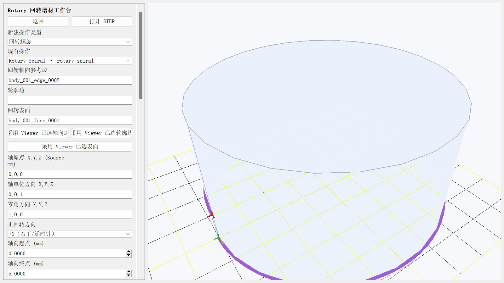

## 2. 选边、选面与稳定引用

生成可导出产品必须同时具备轴 edge 引用和至少一个回转表面 face 引用。只填数值坐标不足以通过产品生成前置检查。

- **回转轴向参考边**：必须是 STEP 解析后具有 `axis_direction` 的 edge。它为轴单位方向提供稳定引用，可以是圆柱/圆锥母线；回转轴原点来自所选回转面的解析轴线，不使用母线中心。当参考边与选定回转面轴向不平行时，应用报 `rotary.axis_surface_mismatch`。
- **回转表面**：当前只接受解析为 `cylinder` 或 `cone` 的 face。轴向范围由所选 face 的真实边界 edge/vertex 投影确定；多面还必须类型一致、轴线同轴，并通过圆柱半径一致性或圆锥半径连续性检查。
- **轮廓边**：可选，保存完整 `GeometryReference`，并可把 profile 的轴向起止范围限制到该 edge 的投影区间。当前路径的径向轮廓仍是圆柱常半径或圆锥沿轴向的线性变半径，不会沿任意 contour edge 生成非线性径向插值。

应用时会保存对象 ID、几何类型、父实体和 kernel signature。STEP 更新后使用签名唯一重绑；引用缺失、候选不唯一或几何类型改变时，操作进入 Invalid/Stale，需要重新选择。

下图将轴 edge 和圆柱 face 同时高亮。正确顺序是先在 Viewer 切到相应选择模式并点击几何，再按“采用 Viewer 已选轴向边/已选表面”；橙色面和蓝色边是待应用选择，左侧文本框中的稳定 ID 是保存对象。


### 2.1 扇叶模型的选面示例

`example/扇叶/风扇扇叶(1).STEP` 可用于判断选择是否落在 Rotary 支持范围内。三片叶片的主面是 B-spline 自由曲面，选中后 Apply 会返回 `rotary.surface_reference_invalid`；中央轮毂外表面是 R17.5 mm 圆柱面，配 65 mm 轴向边可以正确派生轴线、半径和轴向范围。

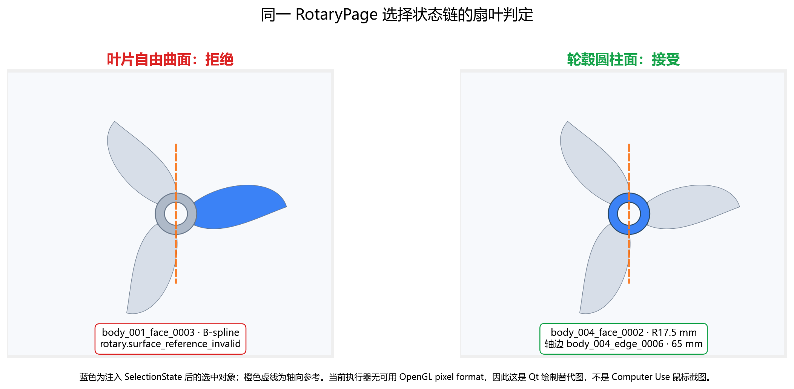

轮毂外表面由两个半圆柱 face 组成。要建立完整 360° 轮毂操作，应同时选择两个同轴、同半径面，再显式填写起止角。当前 face 选择不会自动把修剪面的 180° 边界转换成 Around Part 角区间；周向覆盖始终由操作角度或 Around Part Region 决定。扇叶整件与手工 XYZAC 代码的对比、180° 坐标注册和多轴长跨步风险见 [pipe2 与扇叶可视化对比报告](../reviews/2026-09-13_pipe2_model_manual_gcode_comparison.md)。

## 3. 回转坐标和角度周期

Rotary frame 在 Source 坐标中包含：

- `axis_origin_mm`：回转轴上的原点，允许非零中心；
- `axis_direction`：回转轴单位方向；
- `zero_direction`：0° 在轴法平面中的单位方向，必须与轴垂直；
- `positive_direction`：`+1` 使用右手/CCW 横向基，`-1` 反转横向基。

几何点先按 `Source/Model → Build` 刚体变换生成 shared Toolpath，再按 `Build → Workpiece → Machine` 进入机床运动学。轴原点、工具长度、安装位置和非默认 Build CS 都参与计算。

界面允许输入跨周期端点。例如区域 `350:20` 且方向为 CCW 时，计划使用 350°→380°，不在 360° 重置为 0°。多区域之间把下一起点移到距前一终点最近的等价相位，减少无必要的整周绕行。

下图显示当前非零回转中心、轴单位方向、零角方向、正方向、face 引用和 Source 单位。

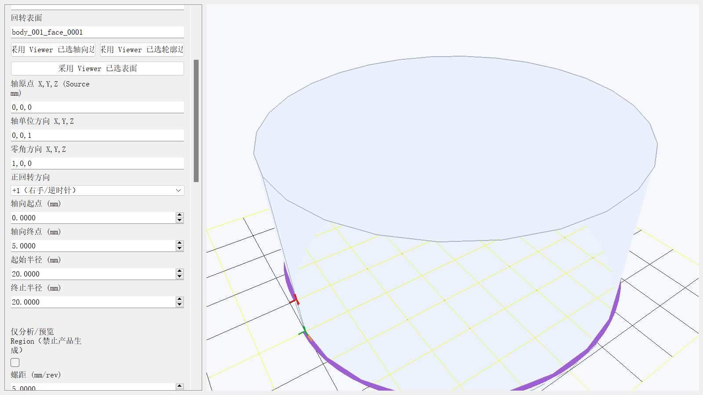

## 4. 三种操作

### 4.1 Rotary Spiral

Spiral 使用起始角、终止/展开角、CCW/CW 和螺距定义一条连续螺旋。轴向位移等于圈数乘以螺距，起点使用 profile 的轴向起点；计算终点不能超出 profile 轴向终点。圆柱的半径不变，圆锥的半径按轴向坐标线性变化，法向包含锥度分量。


### 4.2 Rotary Thin Wall

Thin Wall 要求起止角明确构成一个完整周期。轴向从 profile 起点到终点按轴向步距取层，包含终点；每层按径向道数和径向间距生成圆周道。路径按道交替方向，使用蛇形顺序降低整周回绕。

目标壁厚必须容纳有效道宽和所有径向道。当壁厚小于标称道宽时：

- `error`：报 `rotary.thin_wall_below_minimum`，禁止生成/导出；
- `reduce`：把该操作的有效道宽缩减为目标壁厚，结果带 `rotary.thin_wall_width_reduced` Warning。该策略是几何退化处理，不代表实际材料能稳定拉出更窄道。

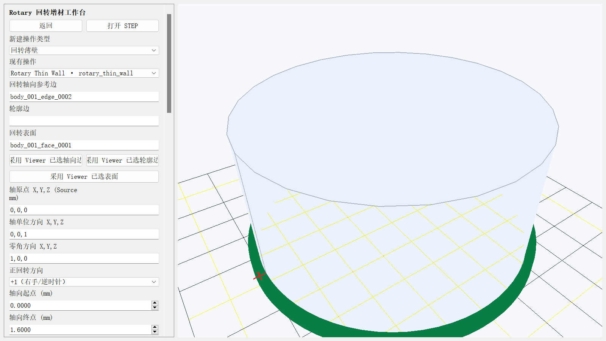

### 4.3 Around Part

Around Part 在一个或多个有向角区域内生成局部周向道，再按轴向步距重复。界面格式为 `起角:终角;起角:终角`，例如 `350:20;120:210`。当前界面的“区域展开方向”作用于该次输入的全部区域；Around Part 的区域方向为权威语义，通用“路径回转方向”不替代它。

轴向相邻道交替方向。程序从净空半径上的首个安全点开始，经 safe approach 到首道起点。跨区域时先 Retract，沿“当前/目标半径的较大值 + 安全连接间隙”离开表面，在该净空半径上插值相位和轴向位置，然后 Approach 到下一道起点并 Prime。最后一道结束后执行 Retract、safe depart 和 finish，使入口、段间和出口均进入后续轴限和碰撞检查。

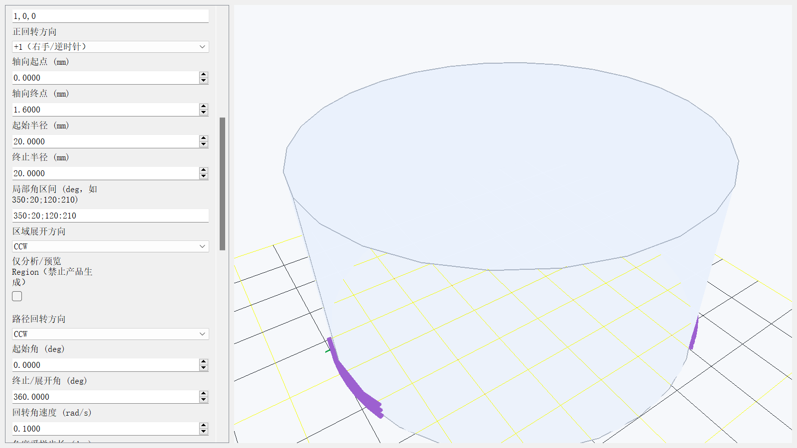

下图同时显示 `350:20;120:210`、跨 0° 展开和区域间非沉积安全连接。

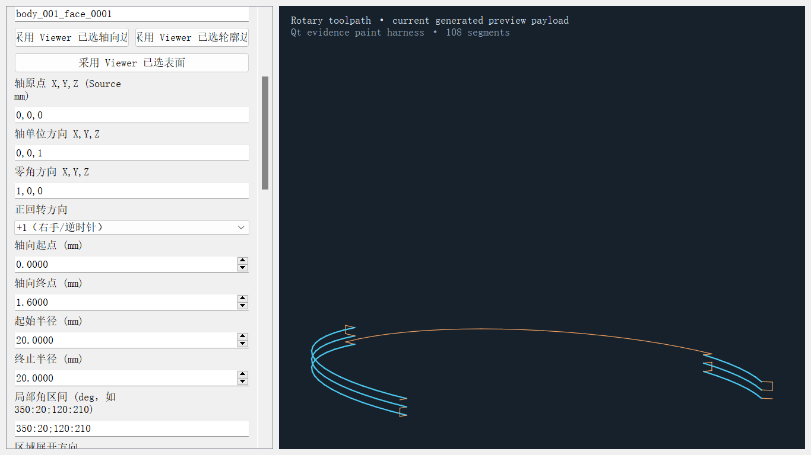

## 5. 参数、默认值和作用域

| 参数 | 默认值 | 当前规则 |
| --- | ---: | --- |
| 螺距 | 5 mm/rev | 大于 0；仅 Spiral 使用；按展开圈数换算轴向位移 |
| 路径回转方向 | CCW | Spiral/Thin Wall 的起始方向；Thin Wall 后续道交替方向 |
| 起始/终止角 | 0°/360° | 两值不能相同；界面 deg，保存为 rad |
| 回转角速度 | 0.5 rad/s | 大于 0；与线进给同时限制段时间 |
| 角度采样步长 | 5° | 大于 0；影响弦长误差、轨迹点数和连接插值 |
| 道宽 | 0.6 mm | 大于 0；参与半径偏置、材料体积和碰撞包络 |
| 层高 | 0.2 mm | 大于 0；参与沉积体积 |
| 沉积进给 | 900 mm/min | 大于 0；参与 deposition 段的计划时长 |
| 空移进给 | 1800 mm/min | 大于 0；参与 safe approach/depart/travel 的计划时长 |
| 回抽长度 | 1 mm | 大于等于 0；使用显式 Retract/Prime 事件 |
| 层间停留 | 0 s | 当前只支持 0；非零值报 `rotary.dwell_unsupported`，避免产生无法 G4 回读的伪停留 |
| 轴向步距 | 2 mm | 大于 0；Thin Wall/Around Part 使用，终点保留 |
| 径向道数 | 1 | 1—100；仅 Thin Wall 使用 |
| 径向道间距 | 0.6 mm | 大于 0；仅 Thin Wall 使用 |
| 目标壁厚 | 0.6 mm | 大于 0；必须容纳有效道宽和径向道 |
| 不足一道宽策略 | error | `error` 禁止生成；`reduce` 减小有效道宽并输出 Warning |
| 安全连接间隙 | 1 mm | 大于 0；用于多道/多区域的径向离开 |

输入参数、几何引用、Source 文件、Build CS、机型/喷嘴/材料快照或安装变换变化时，生成输入指纹改变，旧结果进入 Stale。Viewer 相机、显示质量和可见性不进入 Rotary 操作语义哈希。

## 6. 生成、取消、状态和恢复

生成链为：

`Geometry/RotaryRegion → RotaryPlan → shared Toolpath/events → prescribed MachineAxisTrajectory → ValidationReport → Postprocessor → G-code readback`

| 状态 | 含义 | 导出 |
| --- | --- | --- |
| Draft | 操作已创建，几何/参数或 Setup 尚未应用 | 禁止 |
| Ready | 路径、轴轨迹、离线检查和回读通过 | 允许 |
| Warning | 无阻断错误，但有需人工核对的警告 | 允许，警告写入结果 |
| Error | 计划、IK/FK、限位、运动、碰撞或回读失败 | 禁止 |
| Stale | 已有结果与当前输入不同，或项目重开后没有运行时产品 | 禁止，需重新生成 |

生成过程中点击“取消生成”会设置取消标记。计划在采样和连接节点响应取消；提交结果前还会再次核对输入指纹。取消或生成期间输入变化不会覆盖上一份 Ready/Warning 运行时结果。

## 7. 周期接缝、事件和安全连接

每条沉积道保存 `index_start`、`prime`、`index_end` 和结束 `retract` 语义。首段的 `safe_approach`、多道之间的 `safe_depart/retract/depart/travel/approach/safe_approach/operation_change/prime`，以及程序末尾的 `retract/safe_depart/finish` 均与 deposition 明确分开，非沉积段的材料体积为 0。

计划中的 `unwrapped_angle_rad` 是工艺相位。它在 0°/360° 连续展开，用于选择连续 IK 解支和计算角速度所需段时间。对于任意方向的 Build CS 和一般 XYZAC 拓扑，工艺相位不应直接当作控制器 C 轴值。实际 A/C 由已注册机床运动学求解，并逐点做 FK 回代。

## 8. Viewer、机床轴轨迹与检查

Viewer 直接读取 generated shared Toolpath，其 source 标识为 `<generated:operation_id>`；导入 NC 仍使用独立的 imported G-code 预览链，两者不混合。每个 ToolpathPoint 保留位置、表面法向、切向、喷嘴轴、进给、道宽、层高、材料体积、operation/stage/layer/region 和 point type。

离线检查包含：

- 计划沉积长度与 Toolpath 段长、点材料体积与道截面体积的一致性；
- 连续展开相位的最大相邻步长，用于发现 0/360° 重置；
- 工具长度、IK 解支、轴软限位、奇异、相邻段轴速度/加速度、从静止到首段和末段到静止的起停加速度，以及逐点 FK 位置/姿态回代；
- 喷嘴包络对 Setup 中夹具 AABB 的连续分段采样，以及对早先已沉积段的 IPW 近似检查；
- 后处理使用 `G93` 逆时间协调进给，把 `MachineAxisTrajectory.time_s` 的段时长写入 NC；回抽/预供料暂切 `G94` 后恢复 `G93`，程序末尾恢复 `G94`。回读核对模式切换、逐段逆时间 `F`、点顺序、XYZAC 控制器值、绝对挤出和事件；删除 `G93` 或篡改逆时间 `F` 都会失败。

当前夹具碰撞使用保守 AABB，IPW 使用离散沉积段近似。机床壳体、线缆、现场夹具细节、热变形和完整实体扫掠尚未取得实机证据。

## 9. 常见错误与恢复

| 代码/现象 | 原因 | 恢复 |
| --- | --- | --- |
| `rotary.axis_invalid` | 轴向为零或非有限值 | 重选可解析轴 edge，核对轴单位方向 |
| `rotary.zero_direction_invalid` | 零角方向为零、与轴不垂直或无法投影 | 输入轴法平面中的方向 |
| `rotary.surface_reference_invalid` | 选中非圆柱/圆锥 face | 切换到 face 模式并重选回转面 |
| `rotary.period_ambiguous` | 起止角相同或方向不明确 | 明确 CCW/CW 和非零角度跨度 |
| `rotary.pitch_exceeds_profile` | Spiral 圈数乘螺距超出轴向 profile | 减少圈数/螺距，或重选更长的表面 |
| `rotary.cone_apex_degenerate` | 圆锥路径接近半径零的锥顶 | 缩短轴向范围或修改轮廓，不跨越锥顶 |
| `rotary.thin_wall_period_invalid` | Thin Wall 未定义整一周 | 使起止展开角差的绝对值为 360° |
| `rotary.thin_wall_passes_exceed_width` | 道宽、道数和径向间距超出目标壁厚 | 增大壁厚，或减少道数/间距 |
| `rotary.region_empty` / `rotary.region_overlap` | Around Part 没有区域或区域在周期上重叠 | 使用分号分隔的不重叠有向区间 |
| `xyzac.orientation_unreachable` | 当前机型/限位无可达 IK 解 | 核对 Build CS、安装、机型限位和路径方向 |
| `xyzac.velocity_limit_exceeded` / `xyzac.acceleration_limit_exceeded` | 轴运动超出机型参数 | 降低线进给/角速度，减小姿态跳变，重新生成 |
| `rotary.nozzle_obstacle_collision` / `rotary.nozzle_ipw_collision` | 喷嘴包络与夹具或已沉积段相交 | 先定位问题点，再修改安装、区域、顺序或连接间隙 |
| `rotary.gcode_readback_failed` | NC 点、轴、F/E 或事件回读不一致 | 不导出；恢复注册控制器语义并重新生成 |

计划与 IK 异常会保存结构化 `code/severity/object_id/context`，界面问题项可定位到操作或点。下方错误图明确显示 `xyzac.acceleration_limit_exceeded · sample-1` 和禁用的导出按钮；恢复图来自修正限制后的重新生成。

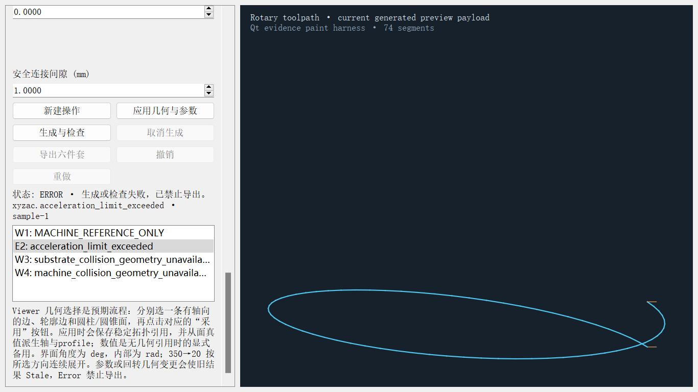

下图是同类错误在生产 Viewer 中的当前画面：状态为 `ERROR`，问题列表包含 `acceleration_limit_exceeded`，导出按钮禁用。它是错误示例，不是成功结果。

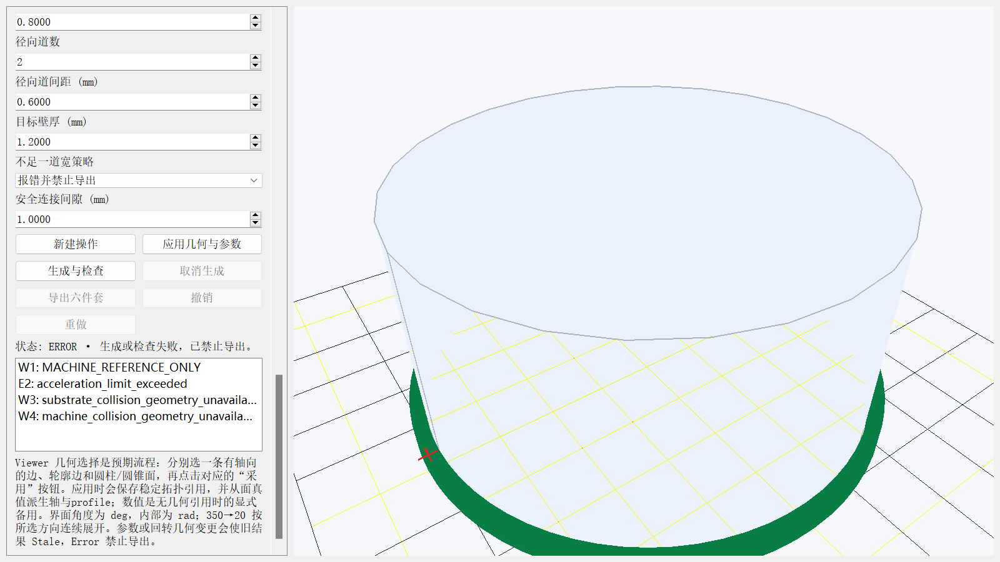

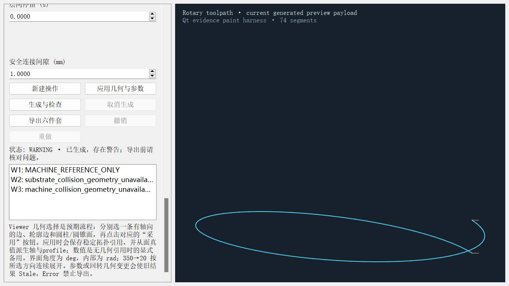

## 10. 六件套与 G-code 回读

每个 Ready/Warning 结果导出一个目录，内含：

| 文件 | 用途 |
| --- | --- |
| `main.gcode` | 按注册机型控制器语义输出绝对线性轴、映射后的旋转轴字和绝对 E；协调运动为 `G93` 逆时间进给，Spiral/Thin Wall/Around Part 分别使用 R02/R03/R04 标记；头部记录 `CONTROLLER_AXIS_MAP` |
| `toolpath.json` | shared Toolpath 点、事件、层/区域、姿态、工艺和材料体积 |
| `machine_axes.csv` | 点 ID、时间、`rotary_phase_rad`、XYZAC 内部轴值；回转轴内部为 rad |
| `warnings.json` | 检查状态、指标、问题代码、对象和上下文 |
| `preview.json` | Viewer 可读的分段几何、移动类型、F/E、道宽和层高 |
| `manifest.json` | 操作类型、RotaryPlan、语义哈希、源指纹、算法版本、轴轨迹、检查和回读结果 |

导出使用同目录临时 stage，六个文件写完且未取消后再替换目标目录。替换失败时恢复上一份完整结果。

当前证据保留四个产品：非零中心圆柱 Spiral、非零中心圆锥 Spiral、12 道 Thin Wall 和跨零点 Around Part。每个目录均有完整六件套且回读通过；输入 STEP 和逐文件 SHA-256 见 `docs/reviews/evidence/2026-09-13_rotary_workbench_final/products_summary.json`。

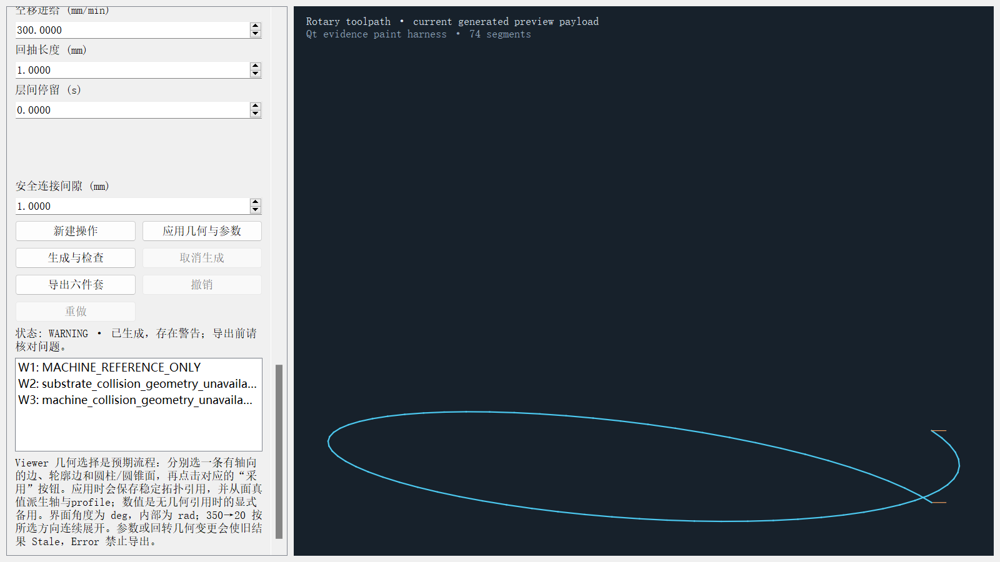

## 11. 撤销、保存重开、STEP 更新和迁移

- Create、Apply 和参数/几何修改进入共享命令历史，可用 Undo/Redo 恢复对应操作与运行时结果。
- 项目保存 Setup、Rotary 操作、稳定几何引用、参数和产品状态摘要。生成的 Toolpath/G-code 对象不嵌入 `project.json`。
- 重开后 Ready/Warning 资格显式改为 Stale，几何引用和参数仍可检查，重新 Generate 才能导出。
- STEP 更新时重绑 axis/contour/surface 引用，并对后台解析期间的 Rotary 输入做并发 token 检查，避免旧草稿覆盖新编辑。

参数变更触发的 Stale 与项目重开的恢复入口相同：左侧保留几何和参数，导出禁用，点击“生成与检查”取得当前运行时结果。下图显示真实生产界面的输入变更 Stale；项目重开的 Stale 证据见紧随其后的三尺寸状态图。

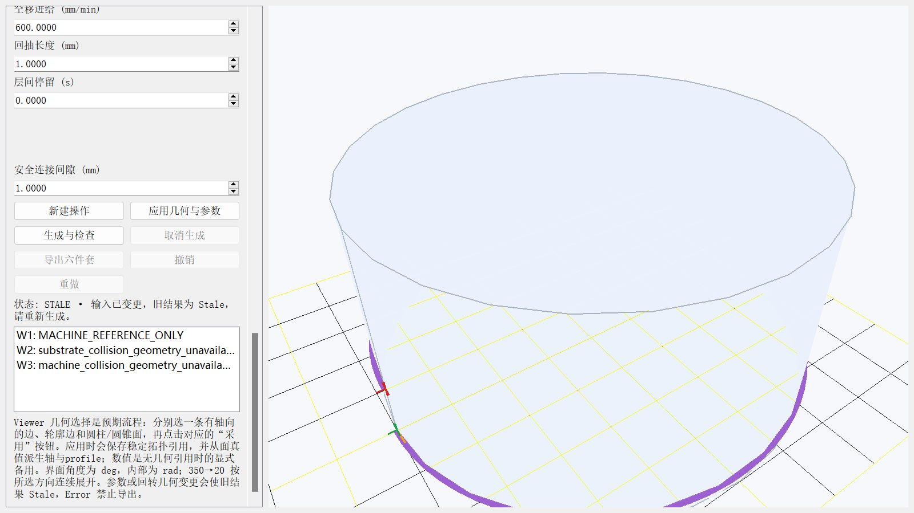

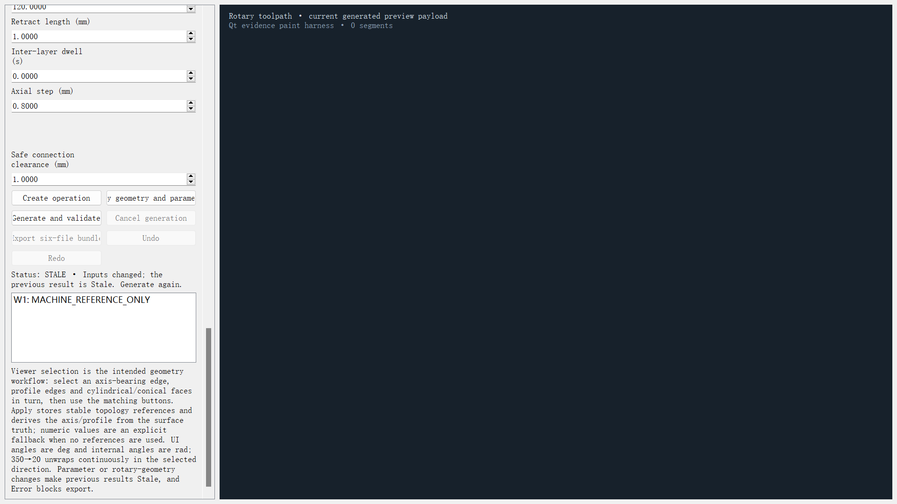

## 12. 受限脚本与 HTTP

受限脚本只解析字面量和 `rotary/回转` namespace，不执行 Python、文件、进程或网络调用。GUI、脚本和 HTTP 最终进入同一 `RotaryCommandService`。下例在已由 GUI 完成几何引用的操作上修改参数并生成：

```python
回转.设置操作(
    operation_id="rotary-operation-1",
    pitch_mm=8.0,
    start_angle_rad=0.5235987755982988,
    end_angle_rad=19.373154697137057,
    angular_velocity_rad_s=0.5,
    bead_width_mm=0.8,
    layer_height_mm=0.4,
    feedrate_mm_min=362.020752228998,
)
回转.生成操作(operation_id="rotary-operation-1")
回转.导出操作(
    operation_id="rotary-operation-1",
    destination="output/rotary-operation-1",
)
```

英文命令为 `rotary.create_operation`、`rotary.set_operation`、`rotary.generate_operation`、`rotary.cancel_generation`、`rotary.export_operation`、`rotary.state`、`rotary.issues`、`rotary.validate`、`rotary.undo` 和 `rotary.redo`。创建新操作后若需全脚本配置几何，`set_operation` 的 `geometry` 必须提供完整 `RotaryGeometrySelection` JSON，包含稳定 axis edge 和 surface face 描述符；不接受仅有数值轴的可导出操作。

HTTP 路由为：`/rotary/state`、`/rotary/issues`、`/rotary/validate`、`/rotary/operation/create`、`/rotary/operation/set`、`/rotary/operation/generate`、`/rotary/generation/cancel`、`/rotary/operation/export`、`/rotary/undo`、`/rotary/redo`。远程绑定、token 和访问范围仍由应用 HTTP 设置控制。

## 13. 公开资料与实机边界

本版实施前固定并静态提取了 Open5x commit `500a786e51447b47e00d2a5ca3dcc938ae542926` 的三份原始 Grasshopper 定义，识别了 IK、Simulation、Speed Compensation、Extrusion、Travel 和 Retract/Deretraction 组织。Open5x 为 MIT 许可，Copyright © 2022 Freddie Hong。本项目没有复制或移植其 Grasshopper 程序，当前运行时不新增 Open5x 依赖。

Siemens NX 公开产品页和 2512/2606 发布说明用于核对 Rotary deposition、Thin Wall、局部回转特征和连续 rotary non-cutting move 的产品语义。Siemens Documentation Center 中相关 NX Additive Manufacturing 正文访问属性为 private，本轮没有声称读取私有 NX Help，也没有反推 NX 内部算法。

当前 Generic XYZAC 只提供离线参考资格。软件已验证自定义轴字会进入四工作台 G-code 和严格回读，但目标固件是否把该字解释为预期物理关节仍未验证。回转正方向、单位/缩放/零偏、轴速度和加速度、回转中心、工具长度、实际喷嘴包络、机床壳体、现场夹具、材料参数和试切均需以目标机床标定与现场证据另行确认。未完成这些工作前，不得把六件套或示例目录中的手工代码直接用于真实机床。

当前 Rotary 专项为 37 passed；最终全仓串行复跑为 820 passed、3 skipped、130 subtests passed，退出码 0。首轮全仓曾在既有 Planar P03 目录替换处遇到一次 Windows `WinError 5`；该用例单测随即 1 passed，换新仓库内 basetemp 后全仓通过，失败日志仍保留。`scripts/check_quality.py` 退出码 0，Ruff、format、context budget 和 Mypy 对 147 个源文件通过。截图 SHA-256 见图片 `summary.json`，六件套指纹见 `products_summary.json`，构建与包检查见最终验证清单。
