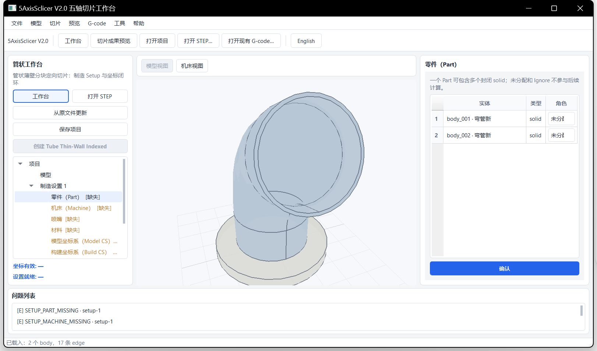
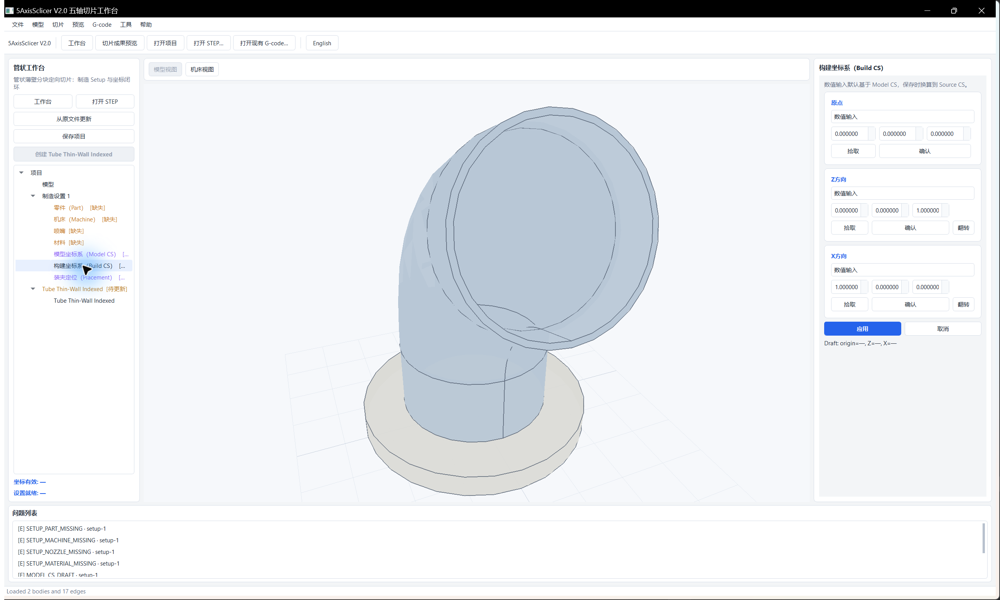
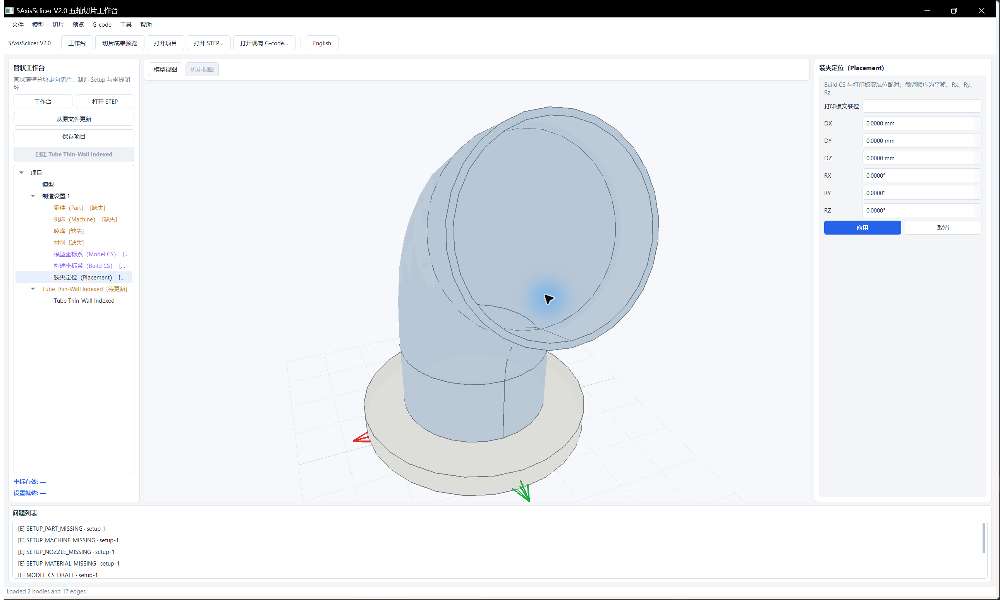

# 管状坐标设置中文图文指南

本指南适用于管状工作台第一阶段。当前只有**管状工作台**接入制造设置与坐标编辑器；平面、曲线、自由曲面和回转工作台仍进入通用操作会话，那里没有“模型坐标系”“构建坐标系”和“装夹定位”节点。

本阶段可完成零件归属、资源选择、两套坐标系、打印板装夹、项目保存与重开。中心线、分块、切层、路径生成、逆运动学和 NC 输出尚未开放。

## 1. 导入 STEP 后从哪里进入

界面顶部按钮显示“English”时，当前已经是中文界面；该按钮用于切换到英文。

STEP 可在任一工作台中导入。模型出现后，按下列任一路径进入坐标设置：

1. 在当前操作会话左侧点击蓝色按钮“进入管状设置（定义坐标）”。
2. 点击顶部“工作台”，选择“管状工作台”。

模型会直接带入管状工作台，无需再次导入。

> 图中位于曲线工作台，左侧蓝色按钮可把当前 STEP 带入管状工作台。

## 2. 三维预览鼠标操作

预览区采用接近 Bambu Studio 的相机操作。短按和拖动由系统拖动阈值区分，越过阈值后松开不会误选几何。

| 鼠标操作 | 结果 |
| --- | --- |
| 左键短按实体、面、边或顶点 | 按当前拾取类型选择几何 |
| 左键短按空白处 | 清空当前选择 |
| 左键拖动 | 旋转视图，起点位于模型或空白处均可 |
| 中键拖动 | 沿屏幕平面平移视图 |
| 右键拖动 | 沿屏幕平面平移视图 |
| 滚轮 | 围绕鼠标指针所在的焦平面位置缩放 |

`F` 适配视图，`H` 恢复默认视角，`Esc` 清空选择。鼠标拖动只控制相机；当前版本未提供对象拖拽、Gizmo、框选和右键菜单。

## 3. 建立管状操作和零件归属

进入管状工作台后，推荐按以下顺序完成坐标闭环：

`零件 → 机床 → 模型坐标系 → 构建坐标系 → 装夹定位`

若左侧树中没有 `Tube Thin-Wall Indexed`，点击“创建 Tube Thin-Wall Indexed”。首版界面只允许创建一条操作，创建后按钮会变灰。

在左侧树中点击“零件（Part）”：

1. 将参与制造的封闭实体设为“零件”。
2. 不参与计算的实体可保留“未分配”或设为“忽略”。
3. 点击右侧“确认”。

`pipe2` 示例中的圆盘和弯管属于同一个打印件，两项都应设为“零件”。首版不接受 sheet 或 shell 作为 Part。

## 4. 选择机床、喷嘴和材料

点击左侧“机床（Machine）”，选择 Machine Profile 后应用。装夹定位依赖机床提供的打印板安装位，因此机床需要在装夹前完成。

内置 `Cartesian Reference` 和 `Generic XYZAC Reference` 可用于坐标设置，二者属于参考机型，问题列表会保留警告。实际可执行输出需要真实标定的 Machine Profile。

喷嘴和材料不会阻止模型坐标系、构建坐标系的编辑，也不影响“坐标有效”。它们会参与“设置就绪”判断：

- 喷嘴需要安装接口、真实总长和碰撞外形。内置 0.4、0.6、0.8 mm 项只提供身份数据。
- 材料需要勾选“已核对来源中的材料单点建议值”后应用。
- 测量数据缺失时可以保持未就绪，不要为消除错误填写猜测值。

## 5. 定义模型坐标系（Model CS）

点击左侧“模型坐标系（Model CS）”。右侧编辑器要求分别确认原点、Z 方向和 X 方向。

### 数值输入

1. 三个下拉框均选择“数值输入”。
2. 输入原点坐标，点击该区域的“确认”。
3. 输入 Z 向量，点击“确认”；方向相反时点击“翻转”。
4. 输入 X 向量，点击“确认”；方向相反时点击“翻转”。
5. 三项状态都出现确认标记后，点击页面底部“应用”。

模型坐标系的数值以 STEP 的 Source CS 为基准。常见的原始朝向可从原点 `(0, 0, 0)`、Z `(0, 0, 1)`、X `(1, 0, 0)` 开始核对。

### 几何拾取

1. 在对应下拉框中选择拾取方式。
2. 点击“拾取”。
3. 在三维预览中短按目标几何。
4. 回到右侧点击该区域的“确认”。

原点可用顶点、面上点或系统列出的几何中心候选；方向可用直边、平面或回转面轴线、两个顶点及系统候选。选择“两个顶点”时按方向起点、终点各点一次。

系统会把 X 投影到 Z 的法平面，再按 `Y = Z × X` 建立右手坐标系。零向量、X 与 Z 共线、非有限值、缩放或剪切都会阻止应用。

## 6. 定义构建坐标系（Build CS）

点击左侧“构建坐标系（Build CS）”，仍按“原点、Z、X 分别确认，再应用”的顺序操作。拾取方式与模型坐标系相同。

构建坐标系独立保存，用于表达打印构建方向。其数值输入默认基于 Model CS，保存时程序会换算到 Source CS。修改模型坐标系不会自动替换已经定义的构建坐标系。

## 7. 设置装夹定位（Placement）

机床和构建坐标系有效后，点击“装夹定位（Placement）”：

1. 从“打印板安装位”选择 Machine Profile 提供的安装位。
2. 按需要输入 `DX`、`DY`、`DZ`，单位为毫米。
3. 按需要输入 `RX`、`RY`、`RZ`，单位为度。
4. 点击“应用”。

微调计算顺序固定为平移、`Rx`、`Ry`、`Rz`。应用后页面切换到机床视图，显示打印板、装夹后的模型和坐标标架。没有测量偏差时六项保持 0。

“打印板安装位”为空通常表示尚未选择机床，或所选 Machine Profile 没有安装位。

## 8. 检查、保存和重开

左侧树和底部问题列表共同显示状态：

- “坐标有效”要求零件、机床、模型坐标系、构建坐标系和装夹定位均有效。
- “设置就绪”还要求喷嘴完整、材料已核对，并且问题列表中没有错误。
- 参考机型会保留警告；警告不会阻止本阶段的坐标闭环。

点击“保存项目”，选择一个项目文件夹。项目会保存 `project.json`、项目内 STEP 副本、资源快照、坐标定义、安装位和装夹微调。存在未应用草稿时，保存对话框会要求“应用”“放弃”或取消保存。

重开时点击顶部“打开项目”，选择项目文件夹内的 `project.json`。外部 STEP 原路径只供显式“从原文件更新”使用，项目内副本承担正常重开。

## 9. 常见问题

| 现象 | 处理方式 |
| --- | --- |
| 导入 STEP 后看不到坐标节点 | 点击“进入管状设置（定义坐标）”；坐标编辑器目前只在管状工作台中提供 |
| “创建 Tube Thin-Wall Indexed”按钮为灰色 | 左侧树中已经存在一条操作，首版无需重复创建 |
| 点击“装夹定位”后没有安装位 | 先在“机床（Machine）”中选择并应用带安装位的 Profile |
| 坐标系无法应用 | 检查原点、Z、X 是否分别确认，并排除零向量或 X/Z 共线 |
| 左键点击后视图发生旋转 | 点击时保持鼠标静止；移动距离越过系统阈值会按拖动处理 |
| “坐标有效”已完成，“设置就绪”仍未完成 | 检查喷嘴接口、总长、碰撞外形及材料核对状态 |

## 10. 交互依据

鼠标规则按 Bambu Studio 官方源码提交 [`12f17b06f4f537f9c03162d08bb70cf733c42839`](https://github.com/bambulab/BambuStudio/tree/12f17b06f4f537f9c03162d08bb70cf733c42839) 核对：

- [拖动与按键分流](https://github.com/bambulab/BambuStudio/blob/12f17b06f4f537f9c03162d08bb70cf733c42839/src/slic3r/GUI/GLCanvas3D.cpp#L5799-L5895)
- [空白点击清除选择](https://github.com/bambulab/BambuStudio/blob/12f17b06f4f537f9c03162d08bb70cf733c42839/src/slic3r/GUI/GLCanvas3D.cpp#L5904-L5946)
- [滚轮与光标锚定](https://github.com/bambulab/BambuStudio/blob/12f17b06f4f537f9c03162d08bb70cf733c42839/src/slic3r/GUI/GLCanvas3D.cpp#L5146-L5168)
