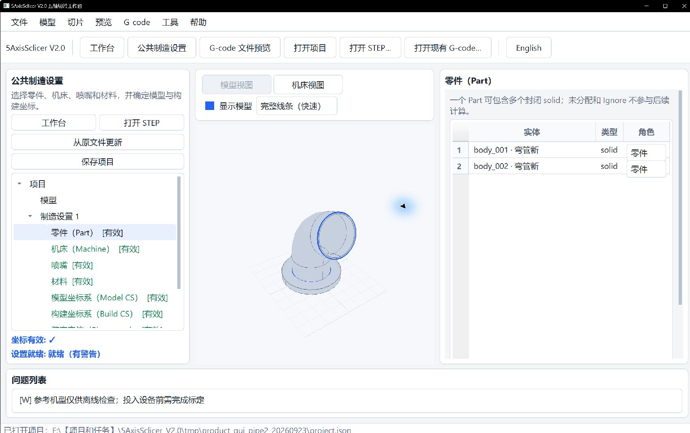

# 管状坐标设置中文图文指南

本指南说明公共制造设置中的零件、机床、喷嘴、材料、坐标系与装夹定位。完成设置后，可进入管状工作台选择操作并生成路径。

完成本指南后，可继续按[Tube 工作台完整手册](tube_workbench_zh.md)选择 Indexed、Buildup 或 Continuous，执行路径生成、离线检查、参考机型后处理、NC 回读和结果导出。Generic XYZAC 仅供离线验证，不能替代真实设备标定和实机资格。

## 1. 导入 STEP 后从哪里进入

界面顶部按钮显示“English”时，当前已经是中文界面；该按钮用于切换到英文。

STEP 可在工作台中导入。模型出现后，点击顶部“公共制造设置”进入坐标设置。若正在管状工作台，也可在左侧树中选择对应设置节点。

模型会保留在当前项目中，无需再次导入。完成公共设置后，点击顶部“工作台”，选择“管状工作台”。

> 图中展示首页入口。打开 STEP 后，点顶部“公共制造设置”；完成设置再由“工作台”进入 Tube。

## 2. 三维预览鼠标操作

预览区采用接近 Bambu Studio 的相机操作。短按和拖动由系统拖动阈值区分，越过阈值后松开不会误选几何。

| 鼠标操作 | 结果 |
| --- | --- |
| 左键短按实体、面、边或顶点 | 按当前拾取类型选择几何 |
| 左键短按空白处 | 清空当前选择 |
| 左键拖动 | 旋转视图，起点位于模型或空白处均可 |
| 中键拖动 | 沿屏幕平面平移视图 |
| 右键拖动 | 沿屏幕平面平移视图 |
| 滚轮 | 围绕鼠标指针所在的焦平面位置缩放 |

`F` 适配视图，`H` 恢复默认视角，`Esc` 清空选择。鼠标拖动只控制相机；对象不能直接拖拽。

左键向下拖动会提高轨道相机的观察仰角，向上拖动则降低仰角。OpenGL 按世界 `+Z` 建立轨道，水平绕到任一方位后仍保持相同的屏幕上下逻辑；VTK 适配器使用同向的 Elevation 增量。

## 3. 建立管状操作和零件归属

进入公共制造设置后，推荐按以下顺序完成：

`零件 → 机床 → 模型坐标系 → 构建坐标系 → 装夹定位`

制造设置完成后，进入管状工作台，选择操作类型并点击“创建 Tube 操作”。已有操作会显示在左侧树中。

在左侧树中点击“零件（Part）”：

1. 将参与制造的封闭实体设为“零件”。
2. 不参与计算的实体可保留“未分配”或设为“忽略”。
3. 点击右侧“确认”。

`pipe2` 示例中的圆盘和弯管属于同一个打印件，两项都应设为“零件”。Part 需要封闭实体；sheet 或 shell 不符合该角色要求。

## 4. 选择机床、喷嘴和材料

点击左侧“机床（Machine）”，选择 Machine Profile 后应用。装夹定位依赖机床提供的打印板安装位，因此机床需要在装夹前完成。

内置 `Cartesian Reference` 和 `Generic XYZAC Reference` 可用于坐标设置，二者属于参考机型，问题列表会保留警告。实际可执行输出需要真实标定的 Machine Profile。

喷嘴和材料不会阻止模型坐标系、构建坐标系的编辑，也不影响“坐标有效”。它们会参与“设置就绪”判断：

- 喷嘴需要安装接口、真实总长和碰撞外形。内置 0.4、0.6、0.8 mm 项只提供身份数据。
- 材料需要勾选“已核对材料与建议温度”后应用。
- 测量数据缺失时可以保持未就绪，不要为消除错误填写猜测值。

喷嘴页面的三个字段按以下口径填写：

- “安装接口（螺纹/型号）”记录喷嘴与加热块或热端的机械连接标识。可填写图纸中的螺纹规格，例如 `M6×1 螺纹`；专用接口填写厂家系列和接口型号。该字段当前只检查文本非空，不推断机械兼容性。
- “总长”沿喷嘴轴线测量，以喷尖为 `Z=0`，`+Z` 指向安装端，数值取到安装端最远点的距离，单位为 mm。内置模板没有通用默认长度，未知时显示“未填写”。
- “使用 R–Z 碰撞外形（缺失时生成简化外形）”会保留 Profile 已有外形；模板没有外形时，程序根据喷孔直径和总长生成粗略轴对称轮廓。管状路径检查会用该轮廓估计喷嘴与障碍的间距。简化轮廓不能代替实测喷嘴几何、完整工具扫掠或实机防碰撞验证。

已有 R–Z 外形与其总长保持一致。修改总长时，先取消外形勾选并应用，再填写新总长、重新勾选并应用；程序会生成与新总长匹配的简化外形。该操作会放弃原 Profile 外形，实测轮廓应在资源编辑器完善后再替换。

R–Z 外形中的半径和 Z 必须为有限非负值，首点位于喷尖 `Z=0`，Z 按升序排列，最远 Z 与总长一致。喷尖外半径不能小于喷孔半径。历史项目可继续读取结构有效的 v2 快照；外形不符合这些物理约束时，喷嘴节点会显示为“无效”，需要重新核对数据。

切换喷嘴 Profile 时，接口、总长和碰撞外形状态会随所选 Profile 更新。鼠标停在标签、输入框、选择框或按钮上可查看填写内容、单位、参考基准和状态影响；状态栏与无障碍描述使用同一份说明。

## 5. 定义模型坐标系（Model CS）

点击左侧“模型坐标系（Model CS）”。右侧编辑器要求分别确认原点、Z 方向和 X 方向。

### 数值输入

1. 三个下拉框均选择“数值输入”。
2. 输入原点坐标，点击该区域的“确认”。
3. 输入 Z 向量，点击“确认”；方向相反时点击“翻转”。
4. 输入 X 向量，点击“确认”；方向相反时点击“翻转”。
5. 三项状态都出现确认标记后，点击页面底部“应用”。

模型坐标系的数值以 STEP 的 Source CS 为基准。常见的原始朝向可从原点 `(0, 0, 0)`、Z `(0, 0, 1)`、X `(1, 0, 0)` 开始核对。

### 几何拾取

1. 在对应下拉框中选择拾取方式。
2. 点击“拾取”。
3. 在三维预览中短按目标几何。
4. 回到右侧点击该区域的“确认”。

原点可用顶点、面上点或系统列出的几何中心候选；方向可用直边、平面或回转面轴线、两个顶点及系统候选。选择“两个顶点”时按方向起点、终点各点一次。

系统会把 X 投影到 Z 的法平面，再按 `Y = Z × X` 建立右手坐标系。零向量、X 与 Z 共线、非有限值、缩放或剪切都会阻止应用。

## 6. 定义构建坐标系（Build CS）

点击左侧“构建坐标系（Build CS）”，仍按“原点、Z、X 分别确认，再应用”的顺序操作。拾取方式与模型坐标系相同。

构建坐标系独立保存，用于表达打印构建方向。其数值输入默认基于 Model CS，保存时程序会换算到 Source CS。修改模型坐标系不会自动替换已经定义的构建坐标系。

## 7. 设置装夹定位（Placement）

机床和构建坐标系有效后，点击“装夹定位（Placement）”：

1. 从“打印板安装位”选择 Machine Profile 提供的安装位。
2. 按需要输入 `DX`、`DY`、`DZ`，单位为毫米。
3. 按需要输入 `RX`、`RY`、`RZ`，单位为度。
4. 点击“应用”。

微调计算顺序固定为平移、`Rx`、`Ry`、`Rz`。应用后页面切换到机床视图，显示打印板、装夹后的模型和坐标标架。没有测量偏差时六项保持 0。

“打印板安装位”为空通常表示尚未选择机床，或所选 Machine Profile 没有安装位。

## 8. 检查、保存和重开

左侧树和底部问题列表共同显示状态：

- “坐标有效”要求零件、机床、模型坐标系、构建坐标系和装夹定位均有效。
- “设置就绪”还要求喷嘴完整、材料已核对，并且问题列表中没有错误。
- 参考机型会保留警告；可用于离线检查，实机使用需完成机床标定。

点击“保存项目”，选择一个项目文件夹。项目会保存 `project.json`、项目内 STEP 副本、资源快照、坐标定义、安装位和装夹微调。存在未应用草稿时，保存对话框会要求“应用”“放弃”或取消保存。

重开时点击顶部“打开项目”，选择项目文件夹内的 `project.json`。外部 STEP 原路径只供显式“从原文件更新”使用，项目内副本承担正常重开。

## 9. 常见问题

| 现象 | 处理方式 |
| --- | --- |
| 导入 STEP 后看不到坐标节点 | 点击顶部“公共制造设置”，在左侧树中选择坐标节点 |
| “创建 Tube 操作”按钮为灰色 | 检查已有操作和当前 Setup 可创建的操作数量 |
| 点击“装夹定位”后没有安装位 | 先在“机床（Machine）”中选择并应用带安装位的 Profile |
| 坐标系无法应用 | 检查原点、Z、X 是否分别确认，并排除零向量或 X/Z 共线 |
| 左键点击后视图发生旋转 | 点击时保持鼠标静止；移动距离越过系统阈值会按拖动处理 |
| “坐标有效”已完成，“设置就绪”仍未完成 | 检查喷嘴接口、总长、碰撞外形及材料核对状态 |
| 不知道“安装接口”填什么 | 查看喷嘴或热端图纸中的机械连接规格；可记录螺纹规格或厂家接口型号，未知时留空 |
| 总长显示“未填写” | 内置喷嘴只含身份数据；按喷尖到安装端最远点的轴向距离填写实测值 |

## 10. 交互依据

鼠标规则按 Bambu Studio 官方源码提交 [`12f17b06f4f537f9c03162d08bb70cf733c42839`](https://github.com/bambulab/BambuStudio/tree/12f17b06f4f537f9c03162d08bb70cf733c42839) 核对：

- [拖动与按键分流](https://github.com/bambulab/BambuStudio/blob/12f17b06f4f537f9c03162d08bb70cf733c42839/src/slic3r/GUI/GLCanvas3D.cpp#L5799-L5895)
- [空白点击清除选择](https://github.com/bambulab/BambuStudio/blob/12f17b06f4f537f9c03162d08bb70cf733c42839/src/slic3r/GUI/GLCanvas3D.cpp#L5904-L5946)
- [滚轮与光标锚定](https://github.com/bambulab/BambuStudio/blob/12f17b06f4f537f9c03162d08bb70cf733c42839/src/slic3r/GUI/GLCanvas3D.cpp#L5146-L5168)
