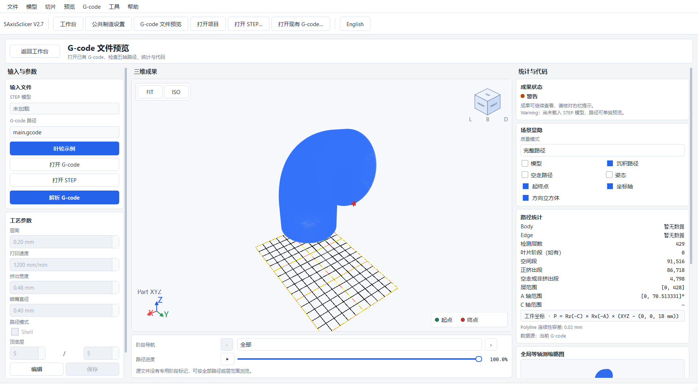

# Tube Workbench Guide

Tube operations cover a single tube with a constant circular section and identifiable inlet/outlet. Complete [coordinates and Setup](tube_coordinate_setup_en.md) first. Example settings are practice values only; determine process parameters and print results for the user's own machine, nozzle, material, and fixture.

## Setup and geometry

Enter **Tube Workbench**, choose an operation type, and create an operation. In Setup, assign closed solids as Part. Sheets, shells, ignored, and unassigned solids stay out of manufacturing calculations. Apply Machine, Nozzle, reviewed Material, Model CS, Build CS, and Placement. Reference machines retain Warnings; missing measured data must remain unresolved rather than guessed.

Select the tube body, inlet circular edge, outlet circular edge, and existing substrate if required. Confirm that each field is populated and that the inlet-to-outlet direction matches the intended build. Do not reuse body/edge IDs from another STEP.

## Three operations

- **Indexed (Tube Thin-Wall Indexed):** segmented thin-wall tube with safe indexing. It partitions the centreline, intersects the current CAD body, creates the passes needed across the wall thickness, and plans reference XYZAC motion. Indexed can also have multiple passes in one layer; multiple passes alone do not distinguish Buildup.
- **Buildup (Tube Buildup and Base):** multi-pass thickening and optional separate base operation. Inspect pass order and safe transitions between operations. The base slices the selected CAD body, preserving holes and non-circular outlines; automatic base generation requires +Z growth orientation.
- **Continuous (Tube Continuous Helix):** continuous helical deposition along a spatial centreline. Check the seam and continuous orientation. Degenerate curvature, frame flips, orientation singularities, axis limits, or collisions can block export.

Shared parameter rules: bead width and layer height must be positive; current layer-height limit is at most twice bead width. Indexed maximum wedge angle is greater than 0° and at most 90°. Maximum bead-height error and safety clearance must be positive. Retract is positive. Deposition and travel feeds are positive. Chord error is positive; smaller values usually create more points. Buildup also has maximum pass spacing and base-order settings. Continuous has a seam angle. Defaults such as 0.6 mm bead, 0.2 mm layer, 5 mm clearance, or 0.02 mm chord error are examples, not universal recommendations.

The current Indexed strategy bounds local deposition thickness. The entered bead width is the maximum width per pass; actual widths are distributed across the wall. Pointwise thickness can range from 0.5 to 1.5 times the nominal layer height, and material volume uses actual segment dimensions. Path positions are material centres; the NC nozzle tip includes a separate half-thickness offset. Use the material-path preview instead of overlaying raw machine XYZ on the model.

The `tube.bounded_boundary_accuracy_deferred` Warning means that small seam gaps, local overlap, and bead-boundary accuracy remain unverified. Offline export and strict NC readback do not qualify that accuracy or demonstrate that material spreading removes the defects. Outputs retain `machine_executable=false` and are not qualified for direct machine execution.

## Generate, inspect, and export

1. Confirm Setup, select the operation, and apply parameters.
2. Click **Generate**. Cancel preserves the previous valid result.
3. Click **Preview Path**. **Full lines (fast)** temporarily hides the model to reveal back and interior routes. Turn on **Show model** to check placement; use **Bead width (simplified)** for local bead inspection.
4. Review issues and report. Error blocks export; review each Warning. Inspect layers, deposition/travel, and five-axis poses rather than relying on an overall screenshot.
5. Export only after checks and NC readback pass.

The G-code File Preview opens the exported Indexed tube `main.gcode` and displays the readback path with travel hidden. Use this overall view to inspect the path layout and zoom in separately to inspect local seams. Review the actual machine configuration and calibration before physical printing.

The output folder contains `main.gcode`, `machine_axes.csv`, `preview.json`, `toolpath.json`, `warnings.json`, and `manifest.json`. Inspect manifest readback and confirm path placement, base-to-tube connection, and travel/indexing against the fixture.

## Move the workflow to your own part

Confirm the geometry is a single constant-section tube; branches, changing sections, and open shells are outside this tube algorithm. Assign tube and base bodies correctly, select the actual port edges, and choose Indexed for thin walls, Buildup for extra passes/base, or Continuous for helical growth. Preview a small range first, check layer support and endpoints, then generate the full path. Do not increase tolerances to mask topology errors.

Save with `Ctrl+S` or **Save Project**. On reopen, select `project.json` in the project folder. Setup and operation inputs are restored; runtime generated paths are not restored. Select the operation and generate again before previewing or exporting. Changing inputs after generation makes the current result Stale. Resolve Setup or readback Errors before export. Before equipment use, verify controller semantics, macros, cumulative C limits, machine calibration, collisions, and trial prints. Offline NC does not qualify real equipment.
