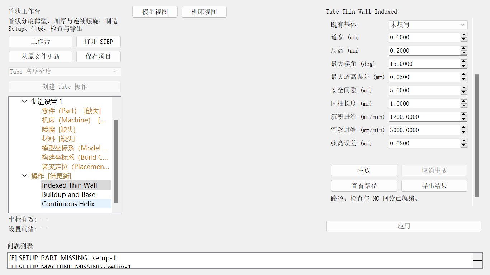
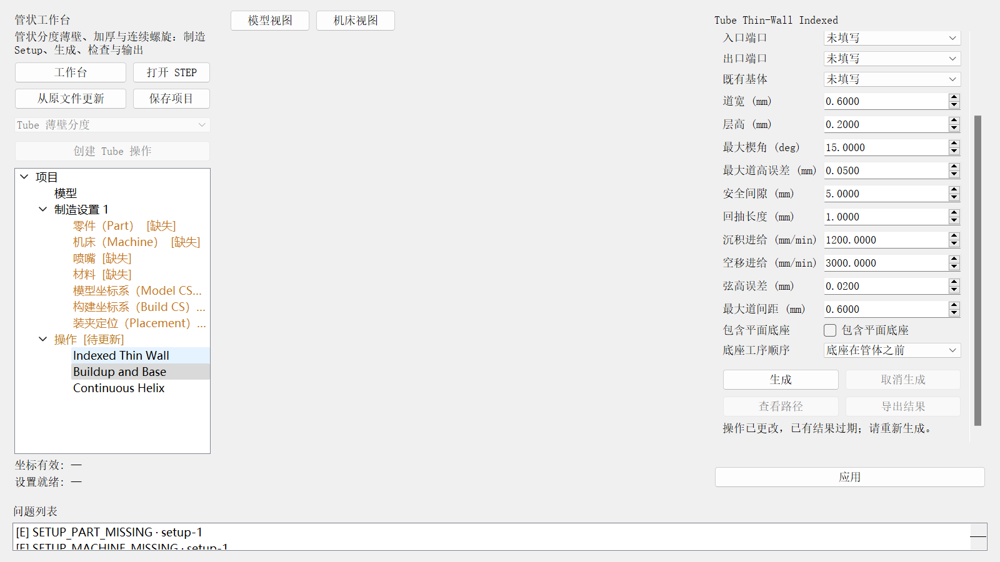
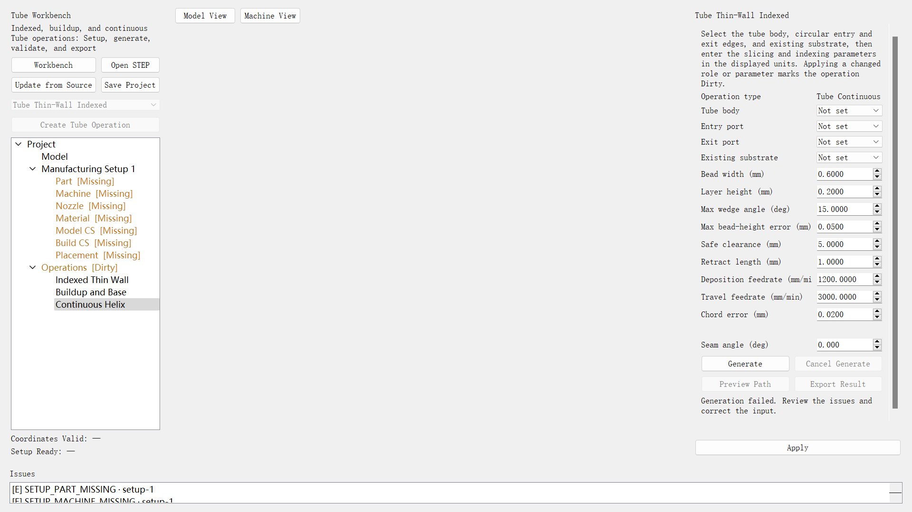

# Tube 工作台中文使用手册

本手册对应当前版本的 Tube Workbench。它描述可在软件中完成的离线流程：导入 STEP、建立制造 Setup、选择 Tube 操作、生成和检查路径、查看 NC 回读结果、导出产品以及保存项目。页面文字可切换中英文。

## AUD-02 修复后的使用要求

生成已接入 Source→Build、Placement 与机型轴变换；完整已应用 Setup 是路径生成前提。源文件、资源、坐标或操作改变后旧结果 Stale，需重新生成，不能沿用旧导出资格。弦高参数用于真实 STEP 轮廓细分；G-code 完整回读核对模式、材料、事件及额外移动。

直管三组装夹/旋转对照已生成并回读通过。真实 pipe2 使用 1 mm 道宽/层高时，在第 7377 个几何点要求 A=±122.318610°，超出 Generic XYZAC 的 ±120°，因此无 NC，碰撞阶段尚未执行。不要扩大机型限位来隐藏该诊断；应使用经过确认的设备与装夹方案。最新六件套和失败定位见 [AUD-02 修复复盘](../reviews/2026-09-12_algorithm_audit_fixes.md)，下方旧截图与数值属于历史示例。

## 1. 进入 Tube 工作台

可用 `Ctrl+O` 导入 STEP/STP，也可先选择任一工作台再打开模型。模型载入后：

1. 点击左侧“进入管状设置（定义坐标）”，或返回“工作台”并选择“管状工作台”。
2. 在左侧点击“创建 Tube Thin-Wall Indexed”，建立第一条操作。
3. 若已有操作，使用操作类型下拉框选择需要的 Tube 操作。当前支持 Indexed、Buildup 和 Continuous；同一版本最多支持三条交互操作。

## 2. 完成 Setup

推荐顺序为：**Part → Machine → Model CS → Build CS → Placement**。Nozzle 和 Material 应同时检查，以便达到“设置就绪”。每个页面修改后点击“确认”或“应用”；坐标和装夹编辑存在草稿时，不要直接用脚本覆盖。

### Part

在“零件（Part）”页把参与制造的封闭 solid 设为 Part。sheet、shell、忽略实体和未分配实体不会进入 Tube 制造计算，但仍可保留在模型显示中。`pipe2` 的圆盘和弯管应作为同一个打印件的 Part。

### Machine、Nozzle、Material

在 Machine 页应用包含轴链、Machine CS、打印板和安装位的 Machine Profile。`Cartesian Reference` 与 `Generic XYZAC Reference` 是参考机型，会保留警告。Nozzle 需要安装接口、实测总长和有效 R–Z 外形；Material 需要完成来源核对。缺少实测资料时应保留未就绪状态，不用猜测值填平错误。

### Model CS 与 Build CS

两套坐标都要分别确认原点、Z 方向和 X 方向，再点击“应用”。可以数值输入，也可以拾取几何；X 与 Z 不能为零向量或共线。Build CS 的数值输入默认以 Model CS 为参考，内部统一保存到 Source CS。

### Placement

在 Machine 和 Build CS 有效后选择打印板安装位，按需输入 `DX/DY/DZ`（mm）及 `RX/RY/RZ`（度），点击“应用”。没有测量偏差时保持六项为 0。

“坐标有效”要求 Part、Machine、Model CS、Build CS、Placement 均有效；“设置就绪”还要求 Nozzle 完整、Material 已核对且没有 Error。Warning 可以保留，但必须在导出前复核。

## 3. 三种 Tube 操作

### Indexed（Tube Thin-Wall Indexed）

用于分段转位的薄壁管体。指定管体、入口圆边、出口圆边和既有基体，并设置道宽、层高、最大楔角、道高误差、安全间隙、回抽、沉积/空移进给和轮廓弦高误差。软件按中心线分区、截交生成轮廓、插入安全转位，并计算参考 XYZAC 轨迹。

### Buildup（Tube Buildup and Base）

用于多道厚壁/加厚以及独立底座工序。除 Tube 工艺参数外，要核对多道顺序、底座操作和跨操作安全衔接。它适合在 Indexed 薄壁结果之外表达加厚或底座构建。

### Continuous（Tube Continuous Helix）

用于空间中心线上的连续螺旋路径。需核对中心线、层/道参数、接缝和连续姿态；低曲率退化、RMF 翻转、姿态奇异、速度/加速度超限或碰撞会使结果不可导出。

三种操作共用以下参数。表中数值是软件默认值，正式项目应按材料、喷嘴、设备和试验结果核定。

| 参数 | 默认值 | 作用与约束 |
| --- | ---: | --- |
| 道宽 | 0.6 mm | 薄壁中心路径对应的沉积宽度；必须大于 0 |
| 层高 | 0.2 mm | 相邻沉积层的名义高度；必须大于 0，且当前约束不超过道宽的 2 倍 |
| 最大楔角 | 15° | 控制 Indexed 中心线分区；必须大于 0 且不超过 90° |
| 最大道高误差 | 0.05 mm | 控制分区和层面允许的道高偏差；必须大于 0 |
| 安全间隙 | 5 mm | 退离、转位和接近阶段的最小规划间隙；必须大于 0 |
| 回抽长度 | 1 mm | 停止沉积和重新起印之间的材料回抽量；必须大于 0 |
| 沉积进给 | 1200 mm/min | 沉积段的线性进给；必须大于 0 |
| 空移进给 | 3000 mm/min | 无沉积移动的线性进给；必须大于 0 |
| 弦高误差 | 0.02 mm | 曲线离散允许误差；值越小通常点数越多；必须大于 0 |

Buildup 另有“最大道间距”（默认 0.6 mm）、“包含平面底座”和“底座工序顺序”；Continuous 另有“接缝角”（默认 0°）。修改参数并点击“应用”后，已有结果会标记为过期（Stale）；Draft、Ready、Warning、Error 和 Stale 是持久化产品状态，生成中和取消是当前界面活动。

## 4. 生成、检查、查看和导出

1. 确认 Setup 为有效状态，选择操作并完成参数应用。
2. 点击“生成”。生成期间可点击“取消生成”；取消后上一份结果保持不变。
3. 生成完成后查看路径预览、问题列表和检查报告。Error 会阻止导出；Warning 需要人工复核。
4. 在 Preview 中检查模型叠加、路径段、层范围、Feature Type 图例，以及 travel、extrusion、五轴姿态抽样开关。点击路径段可查看属性。
5. 只有验证通过且 NC 回读通过的结果才可导出。导出目录会写入产品清单和六件套文件。

以上三图用于说明不同窗口尺寸下的操作树、字段和按钮位置。截图保留了 Setup 缺失、结果过期或生成失败等 UI 冒烟状态，因此属于界面布局与错误态示例；成功产品以问题列表无 Error、产品状态可导出且 NC 回读通过为准。

## 5. 导出结果与六件套

Tube 产品目录通常包含：

- `main.gcode`：生成的 NC/G-code；
- `machine_axes.csv`：参考机床轴轨迹；
- `preview.json`：预览数据；
- `toolpath.json`：路径和运动数据；
- `warnings.json`：警告及需复核事项；
- `manifest.json`：产品版本、输入和验证状态。

仓库中的 `docs/reviews/evidence/2026-09-11_t08_t12/product/pipe2-indexed/` 是阶段验收归档。它用于验证软件流程和文件契约，参数与点数是测试案例数据，不是用户项目的保证值。

## 6. 保存、重开与错误处理

使用 `Ctrl+S` 或“保存项目”。保存前若存在未应用草稿，选择“应用”“放弃”或取消保存。项目目录保存 `project.json`、项目内 STEP 权威副本、资源冻结快照和预览目录。

重开项目时选择目录中的 `project.json`。正常重开使用项目内副本；原 STEP 路径只在明确执行“从原文件更新”时使用。源文件哈希变化、拓扑漂移、资源快照损坏或 YAML/项目冲突会阻止或中断相应操作，应按对话框选择保留项目或载入外部配置。

常见处理：

- 坐标无法应用：检查三项是否分别确认，排除零向量、X/Z 共线和非有限数值。
- 没有安装位：先应用带安装位的 Machine Profile。
- 已生成结果变为 Stale：重新生成当前操作。
- 导出被阻止：先处理问题列表中的 Error，并确认 NC readback passed。
- 视图误旋转：短按时保持鼠标静止；拖动超过阈值后不会触发拾取。

## 7. 能力边界

当前证据覆盖软件内的 Indexed、Buildup、Continuous 生成、检查、回读、UI/脚本/HTTP 路由和保存重开。`Generic XYZAC` 只用于离线参考运动学；通过测试不等于已验证具体控制器语义、后处理器、真实设备参数、机床标定、现场碰撞或试切。导出的 NC 在投入设备前必须由负责工程师按实际机床和控制器重新核对。

本版本的 pipe2 生成产物和“1171 points / readback passed”等数字属于流程测试参数与归档证据，不代表所有模型的性能、精度或生产资格。
