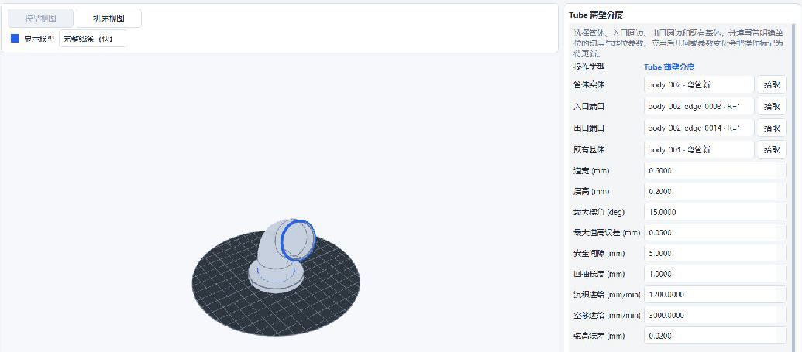
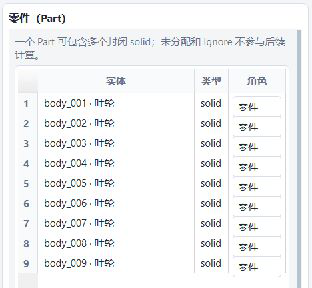
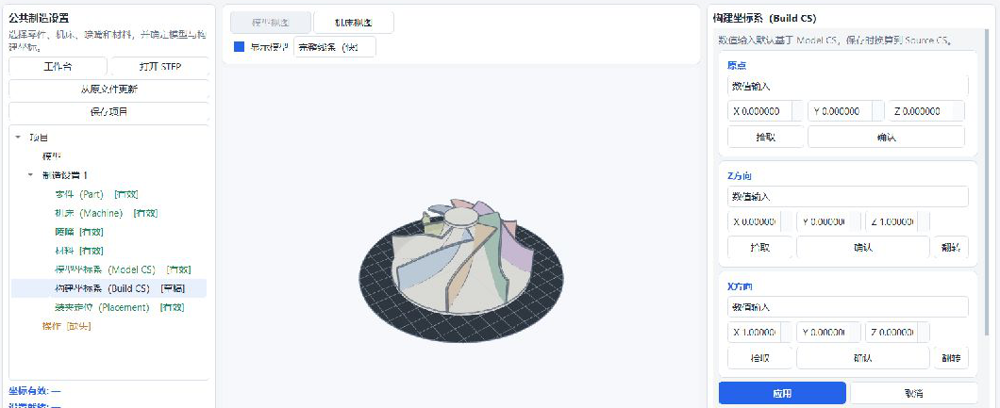
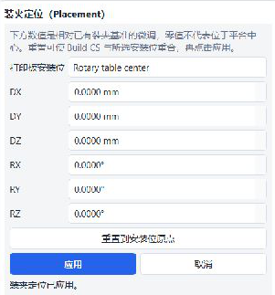
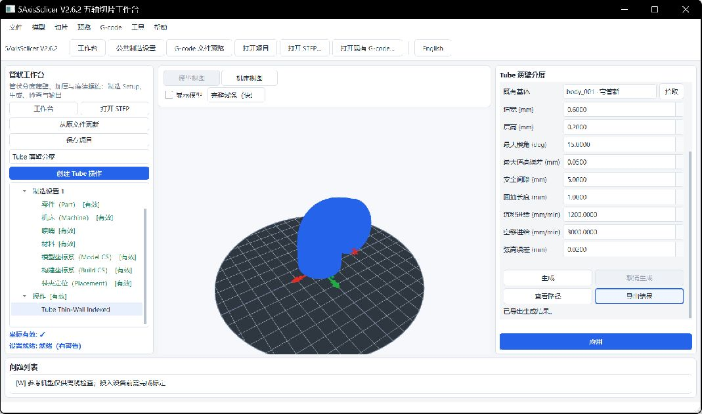

# Tube 工作台中文使用手册

Tube 工作台用于单支恒定圆截面管体的离线切片。操作包括导入 STEP、建立制造设置、选择 Tube 模式、生成和检查路径、回读 NC、导出以及保存项目。页面文字可切换中英文。

> 初次使用请先完成[学习总册](user_learning_manual_zh.md)的 L01—L06；本页是 Tube 专项参考。pipe2 仅用于练习单支恒定圆截面、入口/出口和三种操作的差异，不能把其 ID、参数或点数复制到其他管件。

## 使用前检查

生成已接入 Source→Build、Placement 与机型轴变换；完整已应用 Setup 是路径生成前提。源文件、资源、坐标或操作改变后旧结果 Stale，需重新生成，不能沿用旧导出资格。弦高参数用于真实 STEP 轮廓细分；G-code 完整回读核对模式、材料、事件及额外移动。

Indexed 喷嘴在同一分区内方向固定，仅在安全转位时改变；管壁表面法向只用于几何判断。末层不足名义层高时，按实际厚度挤出。输入变化后结果会 Stale，需重新生成。

本页 pipe2 项目的 0.6 mm 道宽、0.2 mm 层高和 0.02 mm 弦高仅用于演示。自己的模型应按设备、喷嘴、材料和精度要求重新设定，不能照抄案例数值。竖直姿态奇异与参考机型提示可能以 Warning 保留；不要据此修改真实设备限位。真实标定和试切仍需完成。

## 1. 进入 Tube 工作台

可用 `Ctrl+O` 导入 STEP/STP，也可先选择任一工作台再打开模型。模型载入后：

1. 点击顶部“公共制造设置”完成 Part、机型、喷嘴、材料和坐标，再返回“工作台”选择“管状工作台”。
2. 在左侧选择 Indexed、Buildup 或 Continuous，再点击“创建 Tube 操作”。若已有操作，在左侧树中选中它；同一 Setup 可交互创建最多三条 Tube 操作。
3. 在右侧依次点击“管体实体”“入口端口”“出口端口”旁的“拾取”，到中央模型点击对应实体或端口圆边。需要承接既有打印体时，再拾取“既有基体”。核对四项输入后点右下角“应用”。

图中裁取模型与四项几何输入，左侧状态树和下方应用按钮不在裁图内；选好几何后仍需应用并生成，不能沿用保存前的导出状态。换自己的管件时，重新拾取管体、两端口和所需基体，不沿用 pipe2 的几何 ID。

## 2. 完成 Setup

推荐顺序为：**Part → Machine → Model CS → Build CS → Placement**。Nozzle 和 Material 应同时检查，以便达到“设置就绪”。每个页面修改后点击“确认”或“应用”；坐标和装夹编辑存在草稿时，不要直接用脚本覆盖。

### Part

在“零件（Part）”页把参与制造的封闭 solid 设为 Part。sheet、shell、忽略实体和未分配实体不会进入 Tube 制造计算，但仍可保留在模型显示中。`pipe2` 的圆盘和弯管应作为同一个打印件的 Part。

图例来自叶轮项目：九个封闭实体的角色均为“零件”，只用于说明角色表。它不代表弯管的实体数量或完整设置就绪状态；自己的模型须逐项判断。

### Machine、Nozzle、Material

在 Machine 页应用包含轴链、Machine CS、打印板和安装位的 Machine Profile。`Cartesian Reference` 与 `Generic XYZAC Reference` 是参考机型，会保留警告。Nozzle 需要安装接口、实测总长和有效 R–Z 外形；Material 需要完成来源核对。缺少实测资料时应保留未就绪状态，不用猜测值填平错误。

### Model CS 与 Build CS

两套坐标都要分别确认原点、Z 方向和 X 方向，再点击“应用”。可以数值输入，也可以拾取几何；X 与 Z 不能为零向量或共线。Build CS 的数值输入默认以 Model CS 为参考，内部统一保存到 Source CS。

图为叶轮项目的坐标编辑草稿：原点为 (0, 0, 0)，Z 方向为 +Z，X 方向为 +X。它说明三参考编辑器的位置和确认方式，不代表已应用，也不是弯管的推荐坐标值；自己的模型须按几何和构建方向重新定义。

图为叶轮项目的坐标编辑草稿：原点为 (0, 0, 0)，Z 方向为 +Z，X 方向为 +X。它说明三参考编辑器的位置和确认方式，不代表已应用，也不是弯管的推荐坐标值；自己的模型须按几何和构建方向重新定义。

### Placement

在 Machine 和 Build CS 有效后选择打印板安装位，按需输入 `DX/DY/DZ`（mm）及 `RX/RY/RZ`（度），点击“应用”。没有测量偏差时保持六项为 0。

图中为未应用的装夹编辑草稿；需要提交修改时点“应用”。“重置到安装位原点”按 Build CS 与安装位配对，不自动寻找模型中心或底面；未修改的查看可用“取消”退出。

“坐标有效”要求 Part、Machine、Model CS、Build CS、Placement 均有效；“设置就绪”还要求 Nozzle 完整、Material 已核对且没有 Error。Warning 可以保留，但必须在导出前复核。

## 3. 三种 Tube 操作

### Indexed（Tube Thin-Wall Indexed）

用于分段转位的薄壁管体。指定管体、入口圆边、出口圆边和既有基体，并设置道宽、层高、最大楔角、道高误差、安全间隙、回抽、沉积/空移进给和轮廓弦高误差。软件按中心线分区，从当前 CAD 截面生成覆盖管壁厚度所需的多道路径、插入安全转位，并计算参考 XYZAC 轨迹。Indexed 也可能在同层生成多道，不能把多道本身当作 Buildup 的区别。

当前 Indexed 使用有界局部厚度方案：设定道宽是单道宽度上限，实际道宽会按壁厚分配；沉积点层厚可在名义层高的 0.5—1.5 倍范围内变化，材料量按各段实际尺寸计算。路径位置表示材料中心，NC 喷嘴尖端另有半层厚偏移。查看结果时，应使用软件的材料路径预览，不直接把机器 XYZ 当作模型坐标叠加。

若出现 `tube.bounded_boundary_accuracy_deferred` Warning，表示微小接缝缺口、局部重叠与珠道边界精度仍待验证；离线导出和严格回读通过不代表这些精度已合格，也不证明实际材料铺展会消除缺陷。输出保留 `machine_executable=false`，不得据此认定可直接上机。

### Buildup（Tube Buildup and Base）

用于多道厚壁/加厚以及独立底座工序。除 Tube 工艺参数外，要核对多道顺序、底座操作和跨操作安全衔接。它适合在 Indexed 薄壁结果之外表达加厚或底座构建。

Buildup 层面逐层跟随管轴，曲段按内外弯局部道高计算材料量；最大楔角只用于 Indexed。自动底座直接切所选 CAD 实体，保留孔和非圆轮廓。底座使用两道壁、20% 内填充、上下各四层实心皮，复用 Tube 道宽与进给参数；实际层高均分实体厚度且不超过设定值。自动底座要求输入几何处于 +Z 生长姿态，其他姿态会被拒绝。

导出前应检查底座与各道管壁的逐层承接、空移以及材料预热和结束关热事件。离线回读不能代替实机碰撞和试打验证。

### Continuous（Tube Continuous Helix）

用于空间中心线上的连续螺旋路径。需核对中心线、层/道参数、接缝和连续姿态；低曲率退化、RMF 翻转、姿态奇异、速度/加速度超限或碰撞会使结果不可导出。

三种操作共用以下参数。表中数值是软件默认值，正式项目应按材料、喷嘴、设备和试验结果核定。

| 参数 | 默认值 | 作用与约束 |
| --- | ---: | --- |
| 道宽 | 0.6 mm | 名义沉积宽度；Indexed 用作单道宽度上限；必须大于 0 |
| 层高 | 0.2 mm | 相邻沉积层的名义高度；必须大于 0，且当前约束不超过道宽的 2 倍 |
| 最大楔角 | 15° | 控制 Indexed 中心线分区；必须大于 0 且不超过 90° |
| 最大道高误差 | 0.05 mm | 控制分区和层面允许的道高偏差；必须大于 0 |
| 安全间隙 | 5 mm | 退离、转位和接近阶段的最小规划间隙；必须大于 0 |
| 回抽长度 | 1 mm | 停止沉积和重新起印之间的材料回抽量；必须大于 0 |
| 沉积进给 | 1200 mm/min | 沉积段的线性进给；必须大于 0 |
| 空移进给 | 3000 mm/min | 无沉积移动的线性进给；必须大于 0 |
| 弦高误差 | 0.02 mm | 曲线离散允许误差；值越小通常点数越多；必须大于 0 |

Buildup 另有“最大道间距”（默认 0.6 mm）、“包含平面底座”和“底座工序顺序”；Continuous 另有“接缝角”（默认 0°）。修改参数并点击“应用”后，已有结果会标记为过期（Stale）；Draft、Ready、Warning、Error 和 Stale 是持久化产品状态，生成中和取消是当前界面活动。

## 4. 生成、检查、查看和导出

1. 确认 Setup 为有效状态，选择操作并完成参数应用。
2. 点击“生成”。生成期间可点击“取消生成”；取消后上一份结果保持不变。
3. 生成完成后点击操作面板的“查看路径”。中央视窗默认使用“完整线条（快速）”并暂时隐藏模型，以便看见背面和内部的全部路线；勾选“显示模型”可重新叠加 CAD。切换“沉积道宽（简化）”可检查沉积宽度，复杂路径下优先使用完整线条以保持交互流畅。

4. 查看问题列表和检查报告。Error 会阻止导出；Warning 需要人工复核。需要逐层分析 NC 时，在结果预览中调整层范围、路径类型、空移和沉积显示，并核对五轴姿态；不要仅凭一张整体截图判断内部填充或安全移动。
5. 只有验证通过且 NC 回读通过的结果才可导出。导出目录会写入产品清单和六件套文件。

上图为 Indexed 弯管在当前界面中的生成路径，模型已隐藏，右侧显示导出完成。密集线条在整体视图中连成蓝色区域；这张图用于定位查看与导出按钮，局部道间接缝须另行放大检查。底部保留参考机型标定警告，投入真实设备前仍需核对机床配置。

Indexed、Buildup、Continuous 共用上面的几何拾取和生成按钮。切换操作类型后，请以当前面板中出现的字段为准；核对结果时看问题列表、导出状态和 NC 回读，不把未填写的输入面板当作成功结果。

## 5. 导出结果与六件套

Tube 产品目录通常包含：

- `main.gcode`：生成的 NC/G-code；
- `machine_axes.csv`：参考机床轴轨迹；
- `preview.json`：预览数据；
- `toolpath.json`：路径和运动数据；
- `warnings.json`：警告及需复核事项；
- `manifest.json`：产品版本、输入和验证状态。

导出后应检查 `manifest.json` 的完整 NC 回读状态，并在查看器中确认路径落在目标表面、底座与管体相接、空移和转位符合装夹条件。参数和点数取决于当前模型与设置。

## 6. 把流程用于自己的管件

1. 确认目标为单支、恒定圆截面、可辨认入口和出口的管体；分叉、变径或开放片体不适用本工作台的管体算法。
2. 在自己的 STEP 中将管体与同件底座设为 Part。选择属于管体的两条端口圆边，核对入口到出口的生长方向；不要沿用示例的 body/edge 编号。
3. 薄壁选 Indexed；需要多道厚度或一体底座选 Buildup；沿中心线连续沉积选 Continuous。道宽、层高和喷嘴长度按实际材料、喷嘴和目标厚度设置。
4. 先预览少量层，检查路径是否贴着管壁、端部是否闭合、与底座是否相接；再生成完整路径并审查警告与 NC 回读。若端口识别或截面检查失败，重新核对几何，不用放大容差掩盖拓扑问题。

## 7. 保存、重开与错误处理

使用 `Ctrl+S` 或“保存项目”。保存前若存在未应用草稿，选择“应用”“放弃”或取消保存。项目目录保存 `project.json`、项目内 STEP 权威副本、资源冻结快照和预览目录。

重开项目时选择目录中的 `project.json`。正常重开使用项目内副本；原 STEP 路径只在明确执行“从原文件更新”时使用。源文件哈希变化、拓扑漂移、资源快照损坏或 YAML/项目冲突会阻止或中断相应操作，应按对话框选择保留项目或载入外部配置。

重开会恢复 Setup 和操作输入，不恢复运行时生成路径。选择操作并重新生成后，才能预览和导出。生成后修改输入，会使当前结果变为 Stale。

常见处理：

- 坐标无法应用：检查三项是否分别确认，排除零向量、X/Z 共线和非有限数值。
- 没有安装位：先应用带安装位的 Machine Profile。
- 已生成结果变为 Stale：重新生成当前操作。
- 导出被阻止：先处理问题列表中的 Error，并确认 NC readback passed。
- 视图误旋转：短按时保持鼠标静止；拖动超过阈值后不会触发拾取。

## 8. 能力边界

Indexed、Buildup、Continuous 可用于软件内的生成、检查、回读、导出和保存重开。自有 AC 是离线后处理；控制器/宏版本、累计 C 限值、机床标定、现场碰撞和试切仍需核对。导出的 NC 在投入设备前必须由负责工程师按实际机床和控制器重新确认。
