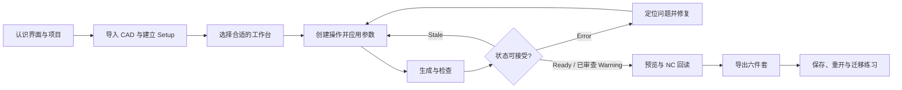
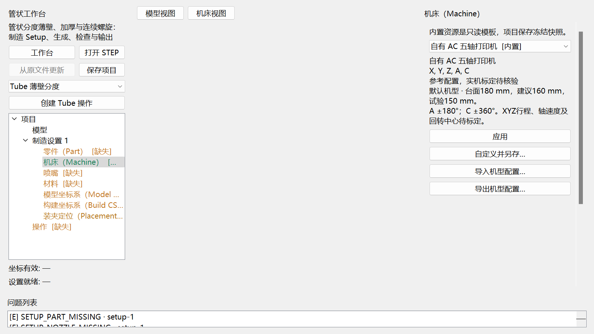
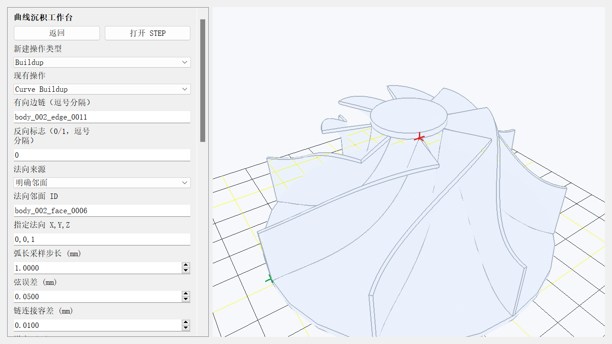

# 5AxisSclicer V2.0 学习手册

文档版本：2026-09-13。适用范围：PC00—PC07 论文核心 AC 受限离线版。

## 0. 当前版本怎样打开窗口

### 在 IDE 中运行

运行仓库根目录的 **`run_app.py`**，不要把测试文件或 `src/five_axis_slicer/app.py` 当作日常启动文件。

- Script path：`<仓库根目录>/run_app.py`
- Working directory：仓库根目录
- Python interpreter：已安装项目运行依赖的 Python 3.10—3.12 环境
- Program arguments：普通启动留空；练习入口可填 `--demo`；只打开成果页可填 `--results`

当前开发工作区已经验证的解释器是 `tmp/pytest9/Scripts/python.exe`。它继承系统依赖，只适合本机当前开发验证；重新搭建环境时按根 README 创建 `.venv`。

### 在 PowerShell 中运行

在仓库根目录打开 PowerShell，推荐显式指定解释器：

```powershell
.\scripts\run_app.ps1 -Python ".\tmp\pytest9\Scripts\python.exe"
```

使用自己创建的 `.venv` 时：

```powershell
.\scripts\run_app.ps1 -Python ".\.venv\Scripts\python.exe"
```

打开内置练习项目或成果预览页：

```powershell
.\scripts\run_app.ps1 -Python ".\.venv\Scripts\python.exe" -Demo
.\scripts\run_app.ps1 -Python ".\.venv\Scripts\python.exe" -Results
```

`scripts/run_app.ps1` 最终调用的仍是根目录 `run_app.py`。如果当前终端的 `python` 已正确安装本项目依赖，也可直接运行 `.\scripts\run_app.ps1`。

这本总册按“认识软件—建立制造语义—选择工作台—生成与判断—导出与重开—迁移到自己的零件”组织。随附的 pipe2、平面件、叶轮、扇叶和半球只用于练手；课程目标是让使用者能够独立判断新零件适合哪个工作台、需要哪些输入、何时可以导出，以及何时必须停止。

模块手册用于查参数和边界，不建议初学者从中任选一个案例直接照抄。学习过程中遇到字段、错误码或高级操作，再从[手册索引](README.md)进入对应参考章节。

## 1. 开始前必须知道的边界

- 当前产品资格限于离线生成、检查、NC 回读、项目保存和重开。
- `Ready` 或 `Warning` 表示软件内流程达到对应状态；`Warning` 必须逐条复核。
- `Error` 会阻止导出；`Stale` 表示输入已经改变，旧结果不可继续作为当前结果使用。
- Generic XYZAC 是参考机型。自有 AC 的控制器/宏版本、标定、现场碰撞和试切仍未验证。
- 当前自有 AC 输出保持 `machine_executable=false`。不要把“能导出 G-code”理解为“可以直接上机”。
- 长度默认用 mm；内部角度用 rad，界面角度字段会明确显示 deg 或 rad。坐标必须区分 Source、Model、Build、Workpiece 和 Machine frame。

## 2. 学习路径



建议按 L01—L06 完成公共基础，再选一条 W01—W05 工作台支线，最后完成 L07—L09。每课都包含“学会什么、练手任务、自检、迁移任务”。如果自检未通过，回到问题对应章节，不要只复制案例中的 ID 或参数。

## 3. 教程矩阵

| 编号 | 学习主题 | 学完能够做到 | 练手材料的用途 | 自检结果 | 参考章节 |
| --- | --- | --- | --- | --- | --- |
| L01 | 界面、项目与 Viewer | 找到工作台、操作树、编辑器、Viewer、问题列表和成果预览 | 任一随附 STEP 只用于认识界面 | 能解释五个区域的职责 | 本册第 4 章 |
| L02 | CAD、对象与稳定引用 | 区分 body/face/edge/vertex，选择 Part 并理解引用重绑 | pipe2 用于观察多个 solid 和圆边 | 能说出所选几何的角色和父 body | [Tube 坐标](tube_coordinate_setup_zh.md) |
| L03 | Setup 与坐标 | 按 Part→Machine→Nozzle/Material→Model CS→Build CS→Placement 完成设置 | pipe2 用于练习原点与方向 | 坐标有效、设置就绪，未知参数没有被猜填 | 本册第 5 章 |
| L04 | 工作台选择 | 根据几何和制造意图选择 Planar、Curve、Rotary、Tube 或受限 Freeform | 五类随附零件用于比较 | 能写出选择理由和拒绝条件 | 本册第 6 章 |
| L05 | 操作与参数 | 创建操作，区分几何、工艺、运动和检查参数 | 使用选定支线的示例默认值起步 | 修改参数后旧结果进入 Stale | 本册第 7 章 |
| L06 | 生成、状态与恢复 | 识别 Ready、Warning、Error、Stale，修复后重新生成 | 错误截图用于学习诊断 | Error 时无法导出，取消不破坏旧结果 | 本册第 8 章 |
| W01 | Planar 支线 | 完成平面区域、层和一种平面路径 | 平面实体用于验证层高、道距和孔岛 | 路径位于区域内，层与覆盖可解释 | [Planar](planar_workbench_zh.md) |
| W02 | Curve 支线 | 建立有向 edge 链、法向和曲线沉积 | 叶轮边链用于练习顺序与法向 | 链连续，方向和相邻面明确 | [Curve](curve_workbench_zh.md) |
| W03 | Rotary 支线 | 建立固定回转轴和角度区间 | 圆柱/轮毂用于练习固定轴 | 轴、零角、周期和区域一致 | [Rotary](rotary_workbench_zh.md) |
| W04 | Tube 支线 | 识别单支恒定圆截面并选择 Indexed/Buildup/Continuous | pipe2 用于比较三种 Tube 意图 | 入口、出口、中心线和安全转位可解释 | [Tube](tube_workbench_zh.md) |
| W05 | Freeform 支线 | 建立有限面组、导引线和显式材料区域 | 半球、扇叶或叶轮用于练习有限面组 | 每条导引有邻面，路径未越过 trim | [Freeform](freeform_workbench_zh.md) |
| L07 | Viewer、检查与 NC 回读 | 分辨模型坐标、机床坐标、沉积、空移和事件 | 任一已生成产品用于逐段检查 | 能从问题、路径和代码三处交叉定位 | 本册第 9 章 |
| L08 | 六件套、项目与重开 | 导出并解释六件套，保存和重开项目 | 已完成练习用于保存重开 | 六文件齐全，重开后来源和状态可追溯 | 本册第 10 章 |
| L09 | 独立迁移 | 不复制示例 ID 和参数，为自己的零件建立流程 | 换成同类自有零件 | 完成迁移检查单并记录未知项 | 本册第 11 章 |

## 4. L01：认识界面，不急着切片

打开任一随附 STEP，先找到五个长期不变的区域：

1. 顶部入口：工作台、成果预览、打开项目、打开 STEP、打开现有 G-code 和语言切换。
2. 左侧工作区：当前工作台说明、操作类型、项目树和快捷动作。
3. 中央 Viewer：模型、生成路径、坐标轴和机床视图。
4. 右侧编辑器：当前树节点或操作的参数。
5. 底部问题列表：Error、Warning 和可定位诊断。


图中的 pipe2 只用于认识模型、body/edge 列表和入口。此时不要求记住它的实体编号。换一个 STEP 后编号可能改变，应根据几何角色和稳定引用重新确认。

**自检**：关闭模型再重新打开，能找到工作台入口、Viewer、问题列表和保存项目按钮；能说明“打开现有 G-code”和“创建制造操作”的用途不同。

## 5. L02—L03：从几何建立制造 Setup

### 5.1 先给对象分配角色

Part 可以包含多个封闭 solid。参与制造的实体设为 Part；辅助 sheet、基体、夹具或明确忽略的实体保留各自角色。不要因为示例里两个 body 都是 Part，就把新模型中的所有对象全部选为 Part。


上图是尚未完成 Setup 的教学画面，问题列表中的缺失项是预期错误示例。完成对应节点后，错误应逐项消失。

### 5.2 按固定顺序完成 Setup

推荐顺序如下：

1. **Part**：确认参与制造的实体。
2. **Machine**：选择参考机型或已核验机型快照。
3. **Nozzle 与 Material**：核对来源、尺寸和审核状态。
4. **Model CS**：定义模型的原点、Z 方向和 X 方向。
5. **Build CS**：定义构建方向和构建平面。
6. **Placement**：把 Build CS 放入机床安装位，并录入有证据的微调。


原点、Z 和 X 要分别确认；X 与 Z 不得为零向量或共线。没有标定依据时，Placement 的六项微调保持 0，并把真实标定列为未完成项。

### 5.3 机型选择只冻结当前项目快照



内置资源是只读模板。项目保存的是冻结快照，之后用户资源库发生变化不会静默改写旧项目。参考机型产生 Warning 是正常安全边界，不应删除警告来获得绿色状态。

**自检**：能够指出 Source、Model、Build 和 Machine 的区别；能解释为什么没有测量依据时不填写虚构零偏或回转中心。

## 6. L04：按制造意图选择工作台

选择工作台时先看几何和制造意图，再看模型名称或外观。

| 问题 | 满足时优先考虑 | 不满足时不要硬套 |
| --- | --- | --- |
| 层面基本平行，区域可由实体截面或平面边界表达吗？ | Planar | 路径必须连续改变构建方向 |
| 制造中心是一条明确有向 edge 链吗？ | Curve | 需要覆盖整个曲面或体积 |
| 区域能由一条固定轴和同轴圆柱/圆锥面表达吗？ | Rotary | 弯管中心线会随空间位置变化 |
| 零件是单支、恒定圆截面的管体吗？ | Tube | 分叉、变径或任意截面 |
| 已有有限修剪面组和明确导引边链吗？ | 受限 Freeform | 需要自动识别全局曲面或任意网格参数化 |
| 只有外部 NC，需要查看和诊断吗？ | Imported NC Review | 不能用它代替路径生成 |

### 6.1 几何外观相似也可能选择不同



叶轮可用于学习 Curve 的 edge 链，也可用有限面组学习 Freeform；两者的输入契约不同。选择 Curve 时制造中心是边链，选择 Freeform 时区域由面组和导引线共同限定。


Rotary 要求固定回转轴。弯管虽然局部截面呈圆形，中心线方向持续变化，通常应进入 Tube，而不是把每个弯曲段硬解释成一个 Rotary 操作。

**自检**：为待处理零件写一句选择理由和一句拒绝条件。例如：“选择 Rotary，因为区域与固定 Z 轴同轴；若实际轴随中心线变化，则退回 Tube 判断。”

## 7. L05 与工作台支线：创建操作和理解参数

所有工作台都遵循同一操作循环：

1. 选择“新建操作类型”，创建操作。
2. 选择或填写几何引用。
3. 录入工艺和运动参数，点击“应用几何与参数”或对应的“应用”。
4. 查看操作树状态和问题列表。
5. 点击“生成与检查”。

参数分为四类：

| 类别 | 例子 | 修改后的影响 |
| --- | --- | --- |
| 几何 | body、face、edge、区域、入口/出口 | 需要重新解析或重绑，旧结果 Stale |
| 工艺 | 道宽、层高、道间距、层数、材料区域 | 影响路径和材料量，旧结果 Stale |
| 运动 | 进给、安全间隙、回抽、姿态和角速度 | 影响轴轨迹和检查，旧结果 Stale |
| 显示 | 视角、路径显隐、层范围 | 通常只改变观察，不改生成结果 |

示例默认值只用于让界面进入可学习状态。迁移到自己的零件时，应根据喷嘴、材料、目标壁厚、设备和试验结果重新核定。

### 7.1 W01：Planar

从 Region 或 Zigzag 开始，观察层高、道宽、填充间距如何改变路径。Offset、Thin Wall、Spiral 和 Planar Support 放在掌握区域与层以后学习。


迁移任务：换一个带孔或岛的平面截面，确认路径没有穿过孔洞，层数和首末 Z 与输入一致。

### 7.2 W02：Curve

先只选一条连续 edge 链，明确顺序、反向标志和法向来源。之后再增加 Multi-pass 或 Offset。若链断开、邻面歧义或 Offset 离开曲面，修复引用，不要用放大容差掩盖问题。

迁移任务：换一条曲率不同的边链，反向一次，检查路径方向和法向是否按预期改变。

### 7.3 W03：Rotary

先完成轴、零角方向、回转面和起止角，再学习 Spiral、Thin Wall 与 Around Part。跨 0° 的区间使用连续展开角表达，不把 350°→380°错误截断成 350°→360°。

迁移任务：在同轴但长度或半径不同的零件上重建轴和区域，确认没有复制示例 face ID。

### 7.4 W04：Tube

Indexed 用于分段转位薄壁，Buildup 用于多道加厚和可选底座，Continuous 用于沿空间中心线连续螺旋。pipe2 用于比较三种制造意图，不要求复刻其点数或 A/C 数值。

迁移任务：用另一条单支恒定圆截面管检查入口、出口和中心线方向；分叉或变径应明确拒绝。

### 7.5 W05：受限 Freeform

每条导引线都要有明确邻面，所有邻面都要包含在受限面组中。有限多道和多层必须仍落在 trim 内。材料区域按生成的 region ID 显式分配，不使用模型名称猜材料。

迁移任务：换一个有限面组，先用单导引生成，再增加第二条导引；每次只改变一个因素并记录 Stale 和重新生成过程。

## 8. L06：把状态和错误恢复当作正式课程

| 状态 | 含义 | 下一步 |
| --- | --- | --- |
| Draft/未应用 | 编辑器内容尚未进入项目状态 | 应用或放弃草稿 |
| Ready | 生成与检查达到当前软件判据 | 继续 Viewer 和回读复核 |
| Warning | 结果存在，但有需要人工审查的限制 | 逐条记录；不能自动当作生产通过 |
| Error | 生成或验证失败 | 导出应禁用；按错误定位根因 |
| Stale | 几何、参数、材料、Setup 或控制器已改变 | 重新生成，不能沿用旧导出资格 |


上图中旧路径仍保留，方便比较，但导出按钮已经禁用。重新生成完成前，旧图形只用于观察。


遇到运动限位、加速度、碰撞或坐标错误时，先检查单位、frame、机型和操作参数。不要直接删除检查项或任意扩大限值。

恢复练习：主动修改一个已生成操作的层高，确认结果变为 Stale；重新生成后再制造一个明确的无效输入，确认 Error 会阻止导出；修复输入并确认恢复。

## 9. L07：Viewer、检查和 NC 回读

生成完成后按三个层次检查：

1. **几何层**：路径是否落在目标区域，接缝、层、道间距和法向是否合理。
2. **运动层**：空移、退离、转位、接近、速度、加速度、轴限、FK 回代和碰撞报告。
3. **代码层**：G90/G91、M82/M83、G93/G94、轴字、E、F、材料事件和宏展开是否符合注册控制器语义。


这张图说明 `Warning` 可保留有效离线路径，但必须审查警告后才允许人工决定是否导出。Viewer 看起来连续不能替代 NC 回读；NC 回读通过也不能替代真实控制器和现场碰撞验证。

## 10. L08：理解六件套、保存和重开

| 文件 | 用途 | 最低检查 |
| --- | --- | --- |
| `main.gcode` | 控制器方言输出 | 模式、轴字、E/F、事件和末尾状态 |
| `toolpath.json` | 规范化路径和事件 | 点、层、区域、材料和来源 |
| `machine_axes.csv` | 参考机床轴轨迹 | 轴范围、连续性和单位 |
| `warnings.json` | 警告和限制 | 每条都有处置或保留理由 |
| `preview.json` | 回读/预览数据 | 来源、frame 和段统计 |
| `manifest.json` | 输入、版本和资格摘要 | 哈希、状态和 `machine_executable` |

保存项目后应关闭并重开一次。重开检查：

- 项目使用保存的 source 权威副本和资源快照；
- 操作、几何引用、材料区域和当前状态仍存在；
- 源文件更新或拓扑漂移会触发重绑或失效，不会静默换成别的几何；
- 重新生成后的六件套与当前输入一致。

## 11. L09：迁移到自己的零件

完成任一随附案例后，必须换一个同类零件做迁移练习。迁移时不要复制 body/face/edge ID、绝对坐标、层数、点数、A/C 范围或示例进给。

### 11.1 迁移检查单

- [ ] 我能用一句话说明选择这个工作台的几何理由。
- [ ] 我记录了不适用条件，并确认当前零件没有越界。
- [ ] Part、Machine、Nozzle、Material、Model CS、Build CS 和 Placement 都有来源。
- [ ] 几何引用由当前零件重新选择，没有复制示例 ID。
- [ ] 道宽、层高、进给、姿态和安全间隙有项目依据；练习默认值已重新核定。
- [ ] 我制造并修复过至少一个 Error，也验证过参数变化后的 Stale。
- [ ] 我检查了几何、运动和代码三个层次。
- [ ] 六件套齐全，项目保存重开后仍可追溯。
- [ ] 未验证的控制器、标定、碰撞和试切项目继续保留为未验证。

### 11.2 结课标准

能够在不查看示例 ID 和逐步答案的情况下，为一个同类新零件完成“选择工作台—Setup—操作—生成—检查—回读—导出—保存重开”，并能解释至少一个 Warning、一个 Error 和一次 Stale 恢复，才算完成入门学习。

## 12. 后续查阅

- [机型选择与自定义](machine_profiles_zh.md)
- [Tube 坐标设置](tube_coordinate_setup_zh.md)
- [Tube 三种操作](tube_workbench_zh.md)
- [Planar](planar_workbench_zh.md)
- [Curve](curve_workbench_zh.md)
- [Rotary](rotary_workbench_zh.md)
- [受限 Freeform](freeform_workbench_zh.md)
- [多材料通道](material_channels_zh.md)
- [自有 AC 离线控制器](paper_core_ac_controller_zh.md)
- [G-code 预览](gcode_preview_zh.md)

Research 工作台仍未完成，因此没有编写可操作教程。设计计划和研究入口不能作为可用功能说明。
