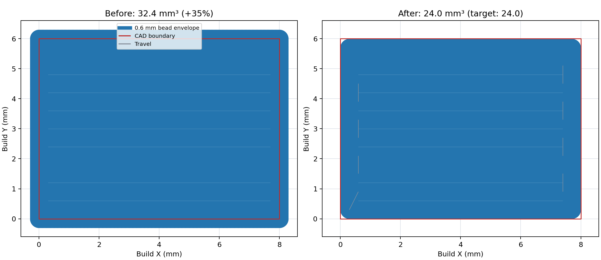
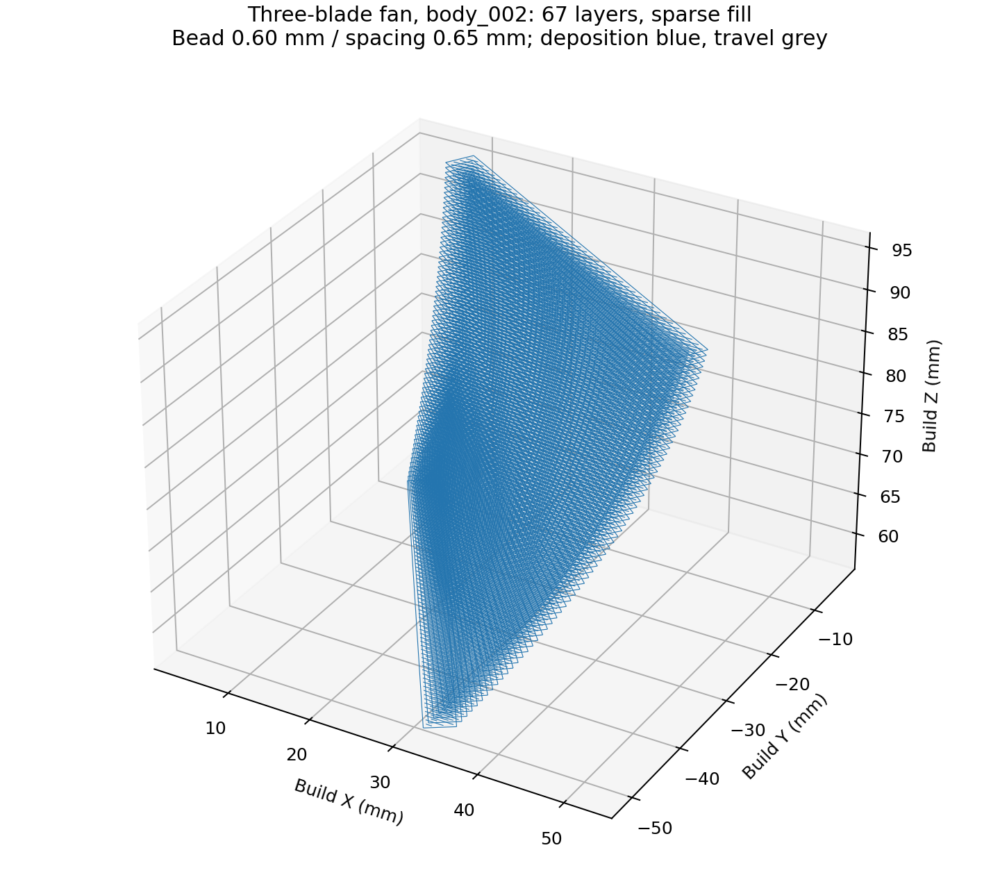

# AUD-02 算法缺陷修复与重新验证

日期：2026-09-12。依据 [AUD-01 审查](2026-09-12_project_algorithm_audit.md)与[批准的修改方案](../planning/2026-09-12_algorithm_audit_fix_plan.md)。用户随后要求“按照检查出来这个缺陷一个一个赶紧修”，本轮已实施。本文对应本轮修复后的能力；早期 AUD-01 和本轮 `*_initial`、`*_v2` 产物保留为过程证据，不能替代最终资格。

## 修复结果

| 缺陷 | 已实施的修改 | 可核对结果 |
| --- | --- | --- |
| Tube 忽略 Placement / Build CS | 建立统一 Source→Build 几何上下文；IK 只接工作台端点到 Mount 的静态变换，避免重复旋转 | 装夹 X 改动 100 mm 后 NC 与机器轴改变；独立 FK 最大误差约 1.6×10⁻¹³ mm；直管三组六件套见 [Tube 摘要](evidence/2026-09-12_audit_fixes/tube/products/summary.json) |
| 修改 Setup 后仍能导出旧结果 | Tube、Planar 的完整输入指纹覆盖坐标、资源、几何与源文件、算法版本；生成中改参不发布旧上下文；恢复/导出再次核验 | 旧资格降为 Stale，保留用户参数及预览；取消保留上一份结果；未应用草稿、未审阅资源和 Setup Error 阻止生成 |
| 基体/fixture 与 IPW 未接入 | Tube 生成服务传入已变换的基体/fixture，启用已打印体与运动检查 | 接入、相交夹具、失效与取消反例已测试。几何计算尚未到达的碰撞阶段不记为通过 |
| NC 回读漏掉模式、材料、事件和额外移动 | Writer 发出 G21/G90/M82/G92 E0；完整流校验所有受支持指令、坐标/进给、逐点 E、回抽/恢复、结束事件与终止位置；极小增量用 Decimal 保存 | 冻结 277 点路径的正常输出通过，E×2、G91、M83、删事件、额外未标记 G1 五类损坏全部失败；[反例结果](evidence/2026-09-12_audit_fixes/gcode/mutation_summary.json) |
| 合法 STEP 截层被误判开口 | 根据共享拓扑顶点恢复有向环，曲线端点校正上限 1 μm；真开口、分支和大误差仍拒绝 | 三叶扇 67/67 层成功；叶轮指定 Z=20.6 mm 成功，全高 59/67 层成功、8 层明确 Error；[逐层结果](evidence/2026-09-12_audit_fixes/sections/final/full_height_sections.json) |
| Tube STEP 分支忽略弦高参数 | 根据请求弦高细分真实截交曲线，并检查线段内部误差 | 半径 5.5 mm、请求 0.001 mm 的直管通过；完整产品由原 129 点增加到 346 点 |
| Zigzag 超边界与过填 | 轮廓中心内移半道宽，填充域内移一道宽；共点交点按偶奇抵消；按邻近端点排序；增加完整线段道宽包络、覆盖/搭接及区域体积检查 | 矩形目标 24 mm³，原指令 32.4 mm³，现为 24 mm³；越界由 0.3 mm 降至数值零；不同岛的欠填不能掩盖局部过填 |
| Spiral 层间只核对插值轮廓 | 内移半道宽，在中间 Z 上独立检查真实 BRep 的中心与道宽周边；finish 位于实际末尾 | 两端截面相同、中间有窄颈的实体反例被阻断；真实三叶扇 129 点输出通过；保留有限采样 Warning |
| 支撑空移穿过柱体 | 用 OCCT 整段距离及实体内部关系核对所有运动，包含沉积、空移、斜移和首点 | 178 点柱/顶板案例的 57 条穿柱空移全部识别，Error、空 G-code、实际导出拒绝；66 点安全对照仍可导出；[支撑证据](evidence/2026-09-12_audit_fixes/support_motion/final/summary.json) |

集成中补修了 Offset/Thin Wall 回抽恢复缺少执行序位、Buildup 跨工序只有事件没有实际安全点、Planar Source/Model 显示坐标混用，以及 Error 结果在 UI 中仍显示“可以生成”的问题。独立 GPT-6 复核另构造两个目标各 100 mm³、指令分别为 150/50 mm³ 的反例；现在逐段累计材料绝对偏差，并按区域汇总真实材料指令，正负误差无法抵消。

## 路径与材料量

图中使用原审查保存的 Toolpath 与修复后的 Toolpath。蓝色为 0.6 mm 道宽包络，红线为 8×6 mm CAD 截面，灰线为空移。体积按声明的矩形道截面 `length × width × height` 计算；图形覆盖按圆端帽二维包络采样。两种量测口径分别报告，不把圆端帽覆盖面积当作真实熔融材料体积。回抽和恢复属于 E 事件，沉积体积不含初始引料。

检查报告新增半道宽包络越界、采样网格、覆盖、搭接、目标截面面积/层体积、实际材料量、逐区域量与逐段绝对偏差。默认网格为 `min(0.25, 最小道宽/3)` mm，面积是离散估计；目标区域面积使用外环减孔的鞋带公式。允许的包络离散误差为 0.001 mm。区域材料超量只允许边界位移造成的 `P×ε + nπ ε²` 面积不确定量乘层高，不因路径过填反向放大容差。

| 模型与参数 | 最终结果 | 输出与限制 |
| --- | --- | --- |
| 8×6×1 mm 矩形，Z=0.5、层高0.5、道宽/间距0.6 mm | 21 点，24.0 mm³，回读通过 | [六件套](evidence/2026-09-12_audit_fixes/planar_models_final/rectangle/product/) |
| 三叶扇 body_002，Z=60.0→61.2，层高/道宽/间距0.6 mm | 424 点，最大包络误差约0.00000249 mm，回读通过 | [局部六件套](evidence/2026-09-12_audit_fixes/planar_models_final/fan_local/product/) |
| 三叶扇 body_002，Z=56.3→95.9，67层，0.6 mm密排 | 截交和路径完成；5层局部材料超量超过边界不确定量，禁止导出 | 初版总量汇总曾放行，最终逐区域检查撤回资格；[明确错误](evidence/2026-09-12_audit_fixes/planar_models_final/fan_full/summary.json) |
| 同一全高模型，道宽0.6、间距0.65 mm | 7475 点，回读通过，采样未覆盖面积约5.98% | **稀疏填充**，不是100%实心；[可导出六件套](evidence/2026-09-12_audit_fixes/fan_full_sparse/product/) |
| 三叶扇 Spiral，Z=60.0→60.6 | 129 点，真实 BRep 采样通过、回读通过 | [六件套](evidence/2026-09-12_audit_fixes/planar_models_final/fan_spiral/product/)；最大线性步长0.1 mm、周向16点；尚无连续体积扫掠证明 |
| pipe2 Planar，Z=20→21.2，道宽/层高0.6 mm密排 | 材料224.916 mm³，对应目标175.134 mm³，禁止导出 | 1 mm壁厚中两条0.6 mm边界道互相搭接，不能再作为合格默认参数 |
| pipe2 Planar，道宽/层高0.4、间距0.5 mm | 4584 点，回读通过；采样未覆盖面积约6.60% | **稀疏填充**；[六件套](evidence/2026-09-12_audit_fixes/planar_models_final/pipe_bead_04_sparse/product/)；空移/沉积路长比0.339。原审查为7.085，参数不同，不把比值差全部归因于排序 |
| pipe2 Tube，1 mm道宽/层高、弦高0.01 mm | 67层、15479个几何点；第7377点需要A=±122.318610°，超出参考机型±120° | 正确阻断，没有NC；尚未进入碰撞阶段；[定位证据](evidence/2026-09-12_audit_fixes/tube/pipe2_wall_1mm/blocked_point.json) |
| 叶轮 body_002，Z=20→21.2，0.6 mm密排 | 截层修复后路径可检查，但最大包络越界0.043274 mm且材料超量，禁止导出 | [具体结果](evidence/2026-09-12_audit_fixes/planar_models_final/impeller_local/summary.json)；全高另有8层原生几何误差过大 |

叶轮被拒绝的层高为2.6、22.4、32.6、33.2、33.8、34.4、35.0、41.6 mm。比较直接平面/大平面 Face、是否 Approximation 等16组内核设置后，最大端点差仍达到0.48511 mm。没有采用扩大容差强行闭环。这部分需要可靠的 CAD 修复或其他经过验证的几何策略。

## 验证与当前边界

实际使用 `five-axis-workbench-development`（含相关 stage gates）与 `five-axis-slicer-validation`。4名 GPT-6 分担 Tube、完整NC/状态、截层/支撑与根任务集成，Qt 和全仓测试串行。解释器为 `tmp/pytest9/Scripts/python.exe`，Python3.12.7；预检依赖与 QSettings 均通过，没有安装组件或修改系统权限。少量子任务遇到系统 pytest 临时目录 WinError5，改用项目内独占 `--basetemp` 后完成。

本轮代码回归与质量结果将在最终日志完成后补入此处。已完成的专题包括 Tube 94 passed/6 subtests、完整NC 52 passed、Planar上下文27 passed、截层12 passed、支撑运动13 passed。专题集合存在交集，不相加作为总测试数。全仓首轮722 passed、1 failed、3 skipped、130 subtests；唯一失败为旧UI文案精确断言，更新后专项30 passed。首次失败、修复后日志和来源快照均保留。

UI增加中英文 Error/Warning 原因、禁止导出及当前输入未就绪说明。真实 Qt/OpenGL 截图覆盖三尺寸、中英文、改参 Stale、材料超量 Error、重新生成恢复与有效Tube产品。初次截图发现英文长诊断压缩表单字段，随后增加滚动内容与字段自然高度约束，并重新渲染检查。最终图片见 [UI摘要](evidence/2026-09-12_audit_fixes/ui_final/summary.json)。

支撑输出仍是独立支撑操作，尚无零件与支撑的联合逐层调度，也没有完整喷嘴扫掠资格。目标CAD相交检查采用保守静态障碍口径，不能解释为真实已打印状态。Spiral报告中的二维离散层投影误差不等同于连续Z实体误差；当前实体检查为明确披露的有限采样。Generic XYZAC、软件默认材料及审查用喷嘴均为离线测试条件，没有现场机床、控制器或打印工艺资格。

Planar最终产品版本提升到v3，旧v1/v2及缺少新上下文的持久化资格失效。修复期间的早期v2六件套仅留作追踪；新结果需要从当前输入生成。Tube使用新生成上下文及旧状态迁移。所有旧AUD-01证据保持原样；本轮归档Python脚本另存`.py.txt`避免进入全仓代码扫描，路径变化见`archive_path_migrations.json`，字节哈希未变。

同一工作区另有自有机型配置任务的改动，本轮保留其内容。该机型不能从本报告的Generic XYZAC数值推断资格；最终源码清单会把并行修改列出，以免将其误记为AUD-02实施。

## 复盘与后续

本轮有效的检查方法是用独立坐标变换/FK、解析体积、真实CAD相交和损坏NC反例验证制造含义。路径生成器与检查器共享数据格式，但不复用同一几何推导作为唯一正确性依据。总量通过仍可能掩盖局部错误，默认参数能够生成也不代表适合每个局部壁厚。

保留严格拒绝不可靠叶轮几何、过填参数及超限轴姿态的取舍。可复用完整流NC验证、生成上下文指纹、截层拓扑恢复、区域体积检查与支撑整段检查。后续若需要100%实心窄壁、自适应道宽、联合支撑调度或特定机床的完整pipe2程序，应按这些具体输入扩大算法与工艺资格；本轮没有把稀疏对照或安全阻断计为这些能力已完成。
