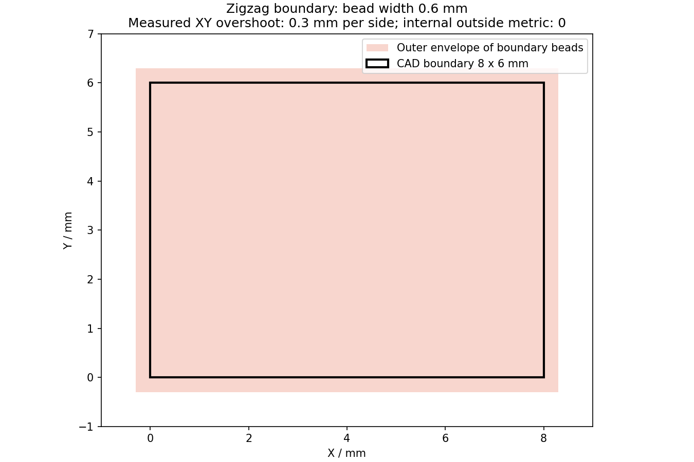

# 项目完成情况与算法独立审查

日期：2026-09-12。任务：AUD-01。范围：核对开发文档、当前实现、示例模型、生成 G-code、回读和界面；提出修改方案。本轮没有修改产品实现。用户随后授权使用 GPT-6 多 Agent，Tube 与支撑分别由子 Agent 独立复核。实施入口见[修改方案](../planning/2026-09-12_algorithm_audit_fix_plan.md)。

## 审查结论

项目已具备 Tube 和 Planar 的离线生成链，但尚不能按“两个工作台均已完成可靠切片”理解。正常案例的局部路径可以生成，独立反例暴露了截层、尺寸、坐标、状态失效和验证漏检。建议在扩展后续工作台前处理这些共用链路问题。

台账此前登记 T01—T12、P01—P06 完成，P07 进行中；Curve、Rotary、Freeform、Research 尚未开始。这里区分“已有实现”和“本轮重新验证完成”，不按卡片数量或任务等权比例计算完成率。正式状态仍以[唯一台账](../planning/progress_tracker.md)为准。

## 版本与验证范围

开始时工作区已有大量未提交 Planar 代码。检查期间 P07 相关源码、测试和文档继续由其他任务写入；本轮没有将这些修改归为审查者的修复。第一次全仓结果来自运行中的工作区，因此另建固定副本，记录 197 个源码、脚本、测试和配置文件的 SHA256。关键反例在固定副本再次复现。证据根目录为 [2026-09-12_project_audit](evidence/2026-09-12_project_audit/)。

| 检查 | 实际结果 | 解释 |
| --- | --- | --- |
| 环境预检 | Python 3.12.7；pytest 9.1.1；依赖约束满足；QSettings 可写 | 使用项目 `tmp/pytest9/Scripts/python.exe`，未安装组件或修改全局配置 |
| 初次工作区全仓 | 581 passed、3 skipped、130 subtests，272.59 s | 期间源码改变，不代表结束时所有源码统一版本通过 |
| 固定副本全仓 | 583 passed、2 failed、3 skipped、130 subtests，285.98 s | 两个失败是 P07 取消异常被包装、测试误读不存在的 `state.summary` |
| P07 最新最小复测 | 46 passed，6.52 s | 另一任务已修复上述两项；仅复测受影响文件，没有声称整个最新工作区重新全仓通过 |
| 质量门禁 | 未全通过 | 初次 `planar_product.py` 1004 行超 1000；固定副本 `build_planar_support_geometry` 66 行超 60。Ruff 等此前门槛通过，单独 mypy 曾报 109 文件通过；不能合并写成所有门禁通过 |
| Qt/OpenGL UI | 8 个正常/错误/恢复场景，三尺寸、中英文；按钮重叠 0，文字适配均通过 | 抓取实际 Qt 页面并查看图片，正常场景导出启用、错误场景禁用。该证据为程序操作 Qt 渲染，未使用真人桌面点击证据 |

3 个 skip 均为 Windows 符号链接权限不足，单列为未覆盖。JUnit、日志、源码快照清单和版本差异清单均已保留；停止重复跑同一验证。

## 示例模型与生成效果

五份项目 STEP 均可导入：弯管 2 个 body、三叶扇 4 个、叶轮 9 个、扇叶 4 个、球形校徽的各 body 见 [model_inventory.json](evidence/2026-09-12_project_audit/model_inventory.json)。文件来源未重新追溯到原始作者，SHA256 已记录。扇叶和球形校徽本轮只检查导入，没有把历史 G-code 当作本项目新生成结果。

| 案例 | 参数与实际结果 | 完成边界 |
| --- | --- | --- |
| 三叶扇 `body_002` Zigzag | Z=60/60.6/61.2 mm，道宽/层高/间距 0.6 mm，沉积与空移 100 mm/min；1193 点，六件套可导出、回读通过 | 仅一片叶片的局部三层；尺寸与回读资格仍受下述缺陷影响 |
| 弯管 `body_002` Planar Zigzag | Z=20/20.6/21.2 mm，同上参数；1008 点，六件套可导出、回读通过 | 带孔截面没有沉积穿孔，但路径次序产生大量横穿孔洞的空移 |
| 叶轮 `body_002` Thin Wall | Z=20→21.2 mm、步长 0.6 mm | Z=20.6 mm 报 `planar.section_open_contour`，未获得产品 G-code |
| 三叶扇完整叶片高度尝试 | Z=56.3→95.9 mm、步长 0.6 mm，目标 67 层 | 截层到 Z=67.7 mm 失败，未完成全高度生成 |
| 弯管 Tube 历史参数重跑 | 1171 点，Ready、六件套与回读通过 | 该夹具道宽与层高均为 10 mm，而模型壁厚为 1 mm；只证明软件链路，不能用作实际壁厚与工艺质量合格证据 |
| 8×6×1 mm 解析实体 | 单层 Zigzag，Z=0.5 mm，层高 0.5、道宽 0.6 mm | 稳定复现尺寸和挤出量验证问题 |

弯管三层的沉积路长为 1069.993 mm，空移为 7581.079 mm，空移/沉积比为 7.085；314 条空移中 312 条保持同一 Z。该数字说明此案例路径排序效率低，不直接证明发生碰撞。[量测](evidence/2026-09-12_project_audit/path_efficiency.json)与[路径图](evidence/2026-09-12_project_audit/pipe_zigzag_3layers/path.png)可复核。

## 确认的问题

### 1. Tube 生成没有使用装夹变换，Setup 变更后旧产品仍可导出

`tube_generation_service.py` 的生成入口只传模型、operation、machine、nozzle、source 与取消回调。`TubeProductService` 的 `T_workpiece_from_build`、obstacles 和 IPW 参数均未接入此入口。下游没有自动从 Setup 补齐这些值。

独立直管 STEP 案例将两个有效 Placement 的 X 分别设置为 250、350 mm。两个 Setup 均 Ready，控制器计算的坐标变换相差 100 mm，生成的 129 点机器轴轨迹和 G-code 却相同，并实际导出成功。Build CS 原点平移 10 mm 也未改变生成结果。使用公开装夹修改入口后，旧 ProductState 仍为 Ready，旧产品仍可导出。错误根源包括生成接口漏传，以及产品语义哈希只覆盖 operation 而不覆盖 Setup/资源。详见 [Tube 专项证据](evidence/2026-09-12_project_audit/tube_probe/ready_setup/summary.json)和[专项审查](evidence/2026-09-12_project_audit/tube_probe/tube_agent_review.md)。

这两项影响机器轴坐标和结果新鲜度，优先级高于路径美化。制造坐标语义、机器/喷嘴/材料资源变更、fixtures/IPW、Setup 必要条件应作为同一生成上下文审查，不只补一个平移参数。纯 Model 显示坐标变化不一定应改变 NC，必须保持物理关系而避免重复变换。首轮未确认材料使 Setup 出现 Error，控制器仍允许生成和导出；最终坐标复现补齐了材料确认，排除了该干扰。

### 2. G-code 回读接受五种明确错误

在原始解析矩形 G-code 基础上，分别执行：全部 E 翻倍、G90 改 G91、M82 改 M83、删除回抽/恢复事件及其 E 行、插入无 POINT 标记的 `G1 X999 Y999 Z999 E999`。五个变体均被 `readback_indexed_gcode()` 判为通过。

回读器仅提取 POINT 标记后的 G1，未处理完整模态状态和其他运动行；挤出检查只看 E 是否增加，没有按材料体积和丝径核对增量。后处理器从本地 E=0 开始累计，但输出没有 `G92 E0` 或声明可核验的初始挤出状态。此函数同时被 Tube 和 Planar 使用。

证据：[固定源码解析案例](evidence/2026-09-12_project_audit/frozen_cases/analytic/summary.json)。故意损坏的程序保存在 `INVALID_*.txt`，属于验证反例，不属于可使用的 NC。

### 3. 有效 STEP 在正常高度被误报为开放轮廓

三叶扇 Z=67.7 mm 与叶轮 Z=20.6 mm 的 BRep 均通过 OCCT 有效性检查，截交成功，各有 4 条边、4 个顶点，每个顶点度数为 2。按拓扑它们是闭合环。

`region.py:_recover_loops/_next_chain` 用曲线采样点之间固定 0.0001 mm 距离连接。上述模型共享拓扑顶点的曲线端点最大差距分别为 0.000111593 mm 和 0.000290903 mm，因此被当作裂口。底层顶点容差另有记录，不能简单把全局阈值统一调大。

修改应优先采用共享顶点/有向边恢复环，对容差修复的位移设独立上限，保留真断裂与高容差输入的诊断。[独立拓扑量测](evidence/2026-09-12_project_audit/section_topology_probe.json)包含每个顶点的度数、容差和端点差。

### 4. Zigzag 实际道宽越界，体积“相等”只核对了路径自身

Zigzag 直接沿原始外环和孔边界布置沉积中心线，再在整个区域内生成填充。8×6 mm 解析矩形采用 0.6 mm 道宽后，熔道扫掠的 XY 包围范围为 X=-0.3→8.3、Y=-0.3→6.3 mm，即每侧超出 0.3 mm。程序却报告 `deposition_outside_max_mm=0`、残余面积 0，并允许导出。

该层目标体积为 8×6×0.5=24 mm³，输出材料体积为 32.4 mm³，高 35%。当前 `volume_difference_mm3=0` 只代表声明体积与“路径长×道宽×层高”相同，不能证明区域没有重复覆盖、外扩或过量沉积。这个计算是离线几何/材料指令核对，未预测实际成形尺寸或流变。

修改应复用既有可靠偏置，将轮廓移至半道宽内，独立裁剪填充域并明确搭接策略；验证应分别量测中心线、完整道宽包络、重复覆盖与材料目标。Spiral 的半道宽与连续 Z 验证也需在同一轮核对，不能沿用 Zigzag 的结论替代实测。

### 5. Planar Support 的空移可穿过零件几何，检查仍允许导出

解析“中央柱+大顶板”单一连通实体生成 178 点，57 条 travel 穿过柱体内部，仍为 Warning、exportable=true、readback=true，唯一报告问题是 XYZAC 奇异。例：Z=0.5 mm 从 (0.3,2.8) 空移到 (8.8,2.8)，穿过 x=4→8、y=2→8、z=0→2.4 mm 的柱体。

支撑检查跳过 travel，仅检查沉积中心线、体积和轴轨迹。当前输出是独立 support operation，尚无零件/支撑统一逐层执行次序，因此此证据证明“穿目标零件几何且没有相应验证”，不能断言某一实际打印顺序已经发生碰撞。要形成可执行的联合程序，需要明确逐层顺序、已打印体状态、空移绕行/抬升及完整运动检查。

证据：[support_probe/summary.json](evidence/2026-09-12_project_audit/support_probe/summary.json)、解析 STEP 和六件套。Tree/Organic、双材料等未承诺功能不列为缺陷。

### 6. Tube STEP 分支没有执行用户指定的弦高精度

精确 STEP 截交分支没有把 `contour_chord_error_mm` 传给采样器，仍使用固定 128 段；当前径向检查只检查路径顶点，没有量测线段中间的弦高误差。解析直管半径 5.5 mm、请求弦高 0.001 mm 时，独立计算的弦中点最大径向偏差为 0.001656497 mm，产品仍为 Ready。参数在控制器中完整保留，所以不能归因于参数未保存。此项与弯管斜切截层的其他径向误差应分开诊断。[数值证据](evidence/2026-09-12_project_audit/tube_probe/ready_setup/summary.json)已归档。

## 验收证据中的不足

- 历史 Planar “真实 STEP 四操作”主要取同一叶片一个高度，Spiral 只取相邻两层；这遗漏了本轮暴露的正常高度截层失败。
- Tube 的通过样例使用 10 mm 道宽/层高，而管壁仅 1 mm；需要增加与实际壁厚、喷嘴和层高相称的独立真值案例。
- 默认 Planar 沉积 1200、空移 1800 mm/min 在本轮三叶扇单层出现加速度 Error，改为已有手册建议的 100/100 后局部三层可生成。应核对机型参数、时间参数化和默认值；不能靠放宽限位或只降低全局速度掩盖问题。
- UI 8 个布局场景通过，仅证明入口、渲染和错误恢复。整件覆盖、原生桌面点击、具体控制器语义、机床标定、实际喷嘴碰撞、材料工艺与试切均未因此得到资格。

## 复盘与后续

本轮有价值的新增方法是：用解析几何判断尺寸与材料目标；用损坏的 G-code 反向验证检查器；用原生拓扑区分模型开口与采样拼接失败；沿公开控制器入口验证坐标和状态；在并行开发时固定源码，分别保存首次失败与后续修复复测。

本次检查完成，修复尚未实施。下一步按[修改方案](../planning/2026-09-12_algorithm_audit_fix_plan.md)确认范围后实施，复用此处失败输入、脚本和量测，避免重新寻找问题。没有机器可用的精确 token 用量，不伪报消耗。

使用的 Skills：`five-axis-workbench-development`（受限范围、独立真值、状态与阶段门槛）；`five-axis-slicer-validation`（解释器、Qt 串行、失败分类、版本指纹和证据归档）。
