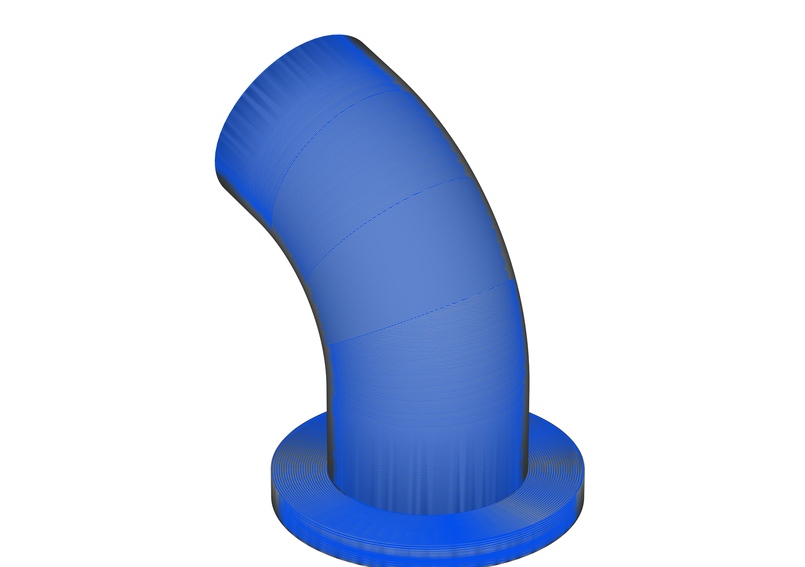
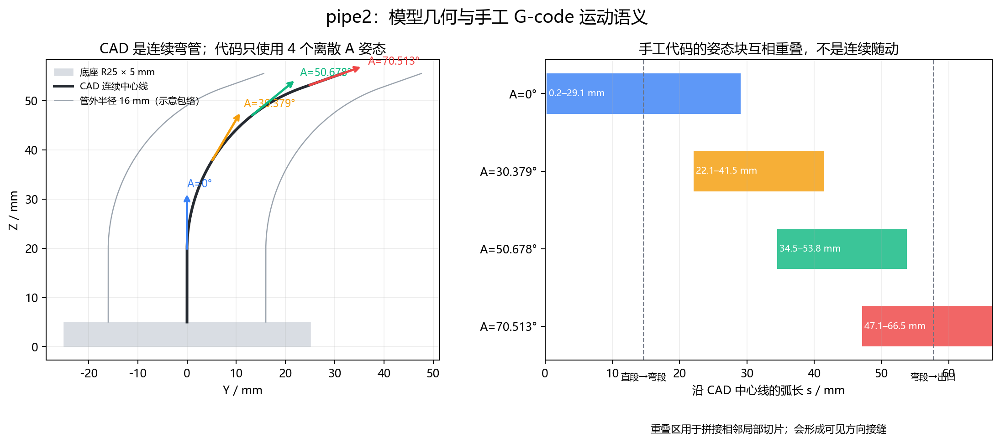
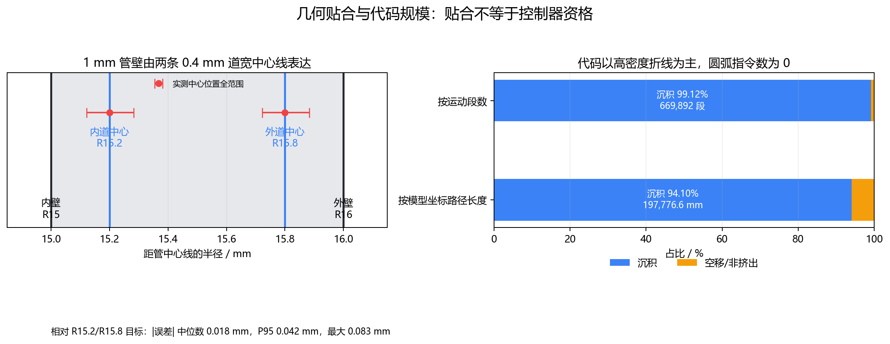
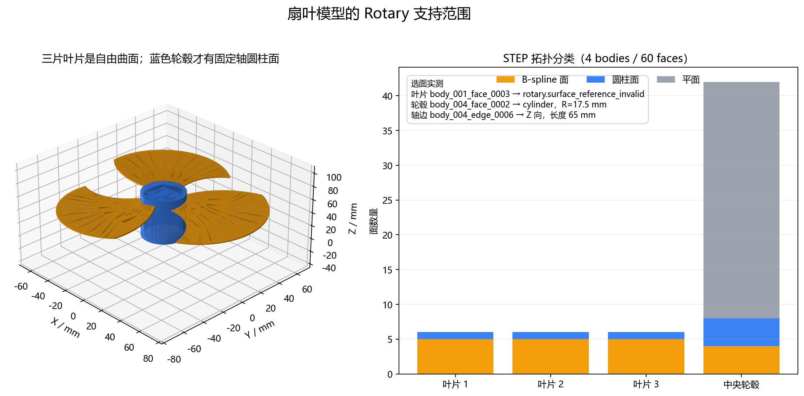
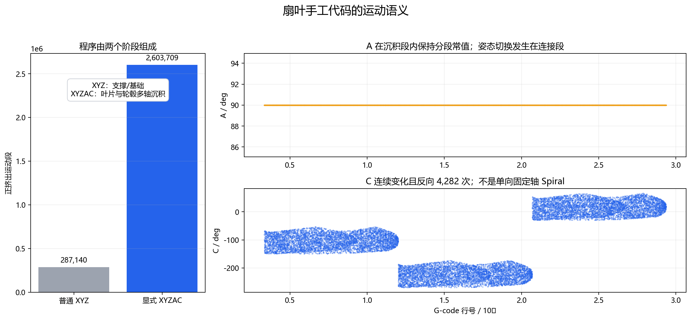
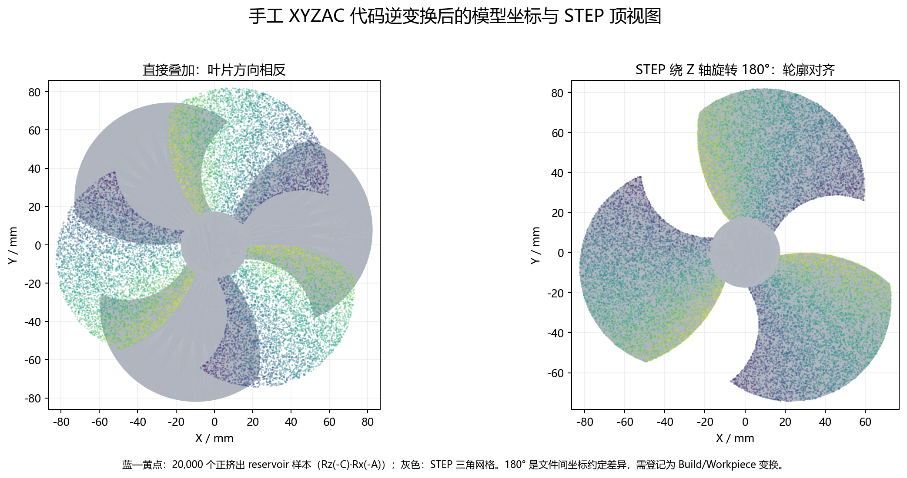

# pipe2 与扇叶模型、手工 G-code 可视化对比

本报告比较 `example/pipe2/弯管新.stp` 与 `example/pipe2/弯管.gcode`，并加入经典扇叶 `example/扇叶/风扇扇叶(1).STEP` 与 `风扇扇叶完整新.gcode`。目标是判断 CAD 几何、手工代码运动策略及其与 Rotary、Tube、Freeform 工作台的对应关系。统计和图像均来自仓库当前文件；机器可读数据见 [`analysis.json`](evidence/2026-09-13_pipe2_manual_comparison/analysis.json) 和 [`fan_blade_analysis.json`](evidence/2026-09-13_pipe2_manual_comparison/fan_blade_analysis.json)。

## 结论

两者在管壁位置上吻合较好，但表达的制造策略不同。CAD 是沿连续弯曲中心线扫掠的空心弯管；手工 G-code 把弯管分成 4 个互相重叠的离散 A 姿态块，在各姿态下使用高密度 G1 折线完成局部切层。A 没有连续随中心线转动，C 始终为 0°。因此整件更接近 Tube Indexed/Continuous 的问题，不适合直接当作一个固定轴 Rotary Region。

扇叶的结论也分两层。逆变换后的手工 XYZAC 路径与 STEP 相差一个绕全局 Z 轴 180° 的坐标注册；登记该 Build/Workpiece 变换后，二者包围范围吻合。三片叶片的主面是 B-spline 自由曲面，只有中央轮毂存在可供 Rotary 使用的 R17.5 mm 圆柱面。手工代码由普通 XYZ 支撑/基础和三个 A=90°、C 连续变化的多轴叶片程序组成，因此整件应进入 Freeform/Curve 类路径流程，轮毂才可单独建立 Rotary 操作。

| 观察 | 是否属于问题 | 当前判定 |
| --- | --- | --- |
| pipe2 路径与管壁中心线有细小偏差 | 基本不属于几何错误 | 对 R15.2/R15.8 道中心的误差中位数 0.0183 mm、P95 0.0421 mm |
| pipe2 使用 4 个离散 A 姿态 | 取决于目标策略 | 目标为 Indexed 时是设计选择；目标为 Continuous 时属于策略不一致 |
| 扇叶路径相对 STEP 旋转 180° | 属于坐标配置缺口 | 可由全局 frame/零角注册解释；未登记变换就生成或下发会出错 |
| 把扇叶 B-spline 面送入 Rotary | 属于支持范围错误 | 当前实现正确返回 `rotary.surface_reference_invalid` |
| 轮毂单个半圆柱 face 自动代表 180° 区域 | 属于产品语义缺口 | 当前 face 只派生轴、半径和轴向范围，周向角仍须显式设置 |
| 手工 XYZAC 外观看起来贴合 | 不能形成机床资格 | 控制器轴语义、回转中心、IK/FK、动态、碰撞和回读仍缺证据 |

蓝色为从 G-code 还原到模型坐标的沉积运动，灰黑色为 STEP 表面。整体贴合说明手工代码表达了该零件；弯曲处可见多组不同方向的局部环线和拼接带。

## 1. CAD 几何真值

STEP 含 2 个 solid、11 个 face，其中 5 个圆柱面、2 个圆环面和 4 个平面。可解析的主要尺寸为：

| 几何 | 当前量测 |
| --- | ---: |
| 底座 | 半径 25 mm，高 5 mm |
| 管壁 | 外半径 16 mm，内半径 15 mm，壁厚 1 mm |
| 入口直段 | 14.642637 mm |
| 弯曲中心线 | 半径 35 mm，转角 70.513° |
| 出口直段 | 约 8.75 mm |
| 总中心线长度 | 约 66.466578 mm |

圆柱面只描述直段，圆环面描述弯段。整件不存在一条固定轴，使所有管壁点都能用同一组“轴向坐标 + 半径 + 周向角”表示。

## 2. 手工代码的运动结构

| 指标 | 当前统计 |
| --- | ---: |
| 总行数 | 679,277 |
| G0 / G1 | 3,210 / 672,624 |
| 运动段 | 675,834 |
| 正挤出段 | 669,892 |
| 空移/非挤出段 | 5,942 |
| 模型坐标沉积长度 | 197,776.608 mm |
| 模型坐标空移长度 | 12,399.574 mm |
| 累计正挤出 E | 6,578.0705 mm |
| G2 / G3 | 0 / 0 |
| C 轴 | 始终 0° |

A 轴只使用 0°、30.379°、50.678°、70.513° 四个离散值。对每个正挤出端点按该段 A 角做逆变换后，沿 CAD 中心线的覆盖区间为：

| A 姿态 | 中心线弧长范围 s |
| ---: | ---: |
| 0° | 0.200–29.063 mm |
| 30.379° | 22.092–41.456 mm |
| 50.678° | 34.491–53.750 mm |
| 70.513° | 47.146–66.467 mm |

相邻块存在 7–12 mm 量级的轴向重叠。重叠可避免局部切层在姿态边界留下未覆盖区，但也会引入接缝、重复沉积、跨块空移和姿态突变风险。它需要作为结构化 operation/region 连接进入轴限、加速度、碰撞和回读检查。

## 3. 管壁贴合

手工代码的管壁沉积集中在距中心线 R15.2 和 R15.8 两条中心线上，可解释为在 R15–R16 的 1 mm 壁厚内布置两道约 0.4 mm 宽的中心路径。相对这两条目标中心线：

- 绝对误差中位数为 0.0183 mm；
- P95 为 0.0421 mm；
- 最大值为 0.0825 mm；
- 到最近 CAD 内/外设计面的距离中位数为 0.1963 mm，与约半道宽的中心线偏置一致。

这些数字证明几何位置基本吻合，不能单独证明挤出体积、搭接率、控制器插补、轴速度/加速度或碰撞安全。代码使用 865 个正挤出 run，其中管体 852 个、底座 13 个；476 个管体 run 的首末闭合距离小于 0.05 mm，其余多为被分区边界截断或连接的局部环线。

## 4. 与当前工作台的对应关系

| 任务 | 推荐入口 | 原因 |
| --- | --- | --- |
| 整个 pipe2 弯管 | Tube Indexed 或 Tube Continuous | 回转轴随空间中心线改变；Indexed 对应手工代码的离散姿态块，Continuous 对应连续中心线随动 |
| 单个直圆柱区域 | Rotary Spiral / Thin Wall / Around Part | 区域内存在一条固定轴，可保存稳定 axis edge 与 cylinder face |
| 弯头圆环面 | 不作为单一 Rotary Region | 圆环面的局部轴随中心线改变，固定轴 Rotary frame 无法表达整段 |
| 把多个固定轴区域组合起来 | 多操作并显式连接 | 每区需独立轴框架，跨区 Retract/Prime、安全半径、连续角解支和碰撞都要检查 |

选边选面时不能仅凭“外形看起来像回转体”判断。Rotary 的 face 引用必须能解析为同轴圆柱/圆锥，轴 edge 必须与这些面的解析轴平行。pipe2 的直段可局部满足；弯头的 torus 面不满足当前 Rotary surface 契约。

## 5. 扇叶对照检查

### 5.1 STEP 拓扑与选面结论

当前 STEP 解析为 4 个 body、60 个 face、156 条 edge 和 108 个 vertex。三片叶片各自的最大工作面均为面积约 4,234.143 mm² 的 B-spline 面；中央轮毂包含两个 R17.5 mm 半圆柱面和可用的 65 mm 轴向直边。

生产领域绑定和真实 `RotaryPage` Apply 使用同一组选择状态做了两次检查：

- `body_001_face_0003` 是 B-spline，配轴边提交后返回 `rotary.surface_reference_invalid`，操作未被错误改写；
- `body_004_face_0002` 是圆柱面，配 `body_004_edge_0006` 后绑定成功，派生轴原点 `(0,0,65)`、方向 `(0,0,-1)`、轴向范围 `0–65 mm` 和半径 `17.5 mm`。

轮毂外表面由 `body_004_face_0002` 与 `body_004_face_0042` 两个半圆柱 face 组成。做完整 360° 轮毂操作时应同时选择两面，并显式设置操作起止角。当前 surface 引用用于解析轴、半径和轴向 profile，不会从修剪 face 自动推导 180° 周向区域；把单个半面理解成自动局部 Around Part 会产生语义错误。

本轮尝试加载生产 VTK Viewer。actor 构建、选择模式、`SelectionState`、面/边高亮属性均通过；当前执行器未提供有效 OpenGL pixel format，实际渲染进程报缺少 GL version 后原生退出。上图采用真实 `RotaryPage` 和兼容选择状态的 Qt 绘制替代图。Computer Use 也没有枚举到 Qt 窗口，因此该图不标作真实鼠标截图。

### 5.2 手工代码的实际结构

本轮用独立流式状态机重新解析 186,891,627 byte 的 `风扇扇叶完整新.gcode`，没有导入产品 G-code parser 或 Rotary 实现。文件使用 G90、G21 和 M83；没有 G91、G20、M82、G2 或 G3。2,910,683 条运动记录全部显式带 G0/G1。

| 阶段 | 行范围 | 正挤出运动 | A/C 特征 | 累计正 E |
| --- | ---: | ---: | --- | ---: |
| XYZ 支撑/基础 | 1–332,309 | 287,140 | A=C=0° | 6,707.283490 mm |
| 第一叶片程序 | 332,310–1,201,190 | 868,539 | 沉积 A=90°，C=-149.79°…-53.56° | 3,855.306768 mm |
| 第二叶片程序 | 1,201,191–2,068,799 | 867,585 | 沉积 A=90°，C=-269.78°…-173.53° | 3,509.398213 mm |
| 第三叶片程序 | 2,068,800–2,936,410 | 867,585 | 沉积 A=90°，C=-29.78°…66.47° | 3,509.398137 mm |

总计 2,890,849 个正挤出运动，其中 287,140 个为普通 XYZ，2,603,709 个显式带 A/C；另有 19,834 个非正挤出运动、2,934 个独立 Retract 和 2,926 个独立 Prime。三个多轴阶段的 C 区间按约 120° 周向分布，对应三片叶片。第一段比后两段多 954 个正挤出运动且 E 较大，这个差异需要按路径角色继续解释，单凭数量不能认定错误。

正挤出 XYZAC 段内 A 恒为 90°。C 增量绝对值中位数为 0.10°、P95 为 0.23°、P99 为 0.29°，方向反转 4,282 次。少量正挤出段同时出现 30.60°–39.42° 的 C 变化、约 32 mm 的 Y/Z 运动和 E=1.67–1.95 mm；它们可能是刻意的径向沉积长道，也可能造成跨空、过挤出或碰撞。只有在目标控制器插补语义、整段几何、动态和碰撞回读后才能定性。最大 228.18° C 跳变发生在 E=0 的程序切换定位，仍需作为非沉积整段运动检查。

### 5.3 180° 差异的来源

按现有 Generic XYZAC 假设，以零回转中心应用 `P_part = Rz(-C) · Rx(-A) · P_machine` 后，正挤出端点范围为 X `-82.500543…72.922255 mm`、Y `-74.331758…81.994276 mm`、Z `0.2…65.0 mm`。STEP 网格绕全局 Z 轴和 `(0,0)` 旋转 180° 后，范围为 X `-82.503439…72.921895 mm`、Y `-74.316812…81.993869 mm`、Z `0…65 mm`；四个 XY 包围边差值不超过 0.015 mm。

这组证据强烈支持“文件间存在 180° 全局坐标/零角约定差异”。它应作为 Source/Model/Build/Workpiece 变换登记并参与语义哈希。当前量测只比较三角网格和路径包围范围，没有做精确 OCCT 点到 BRep 面距离；图中点还包含内部填充与支撑。因此不能从该图推出局部贴面误差小于 0.015 mm，也不能把 180° 当成任意模型的自动修正。

### 5.4 是否算问题

| 类型 | 扇叶案例判定 | 处理方式 |
| --- | --- | --- |
| 几何误差 | 尚未由现有证据证明 | 先登记 180° frame，再按 operation/stage 做精确点面、边界和覆盖检查 |
| 工艺策略差异 | 已确认 | 手工文件是 XYZ 基础加三段自由曲面 XYZAC；不应拿它与单条 Rotary Spiral 逐点比较 |
| 支持范围错误 | 当前实现没有发生 | B-spline 叶片面被正确拒绝；轮毂圆柱面可建立局部 Rotary |
| 产品语义缺口 | 已确认 | surface 选择不会自动推导修剪角区；教程和 UI 必须要求显式角度/Region |
| 资格缺口 | 已确认 | imported NC 未获得目标控制器、机床、碰撞、回读或试切资格，不可直接下发 |

## 6. 方法与限制

STEP 尺寸来自 OCCT/CadQuery 拓扑和解析曲面检查。G-code 解析按文件中的 G90/G91、M82/M83、G92、G0/G1、XYZAC/E/F 状态机处理；沉积段定义为 `ΔE > 0`。由于 C 恒为 0，模型坐标重建对每个点应用当前 A 轴的逆旋转。中心线距离使用已知入口直线、R35 圆弧和出口直线三段的最近点分类。

扇叶 G-code 使用独立流式模态状态机，按 G90/G91、G20/G21、M82/M83、G92 和 G0/G1/XYZAC/E/F 跟踪状态；正挤出定义为运动记录上的 `ΔE > 0`。20,000 个可重复 reservoir 样本用于当前图，完整计数和范围来自全文件单遍统计。扇叶面类型、轴线和半径来自生产 STEP reader；可视网格由 CadQuery/OCCT 在 0.08 mm、0.08 rad 容差下三角化。

扇叶输入位于被 Git 忽略的示例目录。STEP header 记录 `Haoge_aimoyu`、`SolidWorks 2026`，G-code 未提供可核对的生成器或许可证。仓库许可证不会自动覆盖这些输入及派生视图；本报告将它们作为用户提供的内部分析样例，公开再分发前应确认权利。

本报告没有目标控制器说明、真实 A/C 轴旋转中心、正方向、零偏、轴序、机床标定、工具长度、喷嘴模型、夹具与机床实体、材料流量标定、完整生成链回读和现场试切证据。因此它只给出几何、选择契约和代码结构对比，不给手工 G-code 或工作台结果授予实机资格。
